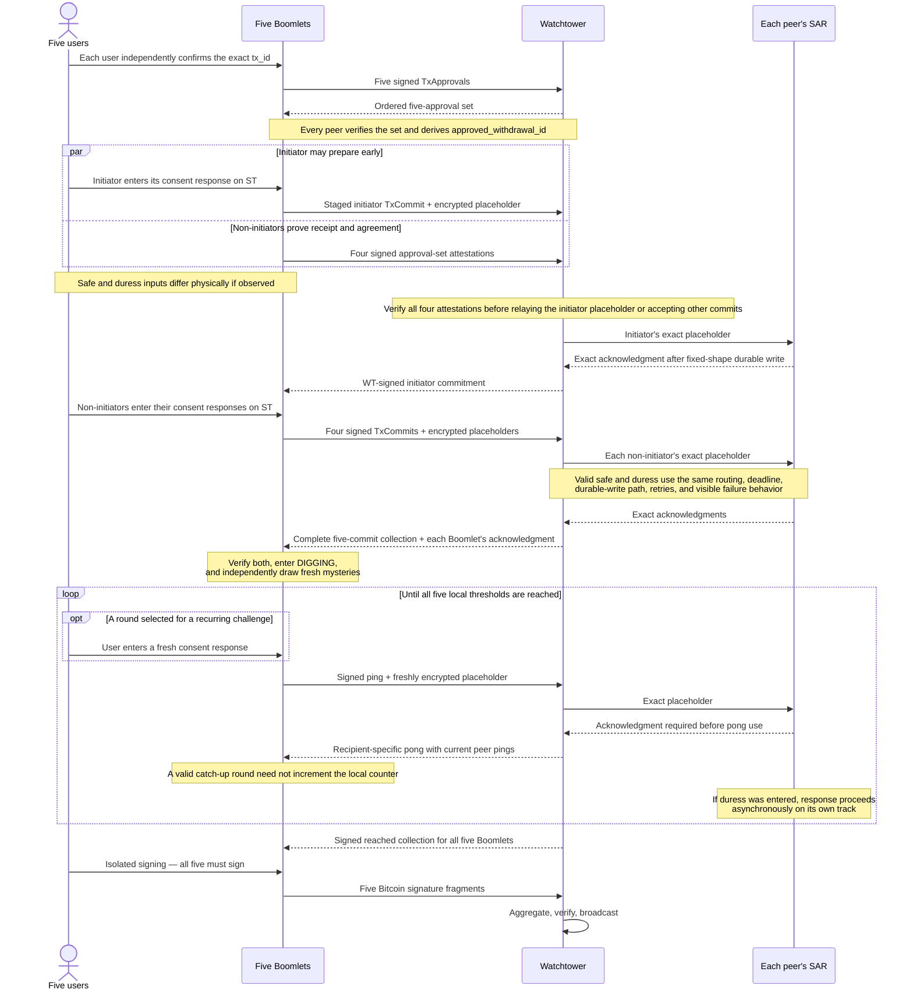
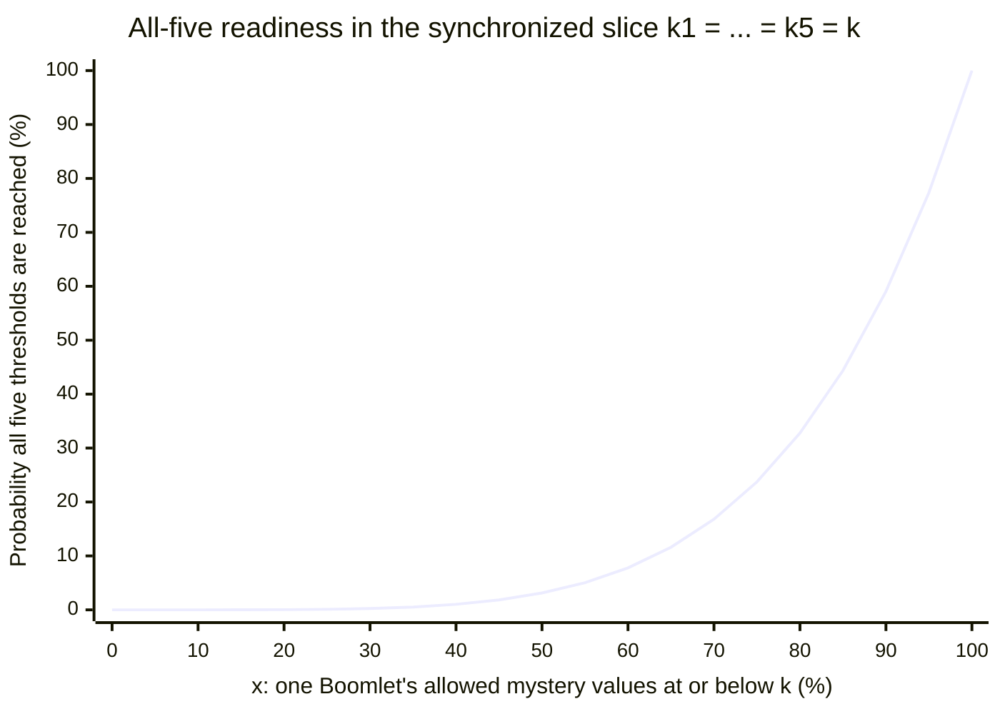
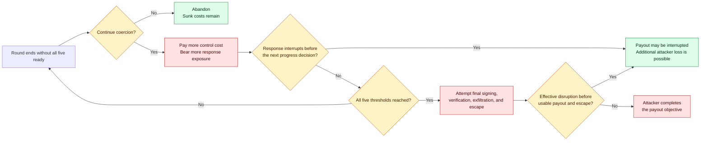

# Boomerang design

Boomerang is an unfinished Bitcoin cold-storage protocol design for a threat
model that includes planned physical coercion. It is not production-ready.
This document is the technical companion to the
[first-contact README](README.md): Sections 1–6 build the concept, Sections
7–11 describe the protocol realization, and Sections 12–17 carry the economic
argument, boundaries, and status. The
[protocol specification](spec/SPEC.md) is normative for exact behavior and
controls wherever the two differ.

## Contents

1. [Attack lifecycle](#1-attack-lifecycle)
2. [Design objective](#2-design-objective)
3. [Existing controls and the remaining problem](#3-existing-controls-and-the-remaining-problem)
4. [The composed mechanism](#4-the-composed-mechanism)
5. [End-to-end coercion scenario](#5-end-to-end-coercion-scenario)
6. [Protocol sequence](#6-protocol-sequence)
7. [Architecture and trust boundaries](#7-architecture-and-trust-boundaries)
8. [On-chain construction](#8-on-chain-construction)
9. [What setup establishes](#9-what-setup-establishes)
10. [Withdrawal in detail](#10-withdrawal-in-detail)
11. [Duress protection and observability](#11-duress-protection-and-observability)
12. [Attack economics and security argument](#12-attack-economics-and-security-argument)
13. [Engineering constraints and trade-offs](#13-engineering-constraints-and-trade-offs)
14. [Failure and human-safety boundaries](#14-failure-and-human-safety-boundaries)
15. [Ancillary procedures and open protocol work](#15-ancillary-procedures-and-open-protocol-work)
16. [Design status and verification path](#16-design-status-and-verification-path)
17. [External context](#17-external-context)

## 1. Attack lifecycle

A coercion attack is a transaction workflow imposed on people. Thinking only
about whether an attacker can obtain a key misses the outcome the attacker
needs and the period during which that outcome can still be disrupted.

**Targeting.** The attacker first identifies a valuable holding and the people,
places, devices, services, and relationships involved in spending it. Public
wealth signals, breached customer data, insider information, and ordinary
surveillance can all turn an anonymous on-chain balance into a physical target.
Geographic separation and multiple custodians may increase reconnaissance and
coordination costs, but an informed attacker may plan around them.

**Control.** The attacker gains enough physical control to issue demands,
observe behavior, restrict communication, and keep the required participants
available. Control may extend to homes, workplaces, family members, phones, and
wallet equipment. The longer it must be maintained, the more resources and
exposure the attacker bears—but also the longer the victims remain in danger.

**Compelled transaction authorization and signing.** The attacker dictates a
destination and forces the participants first through review of the real
unsigned transaction, then through any pre-signing protocol authorizations,
and, once the wallet permits it, through final Bitcoin signing. In a mature
attack, the coercer may know the custody policy and may insist on every required
signer, recovery artifact, or ceremony step. A defense cannot assume that a
victim will refuse, lie successfully, forget a secret, or retain an unobserved
communication channel.

**Verification.** A payout-seeking attacker wants evidence that cooperation
produced the intended transfer. They can inspect transaction details, compare
addresses and amounts, and watch for broadcast or confirmation. A decoy that
cannot survive that verification does not end the attack.

**Exfiltration and escape.** After broadcast, the attacker may wait for
confirmation, move proceeds through additional transactions or services, and
leave the coercion site. Their objective is a usable, verifiable payout
together with a viable exit—not merely possession of credentials.

Boomerang focuses on this complete lifecycle. The interval between compelled
authorization and usable payout is where the protocol seeks to change the
attacker's decision and give a prearranged responder an opportunity to act.

## 2. Design objective

The objective is to prevent compelled human cooperation from reliably
producing a prompt payout. Boomerang does not expect a person under threat to
defeat the attacker through refusal. Its earliest Taproot script branch is the
five-of-five Boomerang branch, available no earlier than
`milestone_block_0`. Bitcoin checks that timelock and the five signatures; the
Boomlet devices withhold their parts of those signatures until an off-chain
withdrawal state machine—whose progress the people cannot accelerate—has
completed.

A coerced withdrawal therefore becomes an operation with an uncertain
completion time, and the same ceremony that withholds signing progress repeatedly
carries covert duress checks to a prearranged responder. A payout-seeking
attacker must bear time, cost, exposure, and response risk without knowing
when completion becomes possible, while the responder gains an interval in
which to act.

The intended result is a less dependable coercion payoff and a meaningful
response opportunity. If no credible response exists, or if extending the
event only increases danger, consuming more time is not itself a safety
property.

## 3. Existing controls and the remaining problem

Familiar custody controls address important threats, and several belong in a
sound Boomerang deployment.

**Multisignature** removes a single signing key as the sole point of failure. It
can limit remote theft, insider action, and accidental loss by requiring
independent signatures. Against a coercer who has discovered the policy and can
control the threshold number of people, however, multisignature can become a
checklist: collect the participants, compel valid signatures, and verify the
transaction.

**Geographic distribution of custodians and keys** makes simultaneous
compromise harder, limits some site disasters, and forces an attacker to
coordinate across locations. It can reduce targeting risk when locations and
identities remain private. Once those facts are learned, distance may increase
the attacker's logistics without changing the final rule that enough compelled
participants can authorize a spend.

**Fixed withdrawal delays** impose a known waiting period between initiating a
withdrawal and allowing the requested transfer to complete. This interval
allows time for detection, cancellation, or response. Its known duration also
lets an informed attacker choose when to begin, estimate how long control must
last, and decide in advance whether the expected payout justifies that interval.

**Decoys and deniable balances** may end opportunistic attacks when the coercer
does not know what exists and accepts the apparent payout. They are weaker
against prior knowledge, on-chain analysis, leaked records, repeated demands,
or an attacker who can verify that the transfer does not match the target they
identified. A failed decoy may also escalate harm.

**Vault constructions** can precommit destinations, provide recovery paths, or
place a delay between an initiating action and unrestricted spending. Those
properties are valuable against key theft and detected unauthorized spends.
Depending on the construction, a fixed and observable recovery window may
still be plannable, and a vault does not by itself provide a covert physical-
duress signal or a prepared real-world response.

The remaining problem is therefore an informed coercer who can demand genuine
cooperation and verify the result. Boomerang composes existing ideas—multiple
custodians, isolated keys, on-chain timelocks, trusted devices, and an external
response path—around that problem. It is meant for situations where preventing
silent remote key theft is necessary but insufficient.

## 4. The composed mechanism

The current profile's earliest Taproot script branch is the five-of-five
Boomerang branch at `milestone_block_0`. Each peer has a recoverable normal key
and a second signing share held by a trusted device called a **Boomlet**. A
peer's two public parts form its Boomerang public key; Bitcoin requires a
signature under all five such keys on this branch. The host cannot read or
directly use the Boomlet's private material. An authorized setup flow can
export that material only inside an authenticated envelope bound to one
designated backup device, called a **Boomletwo**.

During a withdrawal, each user independently checks the `tx_id` of the intended
unsigned transaction on the **Secure Terminal** (`ST`). ST signs a nonce-bound
protocol confirmation of `tx_id` for the user's Boomlet. The Boomlet then signs
a `TxApproval`, a pre-signing protocol authorization bound to the active
withdrawal. One peer starts a given withdrawal as its **initiator** and supplies
the transaction; the other four peers are that ceremony's **non-initiators**.
The **Watchtower** (`WT`) collects one valid `TxApproval` from each of the five
Boomlets.
Every participant verifies the ordered five-`TxApproval` set and computes the
same `approved_withdrawal_id`; the four non-initiator Boomlets attest that they
received and verified that complete set. These approval-set attestations are
receipt-and-agreement evidence.

The initial commitment and duress phase follows. Each user answers a private
duress challenge through ST; answering with the consent set memorized at
setup means safe, and any other structurally valid answer means duress. Both
answers make the Boomlet produce the same kind of encrypted **`placeholder`**,
addressed to that peer's setup-bound **Search and Rescue service** (`SAR`)
and carried with the peer's signed `TxCommit`—a protocol commitment bound to
the approved withdrawal. The initiator may run its duress check and send its
commit early; WT may stage that commit
but must verify all four non-initiator approval-set attestations before
relaying the initiator's `placeholder` to SAR, acknowledging the initiator
commit to non-initiators, or accepting a non-initiator commit. Each
non-initiator commits only after verifying the WT-signed initiator commit.
WT relays every peer's `placeholder` to that peer's SAR, which processes valid
safe and duress `placeholder` values through the same bounded durable-write
path and releases an acknowledgment at the same fixed deadline. A Boomlet
enters `DIGGING` only after it verifies the complete signed `TxCommit` collection
and its own SAR signature over the exact encrypted `placeholder` it sent.

Entry to `DIGGING` is the only point at which a Boomlet generates the active
withdrawal's **`mystery`**: a fresh private threshold—the number of successful
local `counter` increments this device will require—drawn from minimum and
maximum bounds fixed by the implementation profile. The `mystery` belongs only
to that withdrawal and is erased with its active state after signature export,
explicit abort, or unrecoverable failure.

During `DIGGING`, each Boomlet repeatedly sends a **`ping`**, a signed and
sequence-numbered progress message, and WT answers each round with
recipient-specific **`pong` messages** that bundle the other peers' current
`ping` messages. A Boomlet's `counter` advances only for a valid `pong`
accompanied by an advancing local chain view, current `ping` messages from every
other peer, and passing freshness and consistency checks. Every `ping` carries
a newly encrypted `placeholder`, even if its underlying safe or duress value
has not changed. WT forwards that exact `placeholder` to SAR and obtains its
exact acknowledgment before the `ping` may be used in a `pong`. Fresh duress
challenges recur on a randomized, profile-controlled cadence. A Boomlet that
reaches its `mystery` keeps participating until WT has current reached `ping`
messages from all five.

The attacker must sustain the progress traffic to reach signing; that traffic
carries an initial and recurring opportunity for concealed duress state and
confirms its durable delivery. The unknown per-device thresholds deny the
coerced people a way to promise a precise finish or make it arrive sooner. The
resulting interval is valuable only to the extent that SAR and the surrounding
response plan can use it.

Bitcoin does not validate `mystery` or `counter` state, duress checks,
acknowledgments, or the `DIGGING` state machine. Trusted hardware and the
off-chain protocol enforce those rules. Bitcoin consensus enforces the Taproot
spending conditions and absolute timelocks. An implementation that changes the trust
boundaries or message semantics can therefore preserve the same-looking
on-chain output while implementing a materially different security model.

## 5. End-to-end coercion scenario

Before any attack, five peers complete setup. Each peer operates an isolated
environment (**Iso**) for sensitive key work, a networked environment
(**Niso**) for coordination, a Boomlet, an air-gapped Secure Terminal (`ST`) for
trusted display and input, and a Phone for registering encrypted rescue data.
Each selects one SAR. The group agrees on peer identities, a WT, milestone
blocks, a descriptor, and a setup instance. Each Boomlet enrolls a five-country
safe set drawn from the fixed 193-entry display vocabulary, and each user
memorizes that set. Setup also creates and verifies the target-bound Boomletwo
backup.

An attacker later takes control of the five users and demands payment to a
specific address. The attacker has enough knowledge to reject a decoy and
watches the transaction review and protocol coordination. This scenario still
assumes that the attacker cannot observe the ST consent interaction
closely enough to learn or dictate the safe response; Section 11 explains what
fails if that physical assumption does not hold. First the initiator, then each
non-initiator, independently verifies the same unsigned transaction identifier
on ST. Each successful nonce-bound ST confirmation causes that peer's Boomlet
to sign a `TxApproval`. These five messages authorize only the protocol's next
withdrawal phase. WT collects one valid `TxApproval` per Boomlet. Every
participant verifies the complete ordered set and computes
`approved_withdrawal_id`, which binds every later commit,
`placeholder`, `ping`, `pong`, reached report, and signing step to that exact
withdrawal and approval set. Each non-initiator also signs the required
attestation that it received and verified the complete set.

Each Boomlet presents an initial consent challenge through its ST. Selecting
the memorized five-country set means safe; any other structurally valid set
means duress. Those selections are physically distinguishable to an observer;
the valid protocol outputs have the same artifact type and handling. In either
case, the Boomlet creates the same kind of encrypted `placeholder`. The initiator
signs its `TxCommit` first. WT may stage it, but may
not relay its `placeholder` to SAR, acknowledge that commit, or accept a
non-initiator commit until WT has verified all four non-initiator approval-set
attestations. Each non-initiator signs its `TxCommit` only after verifying the
WT-signed initiator commit. For every peer, WT relays the `placeholder` to that
peer's setup-bound SAR and obtains SAR's encrypted acknowledgment. WT sends
every peer the complete signed `TxCommit` collection together with that peer's
encrypted SAR acknowledgment. Every Boomlet verifies that collection and that
its SAR acknowledgment signs its exact `placeholder`.

Only at that point does each Boomlet enter `DIGGING` and
independently draw its fresh `mystery` from the bounds fixed by the profile
constants. Its `counter` begins at zero. The attacker can demand that every
user keep going, but neither the users nor their hosts can inspect the
thresholds or command an increment.

In each round, every Boomlet supplies a signed, sequence-bound `ping` with a
newly encrypted `placeholder`. WT must authenticate the `ping` messages,
forward each `placeholder` to the correct SAR, receive each exact
acknowledgment, observe the round's block-spacing rule, and build
recipient-specific `pong` messages. A Boomlet increments its `counter` only if
its local chain view advanced and every other peer's included `ping` falls
within the permitted freshness relation. Otherwise, a valid round can catch its
height up and produce another fresh `ping` without advancing the `counter`.
Selected rounds ask the user another duress challenge.

For a valid duress `placeholder`, SAR durably activates the rescue state before
releasing the indistinguishable acknowledgment. Rescue-data retrieval and
external action begin asynchronously after release; they are not allowed to
alter the acknowledgment visible to WT or the attacker. The attacker can see
the ceremony continue but should not learn from its protocol traffic whether
the answer was safe or duress.

After all five Boomlets report that their private thresholds have been
reached, WT distributes the signed `reached_pings_collection`. Each Boomlet and
Niso verifies it. Only then do users move Boomlets back to their isolated
environments, reconstruct normal keys, verify the signing packages, and
complete the five peer signatures. WT aggregates and broadcasts the transaction
bound by the verified five-`TxApproval` set. Each Boomlet clears its active
withdrawal state, including the `mystery`, after exporting its signed fragment.

If an effective response reaches the victims before that conclusion, the
attacker's payout may be disrupted. If it does not, the attacker may complete
verification, exfiltration, and escape. SAR's acknowledgment proves a protocol
event, not which of those real-world outcomes follows.

## 6. Protocol sequence

The shape of a withdrawal, at phase level. This shows the security-critical
initiator/non-initiator gates but omits many checks, retries, and all wire
detail — [Section 10](#10-withdrawal-in-detail) restores them, and the full
message-level sequence diagrams live in the
[withdrawal subsystem](withdrawal/README.md). What the picture is meant to
show survives the compression: every required step either withholds signing
or carries acknowledged duress state, and usually both.



## 7. Architecture and trust boundaries

The specified profile is exactly five peers with a five-of-five Boomerang
branch. Each peer's Iso holds or reconstructs the mnemonic-backed normal key.
Niso is online, talks to peers and WT over Tor, and obtains a Bitcoin chain
view. Boomlet holds the host-inaccessible identity and MuSig2 private material,
long-lived protocol state, and active withdrawal state. ST is the trusted
transaction-identifier display and duress-input path. Phone registers and
updates encrypted rescue data. Boomletwo is an inactive backup target.

The durability split between the two per-peer environments is deliberate. Iso
keeps no durable protocol state: it reconstructs the normal key when needed
and holds only session-scoped setup-relay, backup-verification, and signing
state, which it may lose between ceremonies; a lost signing or verification
exchange fails closed rather than silently continuing
([SPEC §7.2](spec/SPEC.md)). Niso persists the Bitcoin RPC configuration,
Boomlet-provided Tor identity material, peer reachability records, and active
setup and withdrawal relay state, and it is never trusted to authorize
spending ([SPEC §7.3](spec/SPEC.md)).

WT is a non-custodial coordinator that relays `placeholder` values, supplies a block-
height view, aggregates final fragments, and broadcasts. It can censor, delay,
equivocate, or leak metadata. Each peer binds one SAR identity during setup; WT
cannot silently substitute another. SAR is also non-custodial but can stall
progress by withholding an acknowledgment and can fail operationally after
receiving a signal.

### Need-to-know exposure

The services see as little as their roles require. WT stores registered setup
agreements, peer identity keys, SAR routing information, active ceremony
identifiers, protocol objects, receipts, and replay state—but never the
descriptor or the milestone schedule, and every PSBT it relays is encrypted
for its recipient Boomlet ([SPEC §7.4, §13.8, §15.3](spec/SPEC.md)). SAR
stores a pseudonymous `doxing_data_identifier`, encrypted rescue-data
envelopes it cannot read, payment status, and `placeholder` replay tuples; it
gains the ability to decrypt the rescue data only when a valid duress
`placeholder` delivers `doxing_key_for_sar`
([SPEC §7.5, §16.3–16.4](spec/SPEC.md)). The residual question—what a SAR
that has learned identifying data during an event might later do with it—is
treated as a standing risk in
[Section 14](#14-failure-and-human-safety-boundaries).

### Trust assumptions

The design assumes Iso is trusted and isolated during setup and final signing,
Boomlet enforces key and state boundaries, ST preserves display and input
integrity, cryptographic primitives and random generation are correctly
implemented, and at least one peer remains honest and follows the Boomerang
path during setup. Niso and the
ordinary host are not trusted to authorize spending. Transaction identifiers,
setup and withdrawal identifiers, the ordered five-`TxApproval` set, the four
non-initiator approval-set attestations, sequence numbers, freshness checks,
signing-package checks, and final transaction revalidation carry authorization
continuity across those boundaries.

### Topology

Peers and WT communicate over Tor onion services; each Niso keeps its own
Bitcoin RPC chain view; the air-gapped ST exchanges encrypted messages with
Boomlet over a host-relayed channel rather than a network connection; and
Phone talks only to SAR. The authoritative pictures are maintained in the
security models: the
[trust-boundary diagram](security_models/architecture.md#trust-boundaries-and-diagram)
and the
[data-flow diagram](security_models/architecture.md#architecture--data-flows)
map every component, boundary, and flow.

## 8. On-chain construction

For peer `i`, the Boomerang public key aggregates the peer's two signing
parts under MuSig2:

```text
boom_pubkey_i =
  derive_musig2_public_key(
    boomlet_musig2_pubkey_share_i,
    normal_pubkey_i
  )
```

The Taproot internal key is unspendable, so only script paths can spend. In
the policy notation, `pk(key)` requires a valid BIP342 signature for `key`;
`thresh(k, expressions)` requires at least `k` listed expressions;
`after(height)` requires the transaction `nLockTime` to satisfy the absolute
block-height lock and all input sequences to permit lock-time enforcement;
`and(left, right)` requires both. The script tree contains:

```text
and(thresh(5, pk(boom_pubkey_0)..pk(boom_pubkey_4)),
    after(milestone_block_0))

and(thresh(5, pk(normal_pubkey_0)..pk(normal_pubkey_4)),
    after(milestone_block_1))

and(thresh(4, pk(normal_pubkey_0)..pk(normal_pubkey_4)),
    after(milestone_block_2))

and(thresh(3, pk(normal_pubkey_0)..pk(normal_pubkey_4)),
    after(milestone_block_3))

and(thresh(2, pk(normal_pubkey_0)..pk(normal_pubkey_4)),
    after(milestone_block_4))

and(thresh(1, pk(normal_pubkey_0)..pk(normal_pubkey_4)),
    after(milestone_block_5))
```

The normative form is [SPEC §11](spec/SPEC.md): the descriptor is constructed
deterministically from the ordered peer keys and the milestone struct, and
every peer compares the exact descriptor string and the underlying Taproot
output key during setup.

Milestones are strictly increasing setup parameters, and the Boomerang branch
is the earliest spendable branch. "Primary" describes that branch order—the
first branch in the tree—not a preference among paths. The current protocol
requires a Boomerang withdrawal to begin only at or after
`milestone_block_0` ([SPEC §15.1](spec/SPEC.md)).

Normal-key fallback begins at `milestone_block_1`, the second milestone;
`milestone_block_0` gates only the Boomerang branch. The first fallback branch
requires all five normal keys. Four-of-five, three-of-five, two-of-five, and
one-of-five normal-key branches then become available at `milestone_block_2`
through `milestone_block_5`. Once their timelocks are satisfied, these
branches do not require Boomlet `mystery` values, WT/SAR acknowledgments, or the
Boomerang withdrawal state machine. The enforcement split stated at the end
of [Section 4](#4-the-composed-mechanism) applies throughout: Bitcoin
consensus enforces this policy and its absolute timelocks; trusted hardware
and the off-chain protocol enforce everything else.

## 9. What setup establishes

Setup installs the long-lived key material, pairs ST, enrolls the five-country
consent set using the 193-entry vocabulary, authenticates peer records, agrees
the ordered peers and milestone blocks, constructs the descriptor, binds the
WT and each peer's SAR, registers service receipts, completes the target-bound
Boomletwo backup, and produces a final chained setup checkpoint. Each Boomlet
tracks that progress through a fixed state chain ([SPEC §12](spec/SPEC.md)):

```text
EMPTY
  -> INSTALLED
  -> ST_ENROLLED
  -> PARAMS_REVIEWED
  -> PARAMETERS_AGREED
  -> WT_READY
  -> SAR_READY
  -> BACKUP_READY
```

The chain is glued together by narrow replay and identity bindings
([SPEC §13.4–13.7](spec/SPEC.md),
[ADR 0001](adr/0001-setup-replay-and-phase-checkpoints.md)). Each Boomlet
signs a peer setup record containing a fresh `peer_setup_nonce`; the
deterministic `setup_instance_id` hashes the ordered signed peer records, the
user-approved WT preference order, and the milestone blocks, so any change in
participants, ordering, milestones, or protocol version produces a different
setup instance. The user approves a nonce-bound commitment to that exact
instance on ST before agreement proceeds, and every later phase extends a
chained `setup_checkpoint` whose phase labels (`parameters_agreed`,
`wt_ready`, `sar_ready`, `backup_ready`) must verify identically across all
five peers—peer-local receipts stay local and never enter the shared
checkpoint.

Consent enrollment happens on ST before the Boomlet ever moves to the
networked environment: two independent nonce-bound rounds over the fixed
193-entry display vocabulary must resolve to the same five-element set, which
only that peer's Boomlet stores and only that user memorizes
([SPEC §13.3, §16.1](spec/SPEC.md)). Each peer binds exactly one SAR identity
for the life of the setup ([ADR 0003](adr/0003-single-sar-per-peer.md)), and
rescue-data confidentiality is rooted in a user-chosen `doxing_password`
([ADR 0005](adr/0005-user-chosen-doxing-password.md)); the derived
`doxing_data_identifier` serves only as a lookup value.

The versioned implementation profile fixes the `mystery` bounds
(`MIN_TRIES_FOR_DIGGING_GAME_IN_BLOCKS`,
`MAX_TRIES_FOR_DIGGING_GAME_IN_BLOCKS`), the duress cadence
(`DURESS_CHECK_INTERVAL_IN_BLOCKS`), freshness tolerances, spacing between
`ping` and `pong` messages,
and height-catch-up limits ([SPEC §6](spec/SPEC.md)). These constants are
loaded locally. The milestone schedule is chosen during setup. Setup creates
no `mystery`, and the backup contains no future `mystery`
([ADR 0006](adr/0006-per-withdrawal-mystery-generation.md)).

Boomlet private key material never becomes plaintext host data. The one
permitted export is the setup-time authenticated backup state encrypted to the
authorized Boomletwo identity, requested under a normal-key-signed
authorization and confirmed by a signed `BackupDone`
([SPEC §13.10](spec/SPEC.md)). Activation, revocation, and proof that only one
of Boomlet and Boomletwo is active remain unresolved.

The complete 94-step message-level procedure, its operation-notation table,
and the full sequence diagram live in the setup subsystem:
[`setup/README.md`](setup/README.md) (notation reference:
[Diagram Notation](setup/README.md#diagram-notation)) and
[`setup_diagram_without_states.svg`](setup/setup_diagram_without_states.svg).

## 10. Withdrawal in detail

A withdrawal moves each Boomlet through a fixed state chain
([SPEC §14](spec/SPEC.md)):

```text
IDLE
  -> REVIEWING_TX
  -> APPROVED
  -> COMMITTED
  -> DIGGING
  -> READY_TO_SIGN
  -> SIGNING
  -> SIGNATURE_EXPORTED
  -> IDLE
```

Two identifiers scope the ceremony. The initiator-created `withdrawal_id`
hashes the active `setup_instance_id`, the unsigned transaction's `tx_id`,
the initiator's Boomlet identity key, and a fresh initiator approval nonce;
it binds the approval fan-out. After unanimous approval,
`approved_withdrawal_id` hashes `withdrawal_id` together with the exact
ordered five-`TxApproval` set; it scopes every later commitment, `placeholder`,
`ping`, `pong`, reached report, signing step, and replay check.

**Preconditions ([SPEC §15.1](spec/SPEC.md)).** A locally stored final setup
checkpoint; inputs controlled by the Boomerang descriptor; current height at
least `milestone_block_0`; a transaction satisfiable under the five-of-five
Boomerang branch; no other active withdrawal ceremony.

**Initiator review ([SPEC §15.2](spec/SPEC.md)).** The initiator supplies a
PSBT to Niso, which validates syntax, inputs, outputs, fees, descriptor
membership, sighash policy, and milestone eligibility; Boomlet then
independently derives `tx_id` from the PSBT. ST displays the nonce-bound
`tx_id` to the user, who must already know—or be able to derive with an
independent tool—the identifier of the intended transaction contents. ST
provides trusted confirmation of the nonce-bound `tx_id`.

**Approval fan-out ([SPEC §15.3–15.4](spec/SPEC.md)).** The initiator Boomlet
computes `withdrawal_id`, signs its `TxApproval`—a pre-signing protocol
authorization that cannot spend funds—and encrypts the PSBT separately for
every other Boomlet; WT verifies and countersigns with `WtTxApproval`. Each
non-initiator verifies the visible approval state, decrypts its PSBT copy
inside its Boomlet, reconstructs and checks `withdrawal_id` from the PSBT
contents, reviews the complete transaction on Niso, performs the same
nonce-bound ST `tx_id` confirmation, and only then signs its own
`TxApproval`. WT collects one valid approval per peer in active setup peer
order. Every receiver verifies one approval from each expected peer in that
order before computing `approved_withdrawal_id` locally. The four non-initiator
Boomlets each sign an approval-set attestation over a self-computed
fingerprint of the ordered approvals and the WT approval; the attestations
prove only receipt, verification, and agreement on `approved_withdrawal_id`.

**Initial duress check and commitment ([SPEC §15.5, §16](spec/SPEC.md)).**
Each user enters a response to the consent challenge
([Section 11](#11-duress-protection-and-observability)), and each Boomlet
combines a signed protocol commitment to `approved_withdrawal_id` (`TxCommit`)
with a fresh encrypted `placeholder` in one signed outer object. The gating order
matters: the initiator may run its check and send its commit early, and WT may
stage that commit, but WT must verify all four attestations before relaying the
initiator's `placeholder` to its SAR, acknowledging the initiator commit to
non-initiators, or accepting any non-initiator commit. Each non-initiator
commits only after verifying the WT-signed initiator commit. WT routes every
`placeholder` to that peer's setup-bound SAR and obtains each encrypted
acknowledgment. It then distributes the complete signed `TxCommit` collection
plus each peer's own acknowledgment.

**`DIGGING` entry and initialization ([SPEC §15.6](spec/SPEC.md)).** A
Boomlet enters `DIGGING` only after verifying the complete signed `TxCommit`
collection and its own exact initial SAR acknowledgment. On entry it
initializes:

```text
mystery =
  random_integer(
    MIN_TRIES_FOR_DIGGING_GAME_IN_BLOCKS,
    MAX_TRIES_FOR_DIGGING_GAME_IN_BLOCKS
  )
counter = 0
ping_seq_num = 0
reached_mystery_flag = false
reached_peers = empty
last_seen_block = niso_i_event_block_height
```

The `mystery` is private to the Boomlet until it is reached and is erased with
the rest of the active withdrawal state after export, abort, or unrecoverable
failure.

**`Ping` ([SPEC §15.7](spec/SPEC.md)).** Each round, a Boomlet signs
`Ping{approved_withdrawal_id, last_seen_block, ping_seq_num,
reached_mystery_flag}` and attaches a freshly encrypted `placeholder`: a fresh
envelope with a fresh IV even when the underlying safe-or-duress plaintext
has not changed. WT verifies both signatures, `approved_withdrawal_id`, strict
increase of `ping_seq_num`, the allowed height range, and monotonicity of
`reached_mystery_flag`. A correctly authenticated `ping` whose
`last_seen_block` lags is still protocol-valid—lagging `ping` messages drive
bounded catch-up rather than terminal failure—and WT must obtain SAR's exact
acknowledgment of the `ping`'s `placeholder` before using that `ping` in any
`pong`.

**`Pong`, `counter` advancement, and height catch-up
([SPEC §15.8–15.9](spec/SPEC.md)).** WT answers each round with
recipient-specific `pong` messages that bundle the signed current `ping`
messages of every other active peer, observing the profile's minimum block
spacing between rounds. A Boomlet increments its `counter` only when the
`pong` is valid for the active ceremony, its local chain view has advanced
since its previous `ping`, and every included peer `ping` falls inside the
permitted freshness window
relative to its local height. Whether or not the `counter` advances, a valid
`pong` performs bounded `last_seen_block` catch-up, and the Boomlet emits its
next `ping` with a freshly encrypted `placeholder`. Height decreases, sequence
regressions, or material chain-view disagreement stall the ceremony. The
freshness relations are drawn in
[`withdrawal/block_constraints.svg`](withdrawal/block_constraints.svg).

**Repeated duress checks and `reached_pings_collection`
([SPEC §15.10–15.11](spec/SPEC.md)).** Rounds are randomly selected for a
fresh duress challenge on the profile-controlled cadence. When
`counter >= mystery`, the Boomlet sets `reached_mystery_flag` but keeps sending
`ping` messages with fresh `placeholder` values and acknowledgments until WT
holds one valid current reached `ping` from every peer and distributes the
signed `reached_pings_collection`, which each Niso and Boomlet independently
verifies.

**Hydration, signing, and export ([SPEC §15.12–15.14](spec/SPEC.md)).** Niso
may add signing-support metadata to the PSBT but must not change transaction
semantics, ordering, sighash policy, or the derived `tx_id`; Boomlet
revalidates descriptor membership, transaction identity, and
`reached_pings_collection` before signing is allowed. The user moves the
Boomlet to Iso. Iso reconstructs the normal key, verifies its local signing
package, and completes the peer's MuSig2 signature with the Boomlet under BIP327
nonce discipline. Back on Niso, the Boomlet exports the signed fragment and
clears all active withdrawal state, including the `mystery`; WT aggregates the
five fragments, verifies the complete transaction, and broadcasts the exact
`tx_id` committed by the approved withdrawal.

Any invalid signature, identity, context, sequence, height relation, or
transition stalls the active ceremony while retaining its bindings. A retry
may retransmit an identical authenticated object; it may not repurpose
nonces, IVs, sequences, or signing secrets. Explicit abandonment clears
volatile attempt state while retaining long-lived state and replay memory
([SPEC §17–18](spec/SPEC.md)).

Fallback is the liveness valve and the main forced-determinism boundary. If the
primary Boomerang withdrawal ceremony stalls, Bitcoin does not automatically
authorize fallback; a normal-key branch becomes usable only at its stated
milestone. Operators are expected to move funds into a fresh Boomerang setup
before deterministic branches become attractive coercion targets. A complete
rollover procedure remains unspecified operational work
([forced-determinism analysis](security_models/forced_determinism.md)).

The step-level ceremony—73 numbered messages with per-step checks—is in
[`withdrawal/README.md`](withdrawal/README.md), with full sequence diagrams
for the
[initiator](withdrawal/initiator_withdrawal_diagram_without_states.svg) and
[non-initiators](withdrawal/non_initiator_withdrawal_diagram_without_states.svg).
Checks that both Boomlet and Niso can perform are performed by both
([Section 13](#13-engineering-constraints-and-trade-offs)).

## 11. Duress protection and observability

The consent set is an unordered five-element subset of the fixed, versioned
193-entry display vocabulary ([SPEC §16.1, Appendix A](spec/SPEC.md)),
enrolled on ST in two independent nonce-bound rounds that must resolve to the
same set; only that peer's Boomlet stores it, and only that user memorizes
it. Each challenge is fresh: the Boomlet generates a new permutation of
`1..193` and a new challenge nonce, ST renders the vocabulary in five
independently shuffled columns, and the user selects one entry per column
([SPEC §16.2](spec/SPEC.md)). The Boomlet rejects stale nonces, duplicate
responses, wrong counts, duplicate indices, and out-of-range indices; among
structurally valid answers, equality with the consent set means safe, and any
other five-element set means duress.

ST is a battery-powered, air-gapped trusted display-and-input device that uses
QR transport and has a deliberately small display
([`secure_terminal/README.md`](secure_terminal/README.md)). Those properties may
support discreet handling, but the protocol specifies no take-away,
retained-response, or delayed-relay procedure and cannot create physical
privacy. A safe selection and a duress selection are visibly different to
someone watching the input. The security argument assumes the attacker cannot
observe that interaction closely enough to learn or dictate the safe response;
an observed interaction defeats that assumption.

Both answers produce the same artifact: a `placeholder` whose plaintext is 32
zero bytes when safe or `doxing_key_for_sar` when duress, freshly encrypted
for the setup-bound SAR under a context bound to `approved_withdrawal_id`
([SPEC §16.3](spec/SPEC.md)). Because that identifier transitively binds the
withdrawal and setup instance, a `placeholder` cannot be replayed across
ceremonies, and SAR additionally keeps per-`placeholder` replay tuples
([SPEC §16.6](spec/SPEC.md)).

### Guessing is not the threat

The safe answer is one unordered five-element subset of 193 entries, so a
coercer forcing a random structurally valid answer matches it with
probability

```text
1 / C(193, 5) = 120 / (193 * 192 * 191 * 190 * 189)
              = 1 / 2,118,000,528
              ≈ 4.7e-10
```

and any non-matching valid answer silently signals duress. Random guessing is
therefore not the operative attack. The realistic threats are observation of
past safe entries, learned or extracted consent responses, repeated testing,
and coerced disclosure—which is why the observability contract below and the
iteration and forced-randomization analysis in the panic-password literature
([Section 17](#17-external-context)) carry the real weight.

### Observability contract

Boomerang conceals the safe or duress classification only in protocol traffic.
For valid safe and duress `placeholder` values, the message type, size class,
WT-to-SAR routing, acknowledgment type, fixed release deadline,
durable-write path, queue and commit policy, retry schedule, operator-visible
protocol status, and final externally visible failure behavior must not depend
on SAR's classification. WT-visible or attacker-observable logs, metrics,
status fields, and errors must not disclose it. Repeated delivery of the same
valid `placeholder` is idempotent and must retain the same observable behavior.

Within that surface, the acknowledgment is deliberately status-free. SAR signs
the exact encrypted `placeholder` envelope it received. Boomlet decrypts the
response, checks SAR's signature, and requires byte-for-byte equality with its
sent envelope. Before releasing the acknowledgment, SAR has durably written the
fixed-shape processing record; for a new valid duress tuple, that write commits
rescue activation. Thus acknowledgment means exact delivery and durable
activation where applicable. It says nothing about the quality or outcome of
the later response.

Protocol-traffic concealment does not protect against physical observation, a
compromised ST or Boomlet, a consent set learned through prior observation or
repeated testing, internal SAR diagnostics, disclosure by a responder or
insider, or physical signs produced by the external response. Boomerang also
does not hide all ceremony timing, endpoint, payment, Tor, or service metadata.
Malformed traffic and service failures may stop progress, although their
attacker-visible errors must remain within the specification's permitted
classes rather than reveal a finer duress reason.

The normative duress protocol is [SPEC §16 and Appendix A](spec/SPEC.md). The
duress subsystem document,
[`duress_protection/README.md`](duress_protection/README.md), records the
design rationale and evaluation criteria—the specification controls where
they differ—and the enrollment and challenge ceremonies are drawn in
[duress_protection_setup_diagram.svg](duress_protection/duress_protection_setup_diagram.svg)
and
[duress_protection_withdrawal_diagram.svg](duress_protection/duress_protection_withdrawal_diagram.svg).
Secure Terminal expectations and hardware are in
[`secure_terminal/README.md`](secure_terminal/README.md); the rescue-data
password root is [ADR 0005](adr/0005-user-chosen-doxing-password.md).

## 12. Attack economics and security argument

Boomerang's central economic hypothesis is that the mechanism can change a
coerced transfer from a prompt, verifiable payout into a sequential decision
under uncertain completion and response risk. Its support comes from observed
attack data and probability derived from the protocol, while required
deployment inputs remain unmeasured.

### What observed attacks establish

Violent coercion for cryptocurrency is documented and materially costly.
Ordekian, Atondo-Siu, Hutchings, and Vasek's
[2024 AFT study](https://drops.dagstuhl.de/entities/document/10.4230/LIPIcs.AFT.2024.24)
reviewed 146 news articles describing 147 incidents and retained 105 cases
reported from 2014 through October 2023. Recorded demands were 40 unspecified
cryptocurrency transfers, 26 Bitcoin transfers, 30 keys or devices, and nine
unspecified demands. Outcomes were 70 reported successes, 29 failures, and six
unstated. The `70 / 99 = 70.7%` success fraction among stated outcomes is a
description of this selected media sample, not a population probability:
underreporting, newsworthiness bias, and missing custody detail limit inference.

The study identifies two cases in which attackers coerced victims to initiate
transfers but failed to fully receive the funds because an exchange's 24-hour
delay and verification feature let the victims flag and stop the
transactions—observed evidence that a pre-payout interval can matter when
someone can use it. A
[2026 TRM Labs/Metropolitan Police review](https://www.trmlabs.com/reports-and-whitepapers/wrench-attacks-crypto-enabled-violent-targeting)
describes 17 reported London offences from March through December 2024: 59%
kidnapping, 35% aggravated burglary, and 6% robbery, with an approximate mean
cryptoasset loss of £660,000 per offence. That review is operational and
commercial context, not official population statistics or protocol evidence.
The datasets, their exact counts, and their explicit sampling limits are
maintained in
[coercion economics §2](security_models/coercion_economics.md#2-observed-attack-evidence).
None of these sources measures the cost of sustained detention, the
probability that a concealed signal produces intervention, or the loss an
attacker experiences if disrupted; no credible Boomerang evaluation should
invent those values.

### Counterfactual fit: what Boomerang could have changed

A historical case is not a Boomerang counterfactual merely because it involved
cryptocurrency and violence. Boomerang could change the attack only if the
target held high-value, low-velocity funds under this policy; the attacker had
to complete a live withdrawal rather than take immediately usable credentials;
the primary branch and trusted devices remained intact; deterministic fallback
was not already the easier route; a user supplied duress; and an effective
response could arrive before payout.

The case-pattern analysis—which observed attack forms are potentially
compatible with these gates and why no historical outcome can be assigned to
any of them—is maintained in
[coercion economics §3](security_models/coercion_economics.md#3-historical-fit-and-counterfactual-outcomes).

There are four defensible counterfactual outcomes. The design could
**deter** an attack before it starts if the uncertain commitment and response
risk make another choice preferable; it could cause **abandonment** once
continuing no longer justifies the cost and exposure; it could produce a
**payout interruption** when an effective response arrives after durable
duress activation but before completion; and it could create a **rescue
opportunity** for the victims within that response interval. The evidence
does not support changing “could” to “would,” assigning a preventable-case
count, or treating rescue as a protocol result.

### Protocol-derived completion probability

The part that can be calculated exactly comes from the specified five-peer
profile. Let each Boomlet independently draw its `mystery`
`M_i` uniformly from the inclusive profile range `{m, ..., M}` when that
withdrawal enters `DIGGING`. Let `n = M - m + 1`. In a simplified synchronized
slice where all five independently maintained local `counter` values happen to equal
the same hypothetical value `k`, the value needed for all five to be ready is:

```text
K = max(M_1, M_2, M_3, M_4, M_5)

P(K <= k) = ((k - m + 1) / n)^5       for m <= k <= M
```

This is the exact discrete cumulative distribution under independent uniform
draws. For a normalized view, define `x` as the share of the values in
`{m, ..., M}` that are no greater than `k`. This definition includes `x = 0`
for `k < m` and `x = 1` for `k >= M`. One Boomlet is ready with probability
`x`; all five are ready with probability `P(K <= k) = x^5`. When device
`counter` values differ, the all-ready probability is instead the product of the
five per-device cumulative probabilities at their respective `counter` values—the
synchronized `x^5` curve is only the slice `k_1 = ... = k_5 = k`:

```text
F(k) = 0                         for k < m
       (k - m + 1) / n           for m <= k <= M
       1                         for k > M

P(all five ready | k_1, ..., k_5) = F(k_1) * F(k_2) * F(k_3) * F(k_4) * F(k_5)
```

The normalized curve below plots that synchronized slice. The x-axis is
`x = F(k)`: the percentage of one Boomlet's allowed threshold values at or
below `k`. The y-axis is `x^5`, the probability that all five independent
thresholds are at or below `k`.



Requiring the maximum of five draws concentrates completion toward the top of
the range: when half of one Boomlet's possible values are at or below its
`counter`, each individual Boomlet has a 50% readiness probability but the
five-of-five branch has only a `0.5^5 = 3.125%` readiness probability. In the
corresponding continuous normalization, the mean position of the maximum is
`5/6`, or 83.3%; its median is `0.5^(1/5)`, or 87.1%; and its 90th percentile
is `0.9^(1/5)`, or 97.9%. Those are positions within the possible-value
distribution, not chosen month or day values. The smooth line is a normalized
guide sampled every five percentage points; a concrete integer profile has a
discrete staircase CDF. The curve also appears in the
[README](README.md#attack-economics), and its reference table is maintained in
[coercion economics §4](security_models/coercion_economics.md#4-protocol-derived-completion-distribution).
Production `m` and `M` remain open implementation-profile constants.

`K` is also not wall-clock duration. It describes successful `counter`
increments in an ideal synchronized execution. Real rounds require chain
advance, fresh enough `ping` messages from every other peer, exact SAR
acknowledgments, and `pong` spacing. A valid no-advance round, chain-view
stall, unavailable peer, WT outage, or SAR outage can make elapsed time
longer. Fallback can instead make the practical attack horizon
deterministic.

### Game-theoretic evaluation: attacker utility and continuation

Let:

- `T` be the random time until a verifiable payout and exfiltration;
- `D` be the time of effective disruption, with `D = infinity` if none occurs;
- `V` be the attacker's usable payout;
- `C(t)` be cumulative operating cost through time `t`; and
- `L` be the additional loss if disruption occurs before payout.

A compact attacker-utility model is:

```text
U_A = V * 1[T < D] - C(min(T, D)) - L * 1[D <= T]

E[U_A] = V * P(T < D)
         - E[C(min(T, D))]
         - L * P(D <= T)
```

For a risk-neutral, payout-seeking attacker, the corresponding break-even value
is:

```text
V* = (E[C(min(T, D))] + L * P(D <= T)) / P(T < D)
```

when `P(T < D) > 0`. This is a sensitivity equation, not an empirical result.
Observed losses help establish plausible stakes, and the protocol defines part
of `T`; public evidence does not yet calibrate `C`, the distribution of `D`, or
`L` for Boomerang deployments.

The attacker does not choose only once. Each incomplete round reveals that
the ceremony has not yet reached all five thresholds, after which the
attacker decides again whether to keep paying control costs and bearing
response exposure or to abandon with the sunk cost:



The detailed round-by-round decision structure is maintained in
[coercion economics §6](security_models/coercion_economics.md#6-game-theoretic-attacker-utility-and-continuation).
The exact conditional completion distribution can be calculated from the CDF
above. For `k > s`:

```text
P(K <= k | K > s) = (P(K <= k) - P(K <= s)) / (1 - P(K <= s))
```

What cannot yet be calculated honestly is the attacker's real continuation
threshold, because that requires deployment- and jurisdiction-specific cost
and response data. The detailed derivation and evidence requirements live in
[`security_models/coercion_economics.md`](security_models/coercion_economics.md).

### Parameter levers

Several profile constants and one setup field are best understood as
security levers. Every relationship below is qualitative: no calibration
values exist yet, and
[coercion economics §7](security_models/coercion_economics.md#7-calibration-and-evaluation-requirements)
owns the measurement requirements that must precede any quantitative claim.

| Lever | Effect |
| --- | --- |
| `MIN_TRIES_FOR_DIGGING_GAME_IN_BLOCKS` / `MAX_TRIES_FOR_DIGGING_GAME_IN_BLOCKS` (profile constants) | Set the support of every `mystery` draw. Translating both bounds upward by the same amount shifts required `counter` progress upward without changing its spread in `counter` units. Moving only one endpoint changes both support and shape; widening downward can lower the expected maximum, so no generic “wider means slower and more variable” rule is valid. The selected range also affects how early rollover must begin relative to the milestones. |
| `DURESS_CHECK_INTERVAL_IN_BLOCKS` (profile constant) | A shorter cadence creates more concealed signaling opportunities per ceremony at the cost of more user interaction and fatigue. |
| Milestone schedule (the setup-time choice) | Fixes when deterministic fallback branches open: what a patient attacker can wait out, and when rollover discipline must act. |
| Single active WT (profile shape) | One coordination service is a stall and denial-of-service surface. Redundancy and switching are unresolved ancillary work ([Section 15](#15-ancillary-procedures-and-open-protocol-work)) — a gap, not a lever that can be tuned today. |
| SAR selection and jurisdiction (setup binding) | Determines whether a durable duress activation can translate into a lawful, competent, timely real-world response. |

### What the model supports

**Ex-ante deterrence.** Before targeting, a cost-sensitive attacker must account
for a completion distribution concentrated toward the far end of the `mystery`
range and a response channel embedded in required progress. This can make
another target or no attack more attractive, but it does not prove that real
attackers calculate rationally or that expected utility is negative.

**Live continuation or abandonment.** Once coercion begins, continuing incurs
more control cost and response exposure while the payout remains unverified.
A reached device cannot end the loop alone, and a subset cannot sign the
five-of-five branch. An attacker able to corrupt hardware, change the
implementation, or wait for fallback faces a different game.

**Reaction opportunity.** Initial exact SAR acknowledgment precedes `DIGGING`,
and every `ping`'s `placeholder` must be acknowledged before `pong` use. Any response
begins asynchronously while the ceremony still withholds signing. That changes
the race only if rescue data, service availability, legal authority,
operational competence, and non-escalatory intervention are credible. The
protocol supplies an opportunity, not a guaranteed outcome.

## 13. Engineering constraints and trade-offs

The cryptographic profile is chosen for constrained secure elements. The
symmetric suite—AES-256-CBC with PKCS#7 padding, full-tag AES-CMAC
encrypt-then-MAC, and an SP 800-108 counter-mode KDF built on the same
AES-CMAC primitive—reuses one hardware engine for encryption,
authentication, and key derivation, which fits Java Card-class devices that
often lack AEAD modes and a second hash-based primitive family. CMAC
verification always precedes decryption and padding validation, and all
decryption failures share one externally observable rejection class
([ADR 0002](adr/0002-java-card-cryptographic-profile.md),
[SPEC §9.5–9.6, §19.2–19.3](spec/SPEC.md)).

**Dual checks by design.** Every check that both Boomlet and Niso can perform
is performed by both. Niso validates the PSBT's syntax, amounts, descriptor
membership, and milestone eligibility, while Boomlet independently
re-derives `tx_id` and revalidates descriptor membership and ceremony state
before signing; Niso and Boomlet each independently verify
`reached_pings_collection` ([SPEC §15.2, §15.11–15.12](spec/SPEC.md)). Niso remains
untrusted for authorization; the duplication exists so that a compromised
host must also defeat the trusted device, not merely lie to it.

**Device load and endurance are standing concerns.** Long ceremonies mean
sustained per-round signing, MAC, and KDF work plus persistent-write traffic
on a card with limited transient memory and finite write endurance; whether
target cards can sustain the expected `ping` and `pong` cycle counts is unvalidated
([SPEC §19.2, §22](spec/SPEC.md)). Two fallback shapes were considered
earlier in the design and are recorded here as context, not current
recommendations: distributing heavy computation to other entities with the
card acting as final verifier, and collapsing the Boomlet and ST into a
single hardware-wallet-class device. The current profile keeps one Boomlet
and one ST per peer ([SPEC §2](spec/SPEC.md)).

The design's costs are deliberate:

| Property | Cost |
| --- | --- |
| Device-enforced completion uncertainty | Potentially long withdrawal latency |
| Duress signaling embedded in required progress | Additional devices and ceremony complexity |
| Five-of-five primary branch | Coordination burden; any peer or dependency can stall progress |
| Deterministic fallback recoverability | Milestone planning and rollover discipline |
| External WT/SAR services | Operational trust and metadata exposure without custody |

## 14. Failure and human-safety boundaries

**Forced determinism.** Device loss, peer refusal, a late start, or deliberate
waiting can shift the practical attack from the Boomlet-enforced withdrawal
ceremony to a known normal-key fallback milestone. A peer may exploit that
predictability rather than use fallback only for recovery. The security
argument assumes timely rollover and that the digging game normally completes
before fallback. It also assumes peers do not exploit the fallback timetable,
users keep authorized backups safe, and operators follow rollover and other
guidance consistently. None of those outcomes is guaranteed by the current
design.

**Five-of-five liveness.** Requiring every peer prevents a bypassing subset,
but one unavailable or malicious peer can stall the primary branch. Peers and
their dependencies must remain available across an unusually long ceremony.
The design assumes non-cooperation is rare enough for this tradeoff to be
acceptable and that at least one peer remains honest; neither assumption makes
the system live when a required party stops.

**Hardware and randomness.** A compromised Boomlet can leak keys, reveal or
alter its `mystery`, roll state back, skip checks, or sign early. The argument
depends on correct random generation across Boomlet, ST, WT, SAR, and supporting
hardware, as well as acceptable secure-element supply chain, firmware,
side-channel, fault-injection, lifecycle, performance, and endurance
properties. Java Card compatibility is not evidence that those requirements
are met. Boomletwo activation and anti-clone rules remain undefined; losing both
devices leaves only later fallback, while concurrent active devices can break
the intended authority model. The model assumes losing both devices is rare
enough that fallback-only recovery remains acceptable.

**Endpoints and handling.** A compromised ST can misdisplay a transaction or
alter duress input. Phone compromise can make registered or dynamic rescue data
stale, forged, leaked, or suppressed. Users must safely move the correct
Boomlet between Iso and Niso without device or peer mix-ups. The profile assumes
one ST per peer, while replacement procedures for ST, Phone, or Niso remain
ancillary. Secure build, update, deployment, and hardening controls for every
endpoint and service are required but not defined by the protocol.

**Services and chain view.** WT's block-height view and each Niso's Bitcoin RPC
view affect freshness and progress. Height decrease or material disagreement
stalls the ceremony; reorg recovery is open. One active WT is a critical
dependency, and redundancy, switching, timeout, and blame procedures are not
complete. SAR or WT unavailability stalls the Boomlet-enforced withdrawal
ceremony. The design relies on SAR reputation and operator selection for social
assurance. A SAR that learns identifying data during an event could become a
later privacy or targeting risk; the model assumes it does not become a later
attacker.

**Long-ceremony viability.** Fee estimates, UTXO data, and permitted PSBT
hydration must remain viable when signing finally begins. Valid progress must
finish before fallback becomes the practical choice. Production values for
`mystery` bounds, cadence, spacing, freshness, and height tolerances are not yet
selected; bad values could destroy either the security benefit or ordinary
liveness. It remains an open assumption that workable values can be selected
without changing the core mechanism.

**Cryptography and conformance.** The argument assumes the specified Schnorr,
MuSig2, ECDH, tagged hashing, key derivation, AES-CBC/PKCS#7, and AES-CMAC
encrypt-then-MAC profile is secure and correctly implemented. It also depends
on exact transaction and ceremony binding through `tx_id`, `withdrawal_id`,
`approved_withdrawal_id`, the five signed `TxApproval` messages, the four
non-initiator approval-set attestations, signing-package checks, and final
revalidation. Implementations must preserve the profile's message semantics
and trust boundaries. The argument also assumes Bitcoin consensus, Taproot
conditions, and timelocks behave as modeled by the descriptor.
Unmodeled interactions may still produce failures beyond the current catalog.

**Operational response.** Exact SAR acknowledgment does not guarantee timely,
lawful, effective, correctly directed, or safe intervention. Rescue may fail,
reach the wrong person, expose private data, or trigger retaliation. The design
defers procedures for WT switching, Boomletwo activation, Phone, Niso and ST
replacement, SAR replacement, timeouts, and blame. Operator discipline must
fill gaps the protocol does not enforce, which is itself an unresolved
assumption.

**Human harm.** An attacker may punish a suspected signal, hold victims until a
fallback milestone, or continue for reasons unrelated to payout. Prolonged
detention can increase injury, trauma, and danger to family or responders.
The deterrence model does not address harm-focused, state, ideological,
exceptionally resourced, or indefinitely patient attackers. No deployment
should treat a longer ceremony as inherently protective: time helps only when
a credible and rehearsed response can use it without creating greater risk.

The catalog above is maintained in depth across the security models: the
[risk register and design gaps](security_models/README.md), the adversary
decompositions in the [attack trees](security_models/attack_trees.md), and
the itemized [assumption register](security_models/assumption_register.md)
with its unproven formal-analysis obligations.

## 15. Ancillary procedures and open protocol work

Several operational procedures are identified but not specified. Their
absence is itself an open assumption: the security argument presumes they can
be added without changing the security model, yet none of them is available
today when the corresponding failure occurs.

1. Switching from an unresponsive WT to a new one.
2. Activating the Boomletwo backup, with revocation and proof that only one
   of Boomlet and Boomletwo is ever active.
3. Replacing a Phone.
4. Replacing a Niso.
5. Replacing an ST.
6. Replacing a peer's single setup-bound SAR.
7. Handling timeouts caused by freshness checks.
8. Handling prolonged peer non-response, including blame assignment and
   notifying the other peers.

Service failure meanwhile stalls the primary ceremony and does not authorize
fallback early. The specification's open-issue list is
[SPEC §22](spec/SPEC.md); design-gap status is tracked in the
[security models](security_models/README.md), and the formal-analysis
obligations in the
[assumption register](security_models/assumption_register.md) remain
unproven.

## 16. Design status and verification path

Boomerang is a draft design, not a production wallet, certified device, or
complete response service. Production `mystery` bounds and cadence values, reorg policy,
wire-schema limits and vectors, hardware validation, service failover,
Boomletwo lifecycle, device replacement, timeout and blame procedures, and
jurisdiction-specific response operations remain open. The assumption that all
of those ancillary procedures
([Section 15](#15-ancillary-procedures-and-open-protocol-work)) can be
supplied without changing the security model has not been demonstrated.

A Rust proof of concept exists at
[github.com/bitryonix/boomerang](https://github.com/bitryonix/boomerang). It
tracks the design for executability; it is not evidence of security, hardware
suitability, or response effectiveness.

Review in this order:

1. [`spec/SPEC.md`](spec/SPEC.md) defines normative actors, data, cryptography,
   states, messages, failure behavior, and conformance requirements.
2. [`security_models/`](security_models/README.md) states the threat model;
   its [assumption register](security_models/assumption_register.md),
   [attack trees](security_models/attack_trees.md), and
   [forced-determinism analysis](security_models/forced_determinism.md) expose
   dependencies and bypass paths, and its
   [audit mappings](security_models/audit_mappings.md) track STRIDE, OWASP,
   and CCSS coverage.
3. [`adr/`](adr/README.md) records accepted decisions, including per-withdrawal
   mystery generation and the target-bound backup profile.
4. The [setup](setup/README.md), [withdrawal](withdrawal/README.md),
   [duress](duress_protection/README.md), and
   [Secure Terminal](secure_terminal/README.md) documents provide subsystem
   views. Where they differ, the specification controls.

A serious verification effort must include adversarial protocol review,
canonical test vectors, state-machine and replay tests, hardware evaluation,
failure injection, usability work under stress, and jurisdiction-specific
response exercises. None of the qualitative argument above substitutes for
that evidence.

One planned instrument deserves naming: dynamic simulation of ceremony
timing. Network delay, irregular block intervals, and human response
latency—users answering duress checks at unpredictable hours—interact with
the profile's freshness tolerances and can lengthen withdrawals in ways
static analysis will not expose. Simulating those delay scenarios is a
prerequisite for selecting production `mystery` bounds, cadence, and tolerance values
([SPEC §6, §22](spec/SPEC.md)).

## 17. External context

- Ordekian, Atondo-Siu, Hutchings, and Vasek's
  [2024 AFT study of wrench attacks](https://drops.dagstuhl.de/entities/document/10.4230/LIPIcs.AFT.2024.24)
  combines interviews, news reports, and online forums to characterize physical
  attacks on cryptocurrency users. It supports treating targeting, coercion,
  underreporting, and physical safety as first-class concerns; it does not
  evaluate Boomerang.
- Clark and Hengartner's
  [*Panic Passwords: Authenticating under Duress*](https://www.usenix.org/conference/hotsec-08/panic-passwords-authenticating-under-duress)
  analyzes coercion-aware authentication, including iteration and forced-
  randomization threats and a five-dictionary construction. It is conceptual
  background for the consent challenge, not a proof of this protocol's
  observability or usability.
- [BIP 345, `OP_VAULT`](https://bips.dev/345/), describes a covenant proposal
  with a fixed delayed withdrawal and a prespecified recovery path. It is a
  useful contrast between a known response interval and Boomerang's off-chain
  per-withdrawal thresholds. BIP 345 is **Closed**, proposed consensus work—not
  an active Bitcoin consensus rule and not a dependency of Boomerang.
- TRM Labs and the Metropolitan Police Service's
  [wrench-attack response framework](https://www.trmlabs.com/reports-and-whitepapers/wrench-attacks-crypto-enabled-violent-targeting)
  emphasizes prearranged escalation, duress procedures, and coordination among
  law enforcement and financial services. It is operational and commercial
  context, not protocol evidence or proof that any SAR response will succeed.
