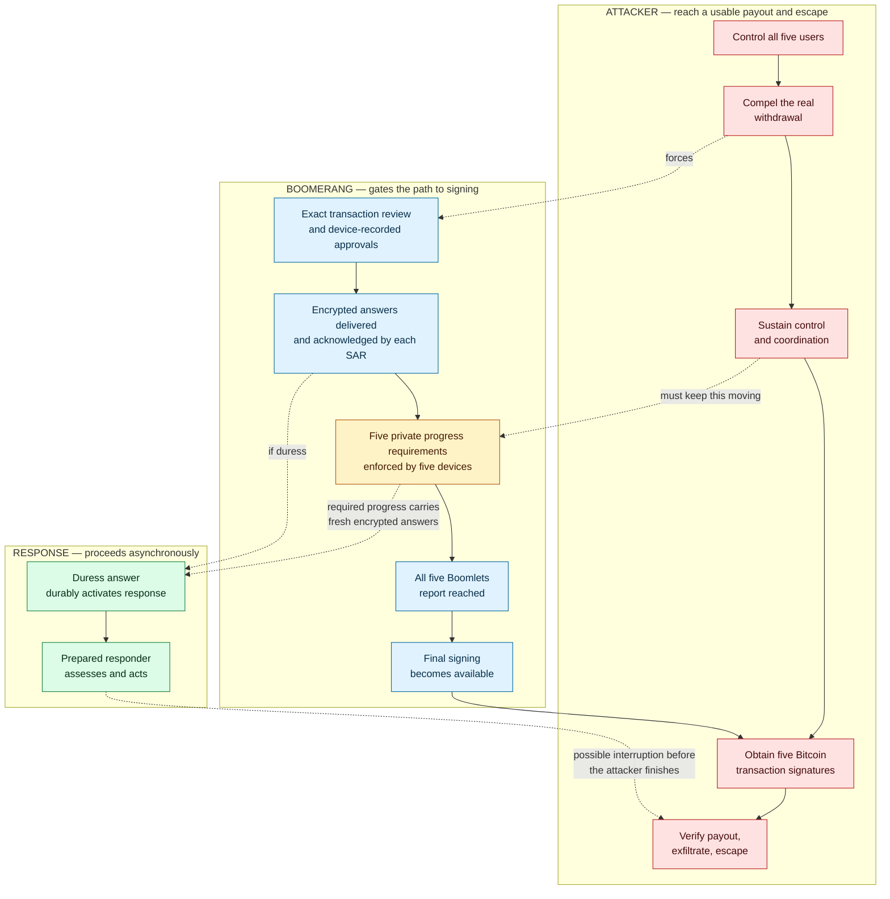
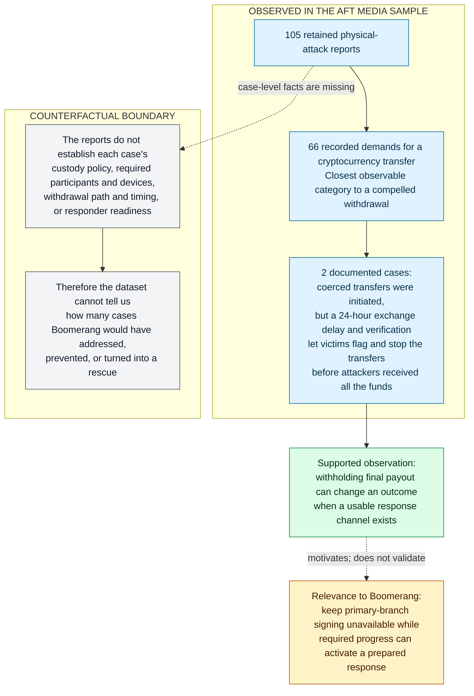
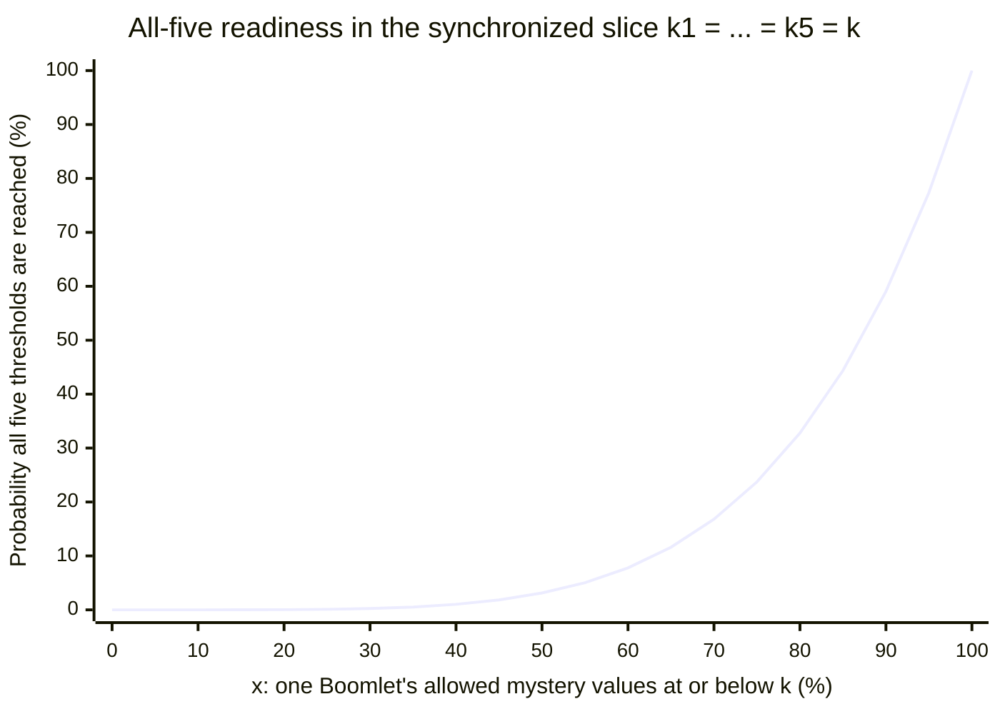
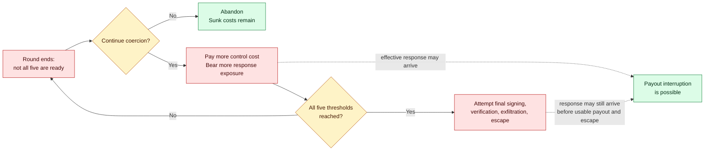
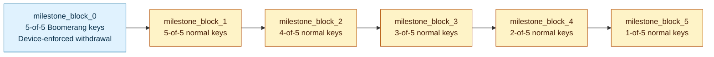

# Boomerang: coercion-aware Bitcoin cold storage

> [!WARNING]
> **Design status: not production-ready.** Boomerang is an unfinished protocol
> design. Its hardware assumptions, operating procedures, parameter choices,
> and complete implementation have not been validated for real funds.

> **Cooperation is not completion.** Boomerang's design goal is to prevent
> forced human cooperation from reliably producing a prompt, verifiable payout.

Boomerang is a Bitcoin cold-storage protocol design for one specific threat:
an attacker who shows up in person and forces the people who control the keys
to cooperate.

Five people, called custodians, protect the funds, and the earliest way to spend
requires all five to participate. Each custodian has a trusted signing device
that withholds its part of the Bitcoin signature until a required withdrawal
procedure finishes. During that procedure, every device independently draws a
fresh private requirement for how much valid progress it must observe. The
users and their computers cannot inspect that requirement in advance, choose
it, lower it, or make the device count invalid progress.

> [!IMPORTANT]
> **The central coupling.** The messages required to complete a withdrawal also
> carry each custodian's encrypted "safe" or "under duress" answer to a rescue
> service arranged in advance. Complete cooperation therefore does not reveal
> a precise finish time, and continuing the forced withdrawal may deliver a
> duress signal while signing remains unavailable. Whether the resulting
> interval is operationally long enough to matter depends on production
> parameters and response capability that have not yet been established.

## Contents

- [The attacker's job](#the-attackers-job)
- [Who is involved](#who-is-involved)
- [Boomerang in 60 seconds](#boomerang-in-60-seconds)
- [A concrete coercion scenario](#a-concrete-coercion-scenario)
- [A coerced withdrawal becomes a race](#a-coerced-withdrawal-becomes-a-race)
- [One coupled mechanism](#one-coupled-mechanism)
- [Attack economics](#attack-economics)
- [Spending paths](#spending-paths)
- [Claims and limits](#claims-and-limits)
- [Intended use](#intended-use)
- [Q&A](#qa)
- [Read next](#read-next)

## The attacker's job

Boomerang assumes an attacker strong enough to identify all five custodians,
take physical control of them and the equipment needed for a withdrawal, and
force them to make a real payment to an attacker-chosen address. Every
custodian follows the attacker's instructions correctly. No one withholds a
password, substitutes a decoy, or merely pretends to cooperate.

To steal the funds, the attacker must complete every step below.

1. Prepare a payment to an address the attacker controls and force all five
   custodians to review and confirm that exact payment.
2. Keep all five custodians and their devices available while the required
   withdrawal procedure runs.
3. Obtain all five final Bitcoin signatures. Nothing completed before this
   step can spend the funds.
4. Verify the payout, move the bitcoin beyond recovery, and escape before a
   responder can intervene.

Multisig, geographic separation, and isolated keys raise the cost of finding
and controlling every required participant. Once the attacker has assembled
all five people and their devices, an ordinary withdrawal can become a
schedulable checklist. Boomerang makes the third step wait on requirements
chosen privately by the devices. The messages needed to satisfy those
requirements also deliver encrypted answers to rescue services. The attacker
must therefore sustain control without knowing the precise signing time, while
a duress answer may already have started a response.

## Who is involved

Each custodian uses a small trusted signing device called a Boomlet. A
coordination service called the Watchtower passes withdrawal messages among
the five custodians. Each custodian also arranges a Search and Rescue service
(`SAR`) in advance to receive encrypted indications that the user is safe or
under duress and begin a prepared response when appropriate. The
[glossary](GLOSSARY.md) provides a concise index of these and other protocol
terms.

## Boomerang in 60 seconds

| What the attacker must do | What Boomerang forces | Why it matters |
| --- | --- | --- |
| Compel all five users to review and confirm the same exact unsigned transaction | Each Boomlet records an approval that advances the procedure but does not sign the Bitcoin transaction | Full human cooperation does not skip the device-enforced gates |
| Keep the withdrawal advancing | Every Boomlet independently draws a fresh private progress requirement, and only valid exchanges with the other devices count toward it | The users cannot disclose or accelerate a precise finish |
| Reach signing, obtain a verifiable payout, and escape | Required messages carry fresh encrypted indications of safety or duress, and the protocol waits for exact SAR acknowledgments | A duress answer can activate a prepared response while signing remains unavailable |

Boomerang therefore turns a forced withdrawal into a race. The attacker must
maintain control through an unpredictable wait, while the required withdrawal
traffic can start a prepared response before signing becomes available.

## A concrete coercion scenario

Suppose five custodians protect a high-value treasury in a Taproot output. The
output's earliest script branch is the five-of-five Boomerang branch: Bitcoin
consensus makes it available no earlier than block height `milestone_block_0`,
and satisfying it requires a signature under every custodian's Boomerang
public key. Each of those signatures is produced jointly by the custodian's
recoverable normal key and a share held in a small trusted device called a
Boomlet—and a Boomlet will not use its share until the withdrawal procedure
specified by the protocol has run to completion. An attacker identifies every
custodian, controls them and their equipment, dictates a destination, and
forces everyone through every step for the same attacker-chosen unsigned
transaction. No one is withholding a password or pretending to cooperate.

In a conventional five-of-five ceremony, that much cooperation may be enough
to produce Bitcoin transaction signatures. In Boomerang, the human-facing
steps come first, and none of them is a Bitcoin transaction signature. During
this withdrawal—not during setup—each user independently confirms the
identifier (`tx_id`) of the exact unsigned transaction on an air-gapped
display-and-input device called the Secure Terminal. That confirmation tells
the user's Boomlet which transaction is meant; it is not a Bitcoin transaction
signature. The Boomlet then signs a `TxApproval`: a pre-signing protocol
authorization bound to this withdrawal's
`withdrawal_id`. A `TxApproval` cannot spend funds either.

A coordination service called the Watchtower collects one valid `TxApproval`
from each of the five Boomlets. Every Boomlet verifies the ordered set of
exactly five `TxApproval` messages and independently computes the same
`approved_withdrawal_id`, the identifier that binds every later step to this
withdrawal and this approval set. One peer starts each withdrawal as its
initiator; the other four are that ceremony's non-initiators, and their
Boomlets send attestations proving that they received and verified the
complete set and agree on that identifier. The attestations are receipts, not
additional authorization.

The initial duress and commitment phase can overlap with final attestation
collection. The initiator may enter its consent response and submit its signed
`TxCommit` early. This message commits its Boomlet to the approved withdrawal
and travels with the encrypted answer intended for its SAR; the Watchtower may
stage both. The Watchtower must verify all four attestations before relaying the
initiator's encrypted answer to its SAR, acknowledging the initiator commit to
the other peers, or accepting their signed `TxCommit` messages. Each
non-initiator commits only after verifying the Watchtower-signed initiator
commit.

At its prescribed point, each user selects five countries from independently
shuffled columns derived from the protocol's fixed 193-entry consent
vocabulary. The memorized five-country set means safe; any other valid
selection means duress. Those physical selections are distinguishable to
someone watching the interaction. The narrower claim is that either valid
selection produces the same kind of protocol-visible encrypted placeholder,
which travels inside required messages to the Search and Rescue service (`SAR`)
that this user bound during setup. Each SAR must durably process and acknowledge
the exact placeholder it received; the full ordering rules are in
[DESIGN §10](DESIGN.md#10-withdrawal-in-detail). A Boomlet may enter the
withdrawal state called `DIGGING` only after it verifies the complete signed
`TxCommit` collection and its own exact SAR acknowledgment.

Entering `DIGGING` is the only moment a Boomlet draws its mystery: a fresh
private threshold, sampled from bounds fixed by the protocol profile, that
sets how many successful local counter increments this device requires before
it will sign. The users cannot read the thresholds before they are reached,
did not choose them during setup, cannot lower them, and cannot make the
counters advance early. An increment requires a valid pong tied to the active
withdrawal, advancing local chain progress, and fresh-enough current messages
from the other peers; an otherwise valid catch-up round need not increment.
Signing begins only after every Boomlet reports that its threshold has been
reached.

Full cooperation therefore gives the attacker no shortcut and no precise
finish time in advance. Waiting requires continuing control and coordination
while increasing exposure to a response.

## A coerced withdrawal becomes a race

The attacker still needs signing, a verifiable payout, exfiltration, and a
safe escape. A primary-branch withdrawal makes signing wait on acknowledged
duress traffic and five private thresholds, while a duress answer from any
user starts a response on a parallel track. The high-level map shows those
tracks. The expandable map beneath it follows one case—coercion that begins
before the withdrawal does—and exposes more of the protocol ordering.

**Visual key:** red is the attacker's path, blue is enforced protocol progress,
amber is private completion uncertainty, and green is the response path. Solid
arrows show required sequencing; dashed arrows show influence or a conditional
real-world effect.

<strong>Expand the detailed protocol-gate map</strong>

This map is explanatory rather than normative. Exact message checks and failure
behavior remain in the [specification](spec/SPEC.md).

```mermaid
flowchart TD
    A["Attacker controls all five users and forces<br/>a withdrawal to the attacker's address"] --> T["During withdrawal, every user verifies<br/>the same unsigned transaction ID"]
    T --> A1["Each Boomlet signs TxApproval<br/>Pre-signing authorization—not a Bitcoin spend signature"]
    A1 --> A2["All Boomlets verify the ordered five-TxApproval set<br/>and derive the same approved_withdrawal_id"]
    A2 --> G["Four non-initiators attest receipt and agreement<br/>The initiator TxCommit may be staged in parallel"]
    G --> I0["Watchtower verifies all four attestations,<br/>then sends the initiator placeholder to its SAR"]
    I0 --> D["SAR durably processes and exactly acknowledges it<br/>Watchtower then signs and relays the initiator commit"]
    D --> N["Each non-initiator verifies that signed commit,<br/>then sends its TxCommit and placeholder"]
    N --> K["Each remaining SAR durably processes, then<br/>acknowledges, its peer's exact placeholder"]
    K --> C["Each Boomlet verifies the complete TxCommit<br/>collection and its own exact SAR acknowledgment"]
    C --> M["Only now: each Boomlet enters DIGGING<br/>and draws a fresh private mystery"]
    M --> R["Progress rounds: each Boomlet's signed ping<br/>carries a newly encrypted placeholder"]
    R --> P["SAR must acknowledge each placeholder<br/>before its ping can enter a pong reply"]
    P --> Q{"All five thresholds reached?"}
    Q -- "No" --> R
    Q -- "Yes" --> S["Signing can begin:<br/>all five peers must sign"]
    S --> V["Attacker must still verify payout,<br/>exfiltrate, and escape"]

    I0 -. "if the initiator<br/>signaled duress" .-> X["The prepared response starts on its own track<br/>while the ceremony continues"]
    K -. "if a non-initiator<br/>signaled duress" .-> X
    P -. "if any later placeholder<br/>signals duress" .-> X
    X --> I["Possible interruption or rescue<br/>before the attacker finishes"]

    classDef attacker fill:#fee2e2,stroke:#b91c1c,color:#450a0a
    classDef protocol fill:#e0f2fe,stroke:#0369a1,color:#082f49
    classDef decision fill:#fef3c7,stroke:#b45309,color:#451a03
    classDef response fill:#dcfce7,stroke:#15803d,color:#052e16
    class A attacker
    class T,A1,A2,D,G,I0,N,K,C,M,R,P,S protocol
    class Q decision
    class X,I response
    class V attacker
```

> [!CAUTION]
> **The protocol does not create physical privacy.** The Secure Terminal is an
> air-gapped trusted display-and-input device, but a safe selection and a duress
> selection are visibly different to someone watching the user's input. No
> retained-response or delayed-relay procedure is specified. The security
> argument therefore assumes the attacker cannot observe the interaction
> closely enough to learn or dictate the safe response. A coercer who learns a
> user's safe answer can force that answer at later checks; the deniability
> claim covers protocol traffic, not observed input. Recurring checks regain
> fresh value where coercion, or a new threat, begins mid-ceremony.

> [!NOTE]
> **A SAR acknowledgment is not a rescue guarantee.** It proves exact protocol
> delivery and durable activation when duress was signaled—not timely, lawful,
> effective, correctly directed, or safe intervention. The responder may act
> while the attacker is still waiting, but the protocol cannot guarantee the
> result.

> [!NOTE]
> **Boomerang defines no special cancellation path.** In a withdrawal approved
> in good faith, the peers might discover during `DIGGING` that the destination
> is controlled by an attacker. The practical opportunity is simply that the
> transaction remains unsigned and unbroadcast: any required peer can stop
> participating or explicitly abandon the ceremony, after which the group can
> start a fresh withdrawal to a correct destination. This cannot reverse a
> transaction that has already been signed and broadcast.

## One coupled mechanism

> [!IMPORTANT]
> **Progress dependency:** initial placeholder → exact SAR acknowledgment →
> `DIGGING`; then signed ping + freshly encrypted placeholder → exact SAR
> acknowledgment → eligibility for pong → possible local counter increment.
> Removing the duress-delivery path also removes required withdrawal progress.

A delay alone merely tells an attacker how long to wait. A silent alarm alone
may be left out of the very path the attacker needs. Boomerang couples them so
that neither can be separated from required progress. A Boomlet must verify
its exact initial SAR acknowledgment before entering `DIGGING`. From then on,
each Boomlet repeatedly sends a signed progress message called a ping, and the
Watchtower replies to rounds of pings with pongs; a device's counter can
advance only on a valid pong. Every ping carries a freshly encrypted
placeholder, and the Watchtower must obtain SAR's exact acknowledgment of
that placeholder before the ping may be used in a pong. Some rounds also
present the user with a fresh duress challenge. The attacker cannot reach
signing without sustaining the same traffic that carries and confirms
concealed duress state.

Valid safe and duress handling has the same protocol-visible response shape,
routing, fixed release deadline, durable-write path, retry behavior, and
externally visible failure behavior, so the answer stays concealed on that
surface. The claim is limited to protocol traffic; physical observation of
the user and compromised equipment are separate threats.

## Attack economics

Physical attacks on bitcoin holders are documented, not hypothetical. A
[2024 peer-reviewed AFT study](https://drops.dagstuhl.de/entities/document/10.4230/LIPIcs.AFT.2024.24)
retained 105 news-reported incidents from 2014 through October 2023. Sixty-six
recorded demands were for cryptocurrency transfers—including 26 specifically
for Bitcoin—30 were for keys or devices, and nine were unspecified. Seventy
attacks were reported successful, 29 failed, and six had no stated outcome.

### What the attack evidence does—and does not—show

This is an evidence map, not an applicability funnel. It connects reported
facts to the limited proposition relevant to Boomerang while keeping the
missing counterfactual evidence visible.

**Visual key:** blue boxes are reported observations, green is the limited
empirical conclusion, amber is the design relevance inferred from it, and gray
marks facts the reports do not supply. The dotted connectors are not measured
effects.

| Exact AFT evidence snapshot | Reported cases |
| --- | ---: |
| Retained incidents | **105** |
| Demanded cryptocurrency transfer | **66** |
| Demanded keys or a device | **30** |
| Demand unspecified | **9** |
| Reported successful | **70** |
| Reported failed | **29** |
| Outcome unstated | **6** |

> [!NOTE]
> **Evidence boundary:** these are counts in a selected, underreported media
> sample—not population rates, an estimate of personal victimization risk, or
> a Boomerang effectiveness rate.

A later
[2026 TRM Labs/Metropolitan Police review](https://www.trmlabs.com/reports-and-whitepapers/wrench-attacks-crypto-enabled-violent-targeting)
describes 17 reported London offences and an approximate mean cryptoasset loss
of £660,000 per offence; it is operational and commercial context, not official
population statistics or protocol evidence.

> [!IMPORTANT]
> **Observed pre-payout interruption:** in two AFT cases, attackers coerced
> victims into initiating transfers but failed to receive all the funds because
> an exchange's 24-hour delay and verification feature let the victims flag and
> stop them. Those cases did not test Boomerang, and stopping a transfer is not
> the same as rescuing a person. They are narrower evidence that withholding
> final payout while a response channel remains usable can change an outcome.

The datasets and their limits are in the
[coercion-economics analysis](security_models/coercion_economics.md).

No historical case shows Boomerang working—the sources record neither the
custody setups nor the responder readiness that a real counterfactual would
need, and street robbery, hot wallets, compromised hardware, and harm-focused
attackers may receive little or no benefit. What Boomerang adds to the
picture can, however, be plotted. During a withdrawal, each of the five
devices privately draws how many successful local counter increments it will
require, from a range fixed by the protocol profile; users and hosts cannot
read a threshold before it is reached or lower it. The chart uses a simplified
synchronized slice in which the five independently maintained counters happen
to equal the same hypothetical value `k`. It does not posit one shared protocol
counter.

> [!IMPORTANT]
> **How to read the readiness curve**
>
> - **Horizontal axis (`x`):** the percentage of one Boomlet's allowed mystery
>   values at or below hypothetical local counter value `k`.
> - **Vertical axis:** the probability that all five independently drawn
>   thresholds have been reached in the special slice where all five local
>   counters equal `k`.
> - **Not shown:** elapsed time, percent of the withdrawal completed, or a claim
>   that real counters remain synchronized.

| `x`: one Boomlet's allowed values at or below `k` | One Boomlet ready | All five ready (`x^5`) |
| ---: | ---: | ---: |
| 0% | 0% | 0% |
| 25% | 25% | 0.10% |
| 50% | 50% | 3.13% |
| 75% | 75% | 23.73% |
| 90% | 90% | 59.05% |
| 95% | 95% | 77.38% |
| 100% | 100% | 100% |

When `x = 50%`, half of one Boomlet's allowed threshold values are at or below
its counter `k`. That Boomlet is 50% likely to be ready, but all five are ready
with probability `0.5^5 = 3.125%`, about 1 in 32. The smooth line is a
normalized guide sampled every five percentage points; a concrete profile has
integer thresholds and therefore a discrete staircase. When actual local
counters differ, all-five readiness is the product of the five cumulative
probabilities at their respective counters. Neither axis is elapsed time or
percent complete. The formal definition, derivation, and caveats are in
[DESIGN §12](DESIGN.md#12-attack-economics-and-security-argument) and
[coercion economics §4](security_models/coercion_economics.md#4-protocol-derived-completion-distribution).

The economic logic is simple: expected payout must exceed the cost of
sustained control plus the expected loss from disruption. Boomerang pushes
completion toward the far end of the range and makes required progress carry
a response opportunity. The attacker's continuation decision repeats after
every incomplete round:

No public dataset currently supplies defensible universal values for attacker
cost or SAR effectiveness, so the project does not claim an empirical
break-even balance. The formulas, observed data, and sensitivity boundaries are
in the
[detailed game-theoretic economics analysis](security_models/coercion_economics.md).

## Spending paths

The current profile has exactly five peers and two on-chain regimes (the full
construction is in [DESIGN §8](DESIGN.md#8-on-chain-construction)):

- The primary five-of-five Boomerang branch becomes available at
  `milestone_block_0`. "Primary" describes branch order—this is the earliest
  branch in the script tree—not a preference among paths. Each peer's signing
  key combines a recoverable normal key with a Boomlet-held share. The
  Boomlet's material is host-inaccessible, although the authorized setup flow
  can export it in an authenticated, target-bound envelope to a designated
  backup device, the Boomletwo.
- Deterministic fallback begins at `milestone_block_1` with a five-of-five
  normal-key branch. Later milestones reduce that threshold from four to one.
  This preserves recoverability but restores a timetable an attacker can plan
  around.

The arrows show increasing block-height milestones, not equal time intervals.
Blue is the Boomerang branch; amber marks deterministic normal-key fallback.

Bitcoin consensus enforces the Taproot policy and its absolute timelocks.
Trusted hardware and the off-chain state machine enforce mystery generation,
progress, and duress acknowledgments. Operators must roll funds into a fresh
setup before fallback becomes an attractive predictable target.

## Claims and limits

Boomerang targets a cost-sensitive, payout-seeking attacker who needs a valid,
verifiable transfer and a viable exit.

| The design argues | The design does **not** claim |
| --- | --- |
| Compelled cooperation can be made insufficient for a reliably prompt payout | People or bitcoin become “duress-proof” |
| Continuing can impose additional cost and response exposure | Every attacker will be deterred or abandon the attack |
| Required progress can create a response opportunity | Rescue, recovery, timely intervention, or human safety is guaranteed |
| The mechanism can matter against a cost-sensitive, payout-seeking attacker | The argument covers harm-focused, state, ideological, exceptionally resourced, or indefinitely patient attackers |

> [!CAUTION]
> **More time can mean more harm.** Longer coercion can increase injury,
> retaliation, trauma, and danger to victims or responders. Time has value only
> when a credible, prepared response can use it without making the situation
> worse.

Five-of-five prevents a bypassing subset from completing the primary branch,
but any one peer or dependency can stall it. Waiting for fallback, starting too
late, losing devices, or deliberate non-cooperation can force deterministic
recovery. Those are central limitations.

## Intended use

Boomerang is intended for high-value, low-velocity bitcoin under a threat model
that explicitly includes planned physical coercion. Its ceremony is
disproportionate for routine spending. Any eventual deployment would require
hardened devices, trained participants, tested recovery procedures, trustworthy
services, jurisdiction-specific response planning, and independent review.

| Strongest intended fit | Poor fit or outside the claim |
| --- | --- |
| High-value, low-velocity treasury funds | Routine or high-frequency spending |
| A custody policy designed around planned physical coercion | Immediately spendable hot-wallet funds |
| Five participants able to sustain a long ceremony | Operations that cannot tolerate one participant or service stalling progress |
| A credible, rehearsed, jurisdiction-aware response plan | A deployment with no prepared responder able to use the interval |

## Q&A

Quick answers for a first read. Each points into the deeper documents.

<strong>Protocol mechanics</strong> — attacker objective, private thresholds, duress delivery, and SAR acknowledgment

**What must a payout-seeking attacker actually complete?**
A valid, verifiable transfer plus a viable exit: compel every user through
transaction review and the pre-signing protocol steps, keep the withdrawal
ceremony progressing to completion, obtain the final Bitcoin signatures,
verify the payment, move the bitcoin beyond recovery, and escape. Learning a
seed phrase alone does not finish the job against the primary branch.

**What can fully cooperating users still not accelerate?**
The five private thresholds. Each Boomlet draws its mystery only on entering
`DIGGING`, from bounds fixed by the protocol profile rather than chosen at
setup. Its mystery counts successful local increments; each increment requires
a valid pong for the active withdrawal, advancing local chain progress, and
fresh-enough current messages from the other peers. The users and hosts cannot
read a threshold before it is reached, lower it, or command an
increment—willingly or under coercion.

**How do the required withdrawal messages carry duress state?**
Each peer's signed `TxCommit` travels with an encrypted placeholder produced
from that user's duress answer, and every later ping carries a freshly
encrypted placeholder. SAR must acknowledge each peer's initial placeholder
before that peer's Boomlet may enter `DIGGING`, and must acknowledge every
ping's placeholder before that ping may be used in a pong—so the alarm
channel cannot be dropped without halting required progress.

**What does a SAR acknowledgment prove—and not prove?**
It proves exact delivery and durable processing of the placeholder, including
durable activation of response state when duress is signaled. It does
not prove timely, lawful, effective, correctly directed, or safe
intervention.

<strong>Economics and spending paths</strong> — attacker cost, graph axes, protocol stages, and fallback

**Why can uncertainty raise the attacker's cost and exposure?**
The attacker must decide, round after round, whether to keep paying for
control without knowing when completion becomes possible. Readiness requires
the maximum of five private draws, which concentrates completion toward the
far end of the allowed range, and every continued round extends exposure to a
response. The quantitative treatment is in the
[coercion-economics analysis](security_models/coercion_economics.md).

**What separates transaction review, `TxApproval`, `TxCommit`, `DIGGING`, and
final signing?**
Transaction review is a user independently confirming the unsigned
transaction's `tx_id` on the Secure Terminal during a withdrawal.
`TxApproval` is the Boomlet-signed pre-signing protocol authorization that
follows, bound to the withdrawal's `withdrawal_id`. `TxCommit` is the
Boomlet-signed commitment to the unanimously approved withdrawal, carried
with the initial duress placeholder. `DIGGING` is the progress state entered
only after the complete signed `TxCommit` collection and the device's own
exact SAR acknowledgment verify; the mystery is drawn there. Final Bitcoin
signing happens last, only after all five devices report their thresholds
reached. None of the earlier steps is a Bitcoin transaction signature; only
the final step produces one.

**What do the axes of the readiness graph show?**
The graph is a simplified slice in which all five independently maintained
local counters happen to equal `k`. The x-axis is the share of one Boomlet's
allowed mystery values at or below `k`; the y-axis is the probability that all
five devices are ready, `x^5`, under independent uniform draws. A concrete
integer profile produces a staircase, not the smooth normalized guide. It is a
counter-state distribution, not elapsed time or percent complete. The formal
definition and derivation are in
[DESIGN §12](DESIGN.md#12-attack-economics-and-security-argument).

**Can a subset of peers take the funds?**
Not through the primary Boomerang branch, which requires signatures under all
five Boomerang keys. The fallback branches change the required set on the
agreed schedule: five normal keys from `milestone_block_1`, four from
`milestone_block_2`, and so on down to one from `milestone_block_5`. Once a
fallback height passes, that branch needs only its stated number of normal
keys. This is the recoverability trade the design makes, and it is why
operators are expected to roll funds into a fresh setup before fallback
becomes an attractive predictable target; see the
[forced-determinism analysis](security_models/forced_determinism.md).

<strong>Limits and deployment</strong> — excluded attackers, failure boundaries, SAR reality, and design status

**Does the argument cover state-level or harm-motivated attackers?**
No. Boomerang targets a cost-sensitive, payout-seeking attacker who needs a
valid, verifiable transfer and a viable exit. Attackers primarily motivated
by harm, state or ideological actors willing to absorb exceptional cost, and
indefinitely patient attackers fall outside the deterrence claim.

**What else limits the claim?**
Five-of-five prevents a bypassing subset but lets any one peer or required
dependency stall the primary ceremony, and WT or SAR unavailability stalls it
too—failure does not authorize fallback early. A compromised Boomlet can
defeat that device's off-chain enforcement. A compromised Secure Terminal can
misdisplay a transaction identifier or alter duress input, but cannot by itself
advance a Boomlet counter or create the Boomlet signing share. The deniability
claim covers protocol traffic only, not physical observation,
learned consent responses, or a responder revealing the signal. Longer
coercion can increase human harm; time has value only when a credible,
prepared response can use it. The full boundary catalog is in
[DESIGN §14](DESIGN.md#14-failure-and-human-safety-boundaries).

**Do Search and Rescue services exist today?**
Not as an established service category. The specification defines the message
contract a SAR must satisfy and deliberately does not define its legal
authority or physical-response procedures. Whether a real institution can
operate the role—lawfully, competently, and per jurisdiction—is an open
deployment question;
[coercion economics §7](security_models/coercion_economics.md#7-calibration-and-evaluation-requirements)
lists the response-exercise evidence a deployment would need.

**Is any of this production-ready?**
No. Hardware assumptions, parameter values, wire vectors, service failover,
device-lifecycle procedures, and response operations remain open, and the
assumption that they can all be supplied without changing the security model
is itself unproven. The [specification](spec/SPEC.md) is a draft;
[DESIGN §16](DESIGN.md#16-design-status-and-verification-path) describes the
verification path.

## Read next

| Document | Use it for |
| --- | --- |
| [`DESIGN.md`](DESIGN.md) | The complete conceptual, economic, and security argument |
| [`spec/SPEC.md`](spec/SPEC.md) | Normative protocol behavior: actors, states, messages, cryptography, and failure rules |
| [`security_models/`](security_models/README.md) | Threat model, assumptions, attack trees, risks, and unresolved gaps |
| [`security_models/coercion_economics.md`](security_models/coercion_economics.md) | Detailed quantitative model, observed evidence, and calibration boundaries |
| [`GLOSSARY.md`](GLOSSARY.md) | Concise lookup index for actors, keys, states, and protocol terms |
| [`adr/`](adr/README.md) | Accepted design decisions and their rationale |

Subsystem material covers [setup](setup/README.md),
[withdrawal](withdrawal/README.md), [duress protection](duress_protection/README.md),
and the [Secure Terminal](secure_terminal/README.md). The specification controls
where explanatory documents differ.

### Suggested reading paths

| Path | Suggested route |
| --- | --- |
| **Orientation · 20–25 minutes** | This README, then the [glossary](GLOSSARY.md) entries for Boomlet, mystery, Watchtower, SAR, and deterministic fallback |
| **Technical overview · about 1 hour** | [`DESIGN.md`](DESIGN.md) end to end, then the specification's protocol profile, goals and non-goals, architecture, descriptor, withdrawal protocol, and failure-behavior sections |
| **Deep review** | [`spec/SPEC.md`](spec/SPEC.md) in full, then the [threat model](security_models/README.md), [assumption register](security_models/assumption_register.md), [forced-determinism analysis](security_models/forced_determinism.md), [coercion economics](security_models/coercion_economics.md), and the [ADRs](adr/README.md) |
| **By contribution angle** | Protocol reviewers: [`spec/SPEC.md`](spec/SPEC.md). Threat modelers: [`security_models/`](security_models/README.md). Hardware reviewers: [Secure Terminal](secure_terminal/README.md), [duress protection](duress_protection/README.md), and the specification's Boomlet sections. Usability reviewers: [setup](setup/README.md) and [withdrawal](withdrawal/README.md) ceremonies |
