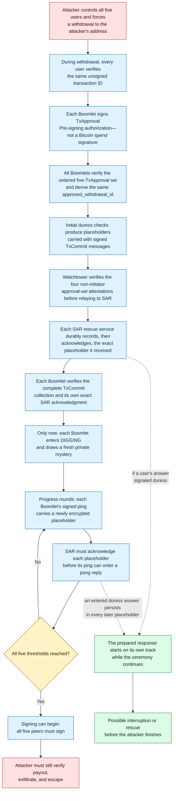
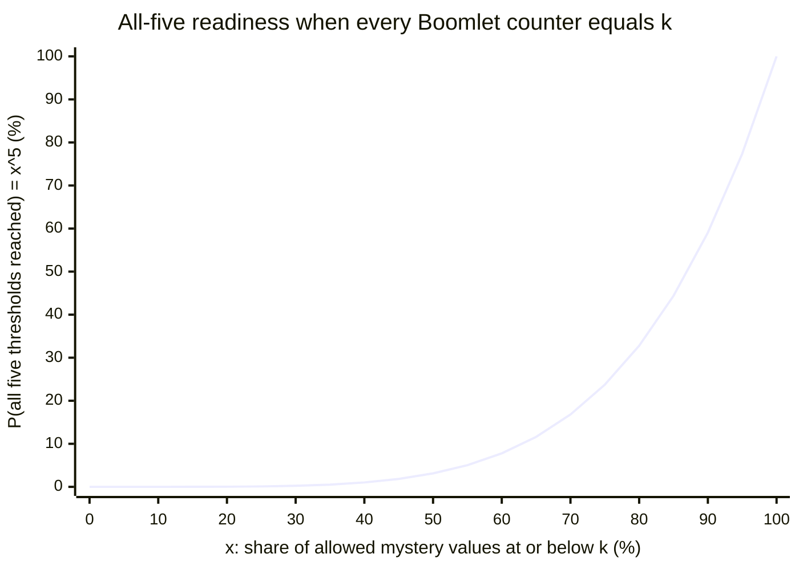

# Boomerang

> **Not production-ready.** Boomerang is an unfinished protocol design. Its
> hardware assumptions, operating procedures, parameter choices, and complete
> implementation have not been validated for real funds.

Boomerang is a Bitcoin cold-storage protocol design for one specific threat:
an attacker who shows up in person and forces the people who control the keys
to cooperate.

Five custodians hold funds behind a Taproot policy whose earliest spending
branch requires all five signatures. Each signature needs a trusted hardware
device, and each device withholds its part until an off-chain withdrawal
procedure has run for a bounded but secret number of progress rounds—a
threshold every device draws privately, and one that nobody, willing or
coerced, can learn, choose, or accelerate.

The same messages that drive that procedure silently carry each custodian's
"safe" or "under duress" answer to a rescue service arranged in advance. An
attacker who compels complete cooperation therefore gets neither a prompt
payout nor a finish time, and the forced progress itself may already have
delivered a duress signal to a prepared responder.

## Contents

- [The attacker's job](#the-attackers-job)
- [A concrete coercion scenario](#a-concrete-coercion-scenario)
- [A coerced withdrawal becomes a race](#a-coerced-withdrawal-becomes-a-race)
- [One coupled mechanism](#one-coupled-mechanism)
- [Attack economics](#attack-economics)
- [Spending paths](#spending-paths)
- [Claims and limits](#claims-and-limits)
- [Intended use](#intended-use)
- [Q&A](#qa)
- [Read next](#read-next)

## The attacker's job

Boomerang addresses a specific cold-storage failure mode: an attacker who can
force the necessary people to cooperate. Such an attacker is not merely trying
to learn a seed phrase. Their actual objective is to push the required users
through transaction review and, once the wallet permits it, final Bitcoin
signing; then verify the payment, move the bitcoin beyond recovery, and escape
before anyone can stop them.

Multisig, geographic separation, and isolated keys can make that job much
harder. But once a sufficiently informed attacker controls all required people
and devices, an ordinary withdrawal may still become a schedulable checklist.
Boomerang changes the operation the attacker must finish.

## A concrete coercion scenario

Suppose five custodians protect a high-value treasury in a Taproot output. The
output's earliest script branch is the five-of-five Boomerang branch: Bitcoin
consensus makes it available no earlier than block height `milestone_block_0`,
and satisfying it requires a signature under every custodian's Boomerang
public key. Each of those signatures is produced jointly by the custodian's
recoverable normal key and a share held in a small trusted device called a
Boomlet—and a Boomlet will not use its share until the withdrawal procedure
specified by the protocol has run to completion. An attacker identifies every
custodian, controls them and their equipment, dictates a destination, and
forces everyone through every step for the same attacker-chosen unsigned
transaction. No one is withholding a password or pretending to cooperate.

In a conventional five-of-five ceremony, that much cooperation may be enough
to produce Bitcoin transaction signatures. In Boomerang, the human-facing
steps come first, and none of them is a signature. During this withdrawal—not
during setup—each user independently confirms the identifier (`tx_id`) of the
exact unsigned transaction on an air-gapped display-and-input device called
the Secure Terminal. That confirmation tells the user's Boomlet which transaction
is meant; it is not a Bitcoin transaction signature. The Boomlet then signs a
`TxApproval`: a pre-signing protocol authorization bound to this withdrawal's
`withdrawal_id`. A `TxApproval` cannot spend funds either.

A coordination service called the Watchtower collects one valid `TxApproval`
from each of the five Boomlets. Every Boomlet verifies the ordered set of
exactly five `TxApproval` messages and independently computes the same
`approved_withdrawal_id`, the identifier that binds every later step to this
withdrawal and this approval set. One peer starts each withdrawal as its
initiator; the other four are that ceremony's non-initiators, and their
Boomlets send attestations proving that they received and verified the
complete set and agree on that identifier. The attestations are receipts, not
additional authorization.

Only now does the covert layer begin. Each user privately answers a duress
check on the Secure Terminal by picking five countries from shuffled lists.
Picking the five-country set memorized during setup means safe; any other
valid selection silently means duress. Either answer produces the same kind
of encrypted placeholder, which travels inside required protocol messages to
the Search and Rescue service (`SAR`) that this user bound during setup. The
Watchtower must verify all four attestations before relaying the initiator's
placeholder to its SAR or accepting the other peers' signed `TxCommit`
commitment messages, and each SAR must durably process and acknowledge the
exact placeholder it received; the full ordering rules are in
[DESIGN §10](DESIGN.md#10-withdrawal-in-detail). A Boomlet may enter the
withdrawal state called `DIGGING` only after it verifies the complete signed
`TxCommit` collection and its own exact SAR acknowledgment.

Entering `DIGGING` is the only moment a Boomlet draws its mystery: a fresh
private threshold, sampled from bounds fixed by the protocol profile, that
sets how many valid progress rounds this device requires before it will sign.
The users cannot read the thresholds, did not choose them during setup,
cannot lower them, and cannot make the counters advance early. A counter
advances only through valid rounds tied to the active withdrawal, current
chain progress, and the other peers' current messages. Signing begins only
after every Boomlet reports that its threshold has been reached.

Full cooperation therefore gives the attacker no shortcut and no precise
finish time. Waiting requires continuing control and coordination while
increasing exposure to a response.

## A coerced withdrawal becomes a race

The attacker still needs signing, a verifiable payout, exfiltration, and a
safe escape. A primary-branch withdrawal makes signing wait on acknowledged
duress traffic and five private thresholds, while a duress answer from any
user starts a response on a parallel track. The diagram follows one case—coercion
that begins before the withdrawal does; other starting points are discussed
below it.

Two honesty notes about this picture. First, duress entry is designed to be
a discreet act, not a public one: the Secure Terminal is a battery-powered,
air-gapped device that communicates only by QR codes, keeps the challenge
and its encrypted answer in its own memory, and has a display sized to be
covered easily—so a user is expected to answer away from watching eyes and
relay the response after returning. What the design cannot do is create that
privacy. A coercer who does watch a user's first answer can force the same
five countries at every later check, collapsing each subsequent check to
whatever the first answer already carried; the deniability claim covers
protocol traffic, not observed input. Recurring checks regain fresh value
where coercion, or a new threat, begins mid-ceremony. Second, the responder
may act while the attacker is still waiting, but an acknowledgment is not a
rescue guarantee: it proves exact protocol delivery and durable activation
when duress was signaled—not timely, lawful, effective, correctly directed,
or safe intervention.

A different case starts with no attacker present at all: the five peers
approve a withdrawal in good faith and only learn during the digging phase
that the approved destination is controlled by an attacker—for example, the
address is revealed as compromised only after approval. The same machinery
that delays a coerced payout then works as a cancellation window. Nothing
spends until every device finishes and all five peers sign, so any single
peer who stops participating or explicitly abandons the ceremony prevents
the payout, and the group can start a fresh withdrawal to a correct
destination.

## One coupled mechanism

A delay alone merely tells an attacker how long to wait. A silent alarm alone
may be left out of the very path the attacker needs. Boomerang couples them so
that neither can be separated from required progress. A Boomlet must verify
its exact initial SAR acknowledgment before entering `DIGGING`. From then on,
each Boomlet repeatedly sends a signed progress message called a ping, and the
Watchtower replies to rounds of pings with pongs; a device's counter can
advance only on a valid pong. Every ping carries a freshly encrypted
placeholder, and the Watchtower must obtain SAR's exact acknowledgment of
that placeholder before the ping may be used in a pong. Some rounds also
present the user with a fresh duress challenge. The attacker cannot reach
signing without sustaining the same traffic that carries and confirms
concealed duress state.

Valid safe and duress handling has the same protocol-visible response shape,
routing, fixed release deadline, durable-write path, retry behavior, and
externally visible failure behavior, so the answer stays concealed on that
surface. The claim is limited to protocol traffic; physical observation of
the user and compromised equipment are separate threats.

## Attack economics

Physical attacks on bitcoin holders are documented, not hypothetical. A
[2024 peer-reviewed AFT study](https://drops.dagstuhl.de/entities/document/10.4230/LIPIcs.AFT.2024.24)
of news-reported "wrench attacks" found that most recorded demands were for a
cryptocurrency transfer or for the means of access, and a later
[2026 TRM Labs/Metropolitan Police review](https://www.trmlabs.com/reports-and-whitepapers/wrench-attacks-crypto-enabled-violent-targeting)
of London cases reports material losses per offence and identifies
coordinated action within hours as the primary recovery mechanism. Most
relevant here: in two observed cases, attackers coerced victims into
initiating transfers but failed to fully receive the funds, because an
exchange's 24-hour delay and verification feature let the victims flag and
stop them. Those cases did not test Boomerang, and stopping a transfer is not
the same as rescuing a person—but they are observed evidence that withholding
final payout while a response channel remains usable can change the outcome.
The datasets, their exact counts, and their limits are in the
[coercion-economics analysis](security_models/coercion_economics.md).

No historical case shows Boomerang working—the sources record neither the
custody setups nor the responder readiness that a real counterfactual would
need, and street robbery, hot wallets, compromised hardware, and harm-focused
attackers may receive little or no benefit. What Boomerang adds to the
picture can, however, be plotted. During a withdrawal, each of the five
devices privately draws how many valid progress rounds it will require, from
a range fixed by the protocol profile; nobody can read or lower these
thresholds. The chart shows the chance that **all five** devices are ready as
a shared progress counter climbs through that range:

When the counter has passed half of the possible threshold values, each
device on its own is 50% likely to be ready—but all five together only 3.1%,
about 1 in 32. Completion therefore piles up near the top of the range. This
is a distribution over counter states, not a calendar forecast; the formal
definition of the axes, the full derivation, and every caveat are in
[DESIGN §12](DESIGN.md#12-attack-economics-and-security-argument) and
[coercion economics §4](security_models/coercion_economics.md#4-protocol-derived-completion-distribution).

The economic logic is simple: expected payout must exceed the cost of
sustained control plus the expected loss from disruption. Boomerang pushes
completion toward the far end of the range and makes required progress carry
a response opportunity. No public dataset currently supplies defensible
universal values for attacker cost or SAR effectiveness, so the project does
not claim an empirical break-even balance. The formulas, observed data, and
sensitivity boundaries are in the
[detailed game-theoretic economics analysis](security_models/coercion_economics.md).

## Spending paths

The current profile has exactly five peers and two on-chain regimes (the full
construction is in [DESIGN §8](DESIGN.md#8-on-chain-construction)):

- The primary five-of-five Boomerang branch becomes available at
  `milestone_block_0`. "Primary" describes branch order—this is the earliest
  branch in the script tree—not a preference among paths. Each peer's signing
  key combines a recoverable normal key with a Boomlet-held share. The
  Boomlet's material is host-inaccessible, although the authorized setup flow
  can export it in an authenticated, target-bound envelope to a designated
  backup device, the Boomletwo.
- Deterministic fallback begins at `milestone_block_1` with a five-of-five
  normal-key branch. Later milestones reduce that threshold from four to one.
  This preserves recoverability but restores a timetable an attacker can plan
  around.

Bitcoin consensus enforces the Taproot policy and its absolute timelocks.
Trusted hardware and the off-chain state machine enforce mystery generation,
progress, and duress acknowledgments. Operators must roll funds into a fresh
setup before fallback becomes an attractive predictable target.

## Claims and limits

Boomerang targets a cost-sensitive, payout-seeking attacker who needs a valid,
verifiable transfer and a viable exit. It aims to make compelled cooperation
insufficient for a reliably prompt payout, raise the burden of continuing, and
create a response opportunity.

It does not make people or bitcoin "duress-proof." It does not guarantee
deterrence, abandonment, rescue, recovery, or human safety. Its argument does
not cover an attacker primarily motivated by harm, a state or ideological
actor willing to absorb exceptional cost, or an indefinitely patient attacker.
Longer coercion can increase human harm; time has value only when a credible,
prepared response can use it.

Five-of-five prevents a bypassing subset from completing the primary branch,
but any one peer or dependency can stall it. Waiting for fallback, starting too
late, losing devices, or deliberate non-cooperation can force deterministic
recovery. Those are central limitations.

## Intended use

Boomerang is intended for high-value, low-velocity bitcoin under a threat model
that explicitly includes planned physical coercion. Its ceremony is
disproportionate for routine spending. Any eventual deployment would require
hardened devices, trained participants, tested recovery procedures, trustworthy
services, jurisdiction-specific response planning, and independent review.

## Q&A

Quick answers for a first read. Each points into the deeper documents.

**What must a payout-seeking attacker actually complete?**
A valid, verifiable transfer plus a viable exit: compel every user through
transaction review and the pre-signing protocol steps, keep the withdrawal
ceremony progressing to completion, obtain the final Bitcoin signatures,
verify the payment, move the bitcoin beyond recovery, and escape. Learning a
seed phrase alone does not finish the job against the primary branch.

**What can fully cooperating users still not accelerate?**
The five private thresholds. Each Boomlet draws its mystery only on entering
`DIGGING`, from bounds fixed by the protocol profile rather than chosen at
setup, and its counter advances only through valid rounds tied to the active
withdrawal, chain progress, and the other peers' current messages. Nobody can
read a threshold in advance, lower it, or command an increment—willingly or
under coercion.

**How do the required withdrawal messages carry duress state?**
Each peer's signed `TxCommit` travels with an encrypted placeholder produced
from that user's duress answer, and every later ping carries a freshly
encrypted placeholder. SAR must acknowledge each peer's initial placeholder
before that peer's Boomlet may enter `DIGGING`, and must acknowledge every
ping's placeholder before that ping may be used in a pong—so the alarm
channel cannot be dropped without halting required progress.

**What does a SAR acknowledgment prove—and not prove?**
It proves exact delivery and durable processing of the placeholder, including
durable activation of response state when duress is signaled. It does
not prove timely, lawful, effective, correctly directed, or safe
intervention.

**Why can uncertainty raise the attacker's cost and exposure?**
The attacker must decide, round after round, whether to keep paying for
control without knowing when completion becomes possible. Readiness requires
the maximum of five private draws, which concentrates completion toward the
far end of the allowed range, and every continued round extends exposure to a
response. The quantitative treatment is in the
[coercion-economics analysis](security_models/coercion_economics.md).

**What separates transaction review, `TxApproval`, `TxCommit`, `DIGGING`, and
final signing?**
Transaction review is a user independently confirming the unsigned
transaction's `tx_id` on the Secure Terminal during a withdrawal.
`TxApproval` is the Boomlet-signed pre-signing protocol authorization that
follows, bound to the withdrawal's `withdrawal_id`. `TxCommit` is the
Boomlet-signed commitment to the unanimously approved withdrawal, carried
with the initial duress placeholder. `DIGGING` is the progress state entered
only after the complete signed `TxCommit` collection and the device's own
exact SAR acknowledgment verify; the mystery is drawn there. Final Bitcoin
signing happens last, only after all five devices report their thresholds
reached. None of the earlier steps is a Bitcoin transaction signature; only
the final step produces one.

**What do the axes of the readiness graph show?**
The x-axis is the share of allowed mystery values at or below the common
counter value `k`; the y-axis is the probability that all five devices are
ready at that point, which is `x^5` under independent uniform draws. It is a
counter-state distribution, not elapsed time. The formal definition and
derivation are in
[DESIGN §12](DESIGN.md#12-attack-economics-and-security-argument).

**Can a subset of peers take the funds?**
Not through the primary Boomerang branch, which requires signatures under all
five Boomerang keys. The fallback branches change the required set on the
agreed schedule: five normal keys from `milestone_block_1`, four from
`milestone_block_2`, and so on down to one from `milestone_block_5`. Once a
fallback height passes, that branch needs only its stated number of normal
keys. This is the recoverability trade the design makes, and it is why
operators are expected to roll funds into a fresh setup before fallback
becomes an attractive predictable target; see the
[forced-determinism analysis](security_models/forced_determinism.md).

**Does the argument cover state-level or harm-motivated attackers?**
No. Boomerang targets a cost-sensitive, payout-seeking attacker who needs a
valid, verifiable transfer and a viable exit. Attackers primarily motivated
by harm, state or ideological actors willing to absorb exceptional cost, and
indefinitely patient attackers fall outside the deterrence claim.

**What else limits the claim?**
Five-of-five prevents a bypassing subset but lets any one peer or required
dependency stall the primary ceremony, and WT or SAR unavailability stalls it
too—failure does not authorize fallback early. A compromised Boomlet or
Secure Terminal can defeat the off-chain enforcement entirely. The
deniability claim covers protocol traffic only, not physical observation,
learned consent responses, or a responder revealing the signal. Longer
coercion can increase human harm; time has value only when a credible,
prepared response can use it. The full boundary catalog is in
[DESIGN §14](DESIGN.md#14-failure-and-human-safety-boundaries).

**Do Search and Rescue services exist today?**
Not as an established service category. The specification defines the message
contract a SAR must satisfy and deliberately does not define its legal
authority or physical-response procedures. Whether a real institution can
operate the role—lawfully, competently, and per jurisdiction—is an open
deployment question;
[coercion economics §7](security_models/coercion_economics.md#7-calibration-and-evaluation-requirements)
lists the response-exercise evidence a deployment would need.

**Is any of this production-ready?**
No. Hardware assumptions, parameter values, wire vectors, service failover,
device-lifecycle procedures, and response operations remain open, and the
assumption that they can all be supplied without changing the security model
is itself unproven. The [specification](spec/SPEC.md) is a research draft;
[DESIGN §16](DESIGN.md#16-design-status-and-verification-path) describes the
verification path.

## Read next

- [`DESIGN.md`](DESIGN.md) gives the complete conceptual, economic, and security
  argument.
- [`spec/SPEC.md`](spec/SPEC.md) is normative for exact protocol behavior.
- [`security_models/`](security_models/README.md) contains the threat model,
  assumptions, attack trees, risks, and unresolved gaps.
- [`security_models/coercion_economics.md`](security_models/coercion_economics.md)
  contains the detailed quantitative model and evidence boundaries.
- [`GLOSSARY.md`](GLOSSARY.md) is the concise term index.
- [`adr/`](adr/README.md) records accepted design decisions.

Subsystem material covers [setup](setup/README.md),
[withdrawal](withdrawal/README.md), [duress protection](duress_protection/README.md),
and the [Secure Terminal](secure_terminal/README.md). The specification controls
where explanatory documents differ.

### Suggested reading paths

**10 minutes.** This README, then the [glossary](GLOSSARY.md) entries for
Boomlet, mystery, Watchtower, SAR, and deterministic fallback.

**1 hour.** [`DESIGN.md`](DESIGN.md) end to end, then the specification's
protocol profile, goals and non-goals, architecture, descriptor, withdrawal
protocol, and failure-behavior sections.

**Deep review.** [`spec/SPEC.md`](spec/SPEC.md) in full, then the
[threat model](security_models/README.md),
[assumption register](security_models/assumption_register.md),
[forced-determinism analysis](security_models/forced_determinism.md),
[coercion economics](security_models/coercion_economics.md), and the
[ADRs](adr/README.md).

**By contribution angle.** Protocol reviewers should start at
[`spec/SPEC.md`](spec/SPEC.md) (message binding, freshness, fail-closed
behavior); threat modelers at [`security_models/`](security_models/README.md);
hardware reviewers at [`secure_terminal/`](secure_terminal/README.md),
[`duress_protection/`](duress_protection/README.md), and the specification's
Boomlet sections; usability reviewers at the [setup](setup/README.md) and
[withdrawal](withdrawal/README.md) ceremonies.
