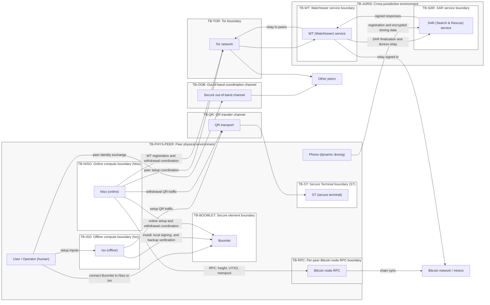
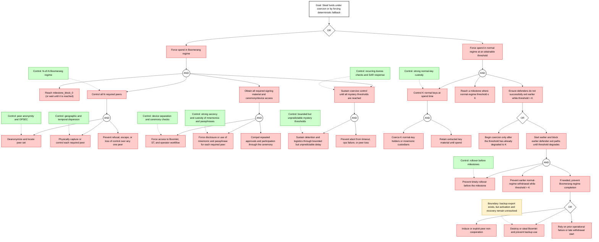
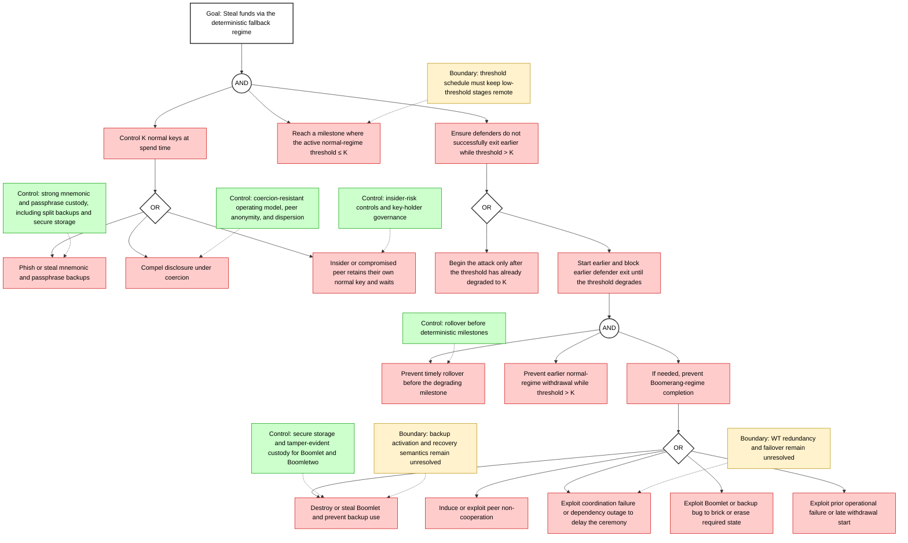
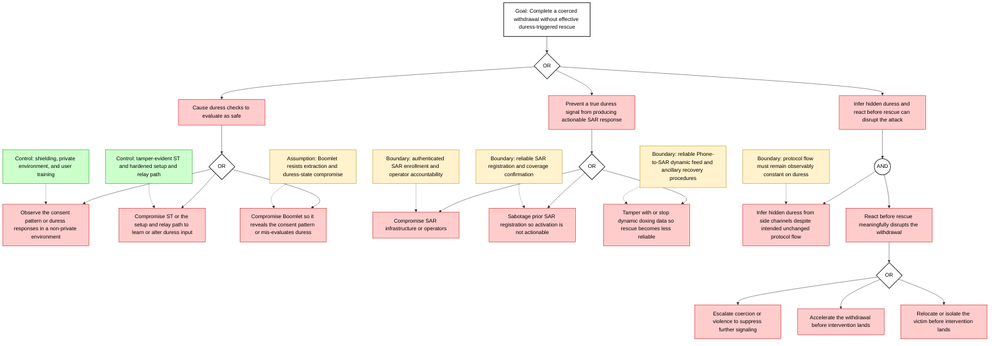
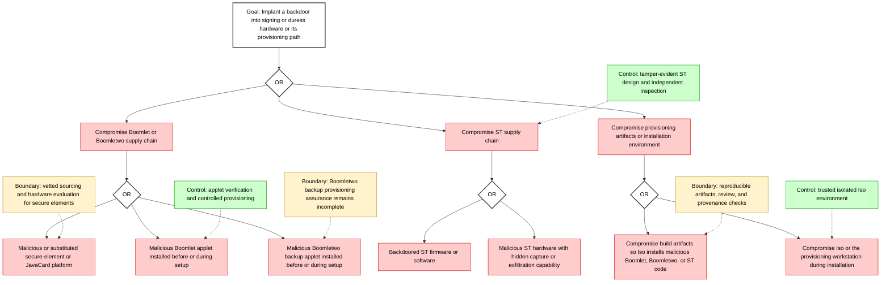

# Boomerang Threat Model

> **Info:** Last change: 2026-07-09 | Summary: Audit mappings moved to a reference file; resolved roadmap and design-gap progress retained.

## Table of Contents

- [Scope & assumptions](#scope-assumptions)
  - [System summary](#system-summary)
  - [In-scope components](#in-scope-components)
  - [Out-of-scope](#out-of-scope)
  - [Primary assets](#primary-assets)
  - [Security objectives](#security-objectives)
  - [High-impact assumptions](#high-impact-assumptions)
  - [Key unknowns blocking production readiness](#key-unknowns-blocking-production-readiness)
  - [Open design boundaries](#open-design-boundaries)
- [Trust boundaries + Trust Boundary Diagram](#trust-boundaries-trust-boundary-diagram)
  - [Trust boundary list](#trust-boundary-list)
  - [Cross-boundary flows](#cross-boundary-flows)
  - [Trust Boundary Diagram](#trust-boundary-diagram)
- [Human & Physical Risk](#human-physical-risk)
  - [Human/physical threat scenarios](#humanphysical-threat-scenarios)
  - [Duress mechanism assumptions](#duress-mechanism-assumptions)
  - [Operational hardening checklist](#operational-hardening-checklist)
- [Architecture & data flows](#architecture-data-flows)
  - [Data flow diagram with trust boundaries](#data-flow-diagram-with-trust-boundaries)
  - [Data classification](#data-classification)
  - [Protocol parameter surface](#protocol-parameter-surface)
  - [Current protocol-binding boundaries](#current-protocol-binding-boundaries)
- [Systematic attack identification](#systematic-attack-identification)
  - [Attack Pattern Checklist](#attack-pattern-checklist)
- [Risk register](#risk-register)
  - [Scoring method](#scoring-method)
  - [Risk register table](#risk-register-table)
- [Attack / attack-defense trees](#attack-attack-defense-trees)
  - [Tree 0: Primary attacker campaign: steal funds under coercion or force deterministic fallback](#tree-0-primary-attacker-campaign-steal-funds-under-coercion-or-force-deterministic-fallback)
  - [Tree 1: Steal funds by tampering PSBT or breaking intent continuity](#tree-1-steal-funds-by-tampering-psbt-or-breaking-intent-continuity)
  - [Tree 2: Reach deterministic fallback and then steal with normal keys](#tree-2-reach-deterministic-fallback-and-then-steal-with-normal-keys)
  - [Tree 3: Complete a coerced withdrawal without effective duress-triggered rescue](#tree-3-complete-a-coerced-withdrawal-without-effective-duress-triggered-rescue)
  - [Tree 4: Deanonymize peers and target them with coercion](#tree-4-deanonymize-peers-and-target-them-with-coercion)
  - [Tree 5: Supply-chain compromise of Boomlet and ST](#tree-5-supply-chain-compromise-of-boomlet-and-st)
- [Mitigations & roadmap](#mitigations-roadmap)
  - [Mitigation roadmap](#mitigation-roadmap)
  - [Component-specific hardening summary](#component-specific-hardening-summary)
- [Audit mapping summary](#audit-mapping-summary)
- [Appendix D: Detailed design gaps](#appendix-d-detailed-design-gaps)
  - [Protocol, timing, and transaction semantics](#protocol-timing-and-transaction-semantics)
  - [Boomlet, ST, and endpoint platform assurance](#boomlet-st-and-endpoint-platform-assurance)
  - [Services, operators, and recovery](#services-operators-and-recovery)
  - [Privacy and network exposure](#privacy-and-network-exposure)

## Scope & assumptions
[Back to Table of Contents](#table-of-contents)

### System summary

Boomerang is a Bitcoin cold-storage protocol designed to raise the cost of coercion by making withdrawals hardware-enforced and bounded but unpredictable in time, while embedding plausibly deniable duress signaling in the standard withdrawal path.

The design, as specified in `spec/SPEC.md` and the canonical sequence diagrams, has five relevant properties:

- **Concrete profile and service topology**
  - The protocol profile has exactly five peers, a 5-of-5 Boomerang branch, one active WT for a ceremony, one selected SAR identity per peer, one active Boomlet per peer, and at most one inactive Boomletwo backup per peer.
  - Changing peer count, primary threshold, fallback tree, cryptographic profile, or setup checkpoint sequence creates a different protocol profile.

- **Taproot descriptor with two spending regimes**
  - **Boomerang regime, probabilistic and coercion-resistant:** spend becomes possible only after `milestone_block_0` and after each peer’s Boomlet reaches a secret internal threshold, `mystery`, through a coordinated ping/pong process that increments a local counter under strict freshness rules.
  - **Normal regime, deterministic fallback for liveness:** a waterfall of timelocked scripts gradually reduces the required signer threshold over future milestone block heights, for example 5-of-5 → 4-of-5 → … → 1-of-5 using **normal keys**.

- **Two-layer signing per peer in the Boomerang regime**
  - Each peer’s on-chain `boom_pubkey_i` is a **MuSig2 aggregate** of:
    - a mnemonic-backed **normal key** held and used by `Iso`, and
    - a **Boomlet-held non-exportable key share** held and used by `Boomlet`.
  - Implication: mnemonic compromise alone is insufficient to produce a Boomerang-regime signature; the corresponding Boomlet is also required.

- **Duress signaling**
  - Duress checks occur at commitment and at randomized intervals during the digging game.
  - `ST` is the trusted UI for duress challenges; `Boomlet` is the trusted evaluator.
  - A duress placeholder is embedded in protocol messages such that:
    - **no duress:** the placeholder decrypts to all-zero padding;
    - **duress:** the placeholder decrypts to `doxing_key` or equivalent unlock material, allowing `SAR` to decrypt the user’s encrypted doxing data and initiate rescue procedures.
  - `WT` forwards placeholders to `SAR`; `SAR` returns signed acknowledgements so the protocol flow remains unchanged while Boomlet obtains assurance of receipt.

- **Explicit setup and withdrawal binding**
  - Setup is bound by `setup_instance_id`, signed `PeerSetupRecord` values, and chained `setup_checkpoint` values across WT registration, SAR finalization, and Boomletwo backup.
  - Withdrawal uses `withdrawal_id` for the approval phase and `approved_withdrawal_id` for commitments, duress placeholders, pings, pongs, reached-ping collections, signing, export, and replay scope.
  - WT must verify non-initiator approval-set attestations before advancing to commit and SAR processing.

### In-scope components

Peers are joint custodians of the bitcoin involved. Per peer or operator, with exactly five peers in the profile:

- **User:** the human operator.
- **Iso, offline:** key-derivation and signing environment for normal keys; interacts with Boomlet and ST.
- **Boomlet, secure element:** holds key share, enforces non-determinism, and runs duress logic.
- **Boomletwo, backup secure element:** authenticated target-bound import of Boomlet backup state *excluding* the active `mystery`; Boomletwo generates its own mystery after import, while activation procedure remains under design.
- **ST, Secure Terminal:** air-gapped, tamper-evident UI for user verification and duress challenges.
- **Niso, online:** networked coordinator per peer; handles Tor communications, talks to Bitcoin node RPC, interfaces with WT, and mediates QR flows to ST.
- **Phone:** used for SAR registration and the encrypted dynamic doxing feed.

External dependencies and services:

- **Bitcoin network / miners:** confirmation, timelocks, reorgs, fee market
- **Bitcoin node RPC endpoint(s)** used by each peer’s Niso
- **Tor network**
- **WT (Watchtower):** one active coordination service per ceremony, liveness oracle, and relay for signed PSBTs / transactions
- **SAR (Search & Rescue):** one selected SAR per peer; receives encrypted doxing data, detects duress, signs exact placeholder acknowledgements, and initiates physical response

### Out-of-scope

The following security-relevant items are outside the model because the design leaves them underspecified:

- SAR’s real-world response procedures
- Detailed organizational governance
- Manufacturing processes for Boomlet / ST hardware
- Wallet UX beyond what is specified by the protocol messages

### Primary assets

**Custody / value assets**
- **Bitcoin funds** locked by the Boomerang Taproot output
- **Transaction authorization correctness:** PSBT contents, destination, amounts, fees

**Key material & cryptographic assets**
- `mnemonic`, `passphrase`, and derived **normal private keys**
- Boomlet-held `boom_musig2_privkey_share`, non-exportable
- Boomlet identity keypair for signing and encryption
- ST identity keypair for the Boomlet↔ST secure channel
- Tor onion-service secret keys for peer Niso addresses
- WT and SAR long-term signing / encryption keys

**Duress & safety assets**
- `duress_consent_set`
- user-chosen `doxing_password`, derived `doxing_key`, and derived `doxing_data_identifier`
- **Static doxing data** and **dynamic doxing feed**

**Protocol state assets**
- Per-Boomlet `mystery` and `counter`
- `boomerang_params` and `boomerang_descriptor`
- `setup_instance_id`, `setup_checkpoint`, `withdrawal_id`, and `approved_withdrawal_id`
- Approval collections, approval-set attestations, commits, pings, pongs, reached-ping collections, and signing-session state
- SAR placeholder replay tuples: `{approved_withdrawal_id, boomlet_identity_pubkey, duress_placeholder.iv}`
- Protocol transcripts
- Milestone schedule, `milestone_block_collection`

### Security objectives

**Funds protection**
- Prevent unauthorized spending in both regimes.
- Prevent silent transaction tampering.
- Ensure recoverability in the normal regime under loss scenarios, while managing the associated risk.

**Coercion resistance**
- Under coercion, reduce attacker confidence in *time to cash-out*.
- Provide unavoidable, plausibly deniable duress signaling with minimal observable divergence.
- Preserve a reaction window for SAR response and deterrence.

**Privacy & safety**
- Minimize metadata that could enable targeting of key holders.
- Protect doxing data and duress signals from unauthorized disclosure.
- Resist correlation attacks that deanonymize peers, schedules, or duress events.

**Integrity & liveness**
- Prevent protocol-state desynchronization and replay.
- Ensure withdrawal completes when honest peers cooperate and dependencies are available.
- Ensure failures degrade safely, preferably fail-closed in the Boomerang regime.

### High-impact assumptions

Assumptions that materially affect risk ratings.

- **Boomlet secure-element security holds**
- **ST integrity holds**
- **Cryptography holds for the message set and signing flows**
- **Software build, update, and deployment paths for Iso, Niso, ST, Boomlet, WT, and SAR are trustworthy enough**
- **At least one honest peer exists**
- **Bitcoin timelocks behave as expected**
- **`most_work_bitcoin_block_height` obtained by Niso and WT is trustworthy enough to drive milestone gating, freshness, and counter advancement**
- **`setup_instance_id`, chained setup checkpoints, `withdrawal_id`, `approved_withdrawal_id`, local freshness checks, and signed transcripts are sufficient to keep each setup instance and withdrawal ceremony correctly bound**
- **`tx_id` continuity plus approval-set attestations, hydrated-PSBT checks, signing-package verification, and final transaction revalidation are sufficient to preserve operator intent across PSBT hydration and final signing**
- **SAR acknowledgements are bound to the exact duress-placeholder instance and do not create a publicly distinguishable safe branch or duress branch**
- **Only one of Boomlet and Boomletwo is ever active for a given peer identity**
- **WT and SAR remain available**
- **Peers have a secure out-of-band channel**

### Key unknowns blocking production readiness

Items that block production-readiness claims.

- Exact values and selection policy for the non-determinism and duress-check parameters
- Reorg-handling policy
- WT / SAR redundancy model
- Cryptographic implementation evidence: canonical-encoding conformance, CBC/CMAC/KDF test vectors, interoperable signature/envelope vectors, and side-channel-safe implementation profiles
- Boomletwo activation / recovery protocol
- Software supply chain and update mechanisms
- Monitoring, alerting, and incident-response workflows

### Open design boundaries

Security boundaries that remain unresolved.

| Boundary | Why it matters |
| --- | --- |
| **Chain view and reorg policy** | Milestone gating, freshness, and counter advancement depend on chain view, but reorg and divergent-node policy remain undefined. |
| **Setup / withdrawal binding** | Core binding is specified through `setup_instance_id`, chained setup checkpoints, `withdrawal_id`, and `approved_withdrawal_id`. |
| **Hydrated PSBT authorization contract** | Transaction authorization is specified through `tx_id` continuity, signing-package verification, descriptor and transaction checks, and final broadcast `tx_id` checks. |
| **Boomlet and Boomletwo activation semantics** | Backup export and import exist, but activation, deactivation, and the one-active-device invariant remain undefined. |
| **Duress-placeholder lifecycle** | The lifecycle is specified through fresh placeholder envelopes, `approved_withdrawal_id` context binding, SAR signatures over the exact encrypted placeholder, replay tuples, and externally indistinguishable protocol behavior. |
| **Operational transitions** | Device movement, replacement, and recovery for Phone, Niso, ST, WT selection, and SAR-set changes remain only partly specified. |
| **Honest-path liveness / fairness policy** | Completion depends on peer availability, timeout policy, blame handling, and scheduler or service fairness that the corpus leaves undefined. |
| **Parameter selection and timing policy** | Security depends on workable choices for milestones, mystery range, duress cadence, and freshness tolerances. |
| **Cryptographic profile and canonical transcript encoding** | The profile specifies AES-256-CBC with PKCS#7, AES-CMAC encrypt-then-MAC, SP 800-108 CMAC KDF context separation, canonical object bytes, and scope-specific contexts; implementation evidence is outside protocol design. |
| **Trusted-hardware assurance boundary** | Boomlet and ST are treated as trusted boundaries; hardware assurance remains outside protocol design. |
| **Software supply chain and service implementation security** | Build, update, deployment, and ordinary service-hardening controls remain outside protocol design. |
| **WT / SAR service governance and accountability** | WT and SAR behavior, WT failover, single-SAR replacement after setup, misuse resistance, and jurisdictional fit remain only partly specified. |
| **Privacy and network exposure policy** | Tor, RPC, WT, SAR, and doxing-data flows lack a final minimization policy for metadata leakage, correlation, and acceptable exposure. |

Boomlet and ST are treated as trusted devices. The cited prototype materials do not establish the trusted-device assurance assumed by this model.

## Trust boundaries + Trust Boundary Diagram
[Back to Table of Contents](#table-of-contents)

Boomerang depends on hard separation between offline and online systems, between human intent and host-mediated I/O, and between local components and external coordination services. The boundaries below are used consistently across the DFD, threat catalog, and risk register.

### Trust boundary list

| Boundary ID  | Boundary type  | Name                        | What it separates                                         | Why it exists / security meaning                                 |
| ------------ | -------------- | --------------------------- | --------------------------------------------------------- | ---------------------------------------------------------------- |
| TB-PHYS-PEER | Environment    | Peer physical environment   | Peer operators and devices vs. the surrounding world      | Theft, coercion, observation, device swap, and unsafe travel     |
| TB-ISO       | Device/Host    | Iso offline host            | Iso execution environment vs. networked or untrusted host contexts | Protect normal keys; reduce signing-time malware risk            |
| TB-BOOMLET   | Device/Host    | Boomlet secure-element devices | Boomlet and Boomletwo internal state vs. attached hosts | Protect non-exportable key share and backup state; enforce non-determinism and duress logic |
| TB-ST        | Device/Host    | ST trusted UI device        | ST UI and key store vs. attached hosts and observers      | Prevent duress-input and verification manipulation               |
| TB-NISO      | Device/Host    | Niso online host            | Niso OS and applications vs. external networks and services | High malware exposure; untrusted for duress integrity            |
| TB-QR        | Channel/Service | QR transfer channel            | Air-gapped devices vs. optical mediators                       | Prevent direct electronic exfiltration; add parsing and swapping risk |
| TB-OOB       | Channel/Service | Out-of-band coordination channel | Peer identity verification vs. attacker-controlled communications | Peer identity and parameters must be verified                    |
| TB-TOR       | Channel/Service | Tor communication path         | Peer onion services vs. the public Internet                    | Provide anonymity with correlation and DoS exposure              |
| TB-RPC       | Channel/Service | Per-peer Bitcoin node RPC path | Niso vs. the peer's chosen Bitcoin node endpoint(s)            | Block height and chain state are security-critical               |
| TB-WT        | Channel/Service | Watchtower service             | Peer systems vs. WT infrastructure, keys, and logs             | Central for liveness, metadata, and transcript routing           |
| TB-SAR       | Channel/Service | SAR service                    | Peer systems vs. SAR infrastructure, keys, operators, and data stores | Holds PII and handles physical response                          |
| TB-JURIS     | Environment    | Cross-jurisdiction environment | Operators, WT, and SAR across legal regimes               | Compelled disclosure or forced inaction can occur                |

### Cross-boundary flows

- **F-QR-1:** Iso ↔ ST over QR during setup key exchange and duress-set confirmation
- **F-QR-2:** Niso ↔ ST over QR during withdrawal `tx_id` verification and duress checks
- **F-USB-1:** Boomlet ↔ Iso during setup and final signing
- **F-USB-2:** Boomlet ↔ Niso during online setup and withdrawal
- **F-USB-3:** Boomletwo ↔ Iso during backup installation and backup import
- **F-NET-1:** Niso ↔ peer Nisos via Tor during setup coordination and signed `PeerSetupRecord` exchange
- **F-NET-2:** Niso ↔ WT via Tor during setup registration, approval collection, approval-set attestation, commit, ping/pong, reached-ping, signing-fragment relay, and broadcast coordination
- **F-NET-3:** WT ↔ SAR during setup-bound SAR finalization and exact encrypted duress-placeholder acknowledgement
- **F-NET-4:** Phone ↔ SAR during registration and dynamic doxing updates
- **F-RPC-1:** Niso ↔ per-peer Bitcoin node RPC
- **F-OOB-1:** User ↔ other peers through secure out-of-band channels

### Trust Boundary Diagram

**Interpretation**

- Boomerang’s strongest intended security properties depend on TB-BOOMLET and TB-ST holding.
- Boomerang’s strongest intended availability properties depend on TB-WT and TB-RPC behaving correctly, or having redundancy and failover.
- Coercion resistance is fundamentally a **human + physical** problem; the technical protocol mainly shapes incentives and time.

---

## Human & Physical Risk
[Back to Table of Contents](#table-of-contents)

Boomerang is designed for a threat environment in which physical coercion is credible. Human operators, facilities, travel patterns, and operational discipline are therefore first-class attack surfaces.

### Human/physical threat scenarios

| Scenario                                                            | Trust boundaries involved          | Primary assets at risk                   | What can go wrong                                                                                    | Candidate mitigations, design and operations                                                                                                 |
| ------------------------------------------------------------------- | ---------------------------------- | ---------------------------------------- | ---------------------------------------------------------------------------------------------------- | -------------------------------------------------------------------------------------------------------------------------------------------- |
| **Coercion or wrench attack** on one peer during withdrawal         | TB-PHYS-PEER, TB-ST, TB-BOOMLET    | Funds, user safety, duress secrecy       | Attacker forces approvals or continuation, tries to detect or bypass duress, or holds the victim until completion | Boomerang non-determinism; duress checks via ST; SAR response; safe-room procedures; operator drills; split-knowledge procedures |
| **Coercion on multiple peers, kidnapping, or round-up**             | TB-PHYS-PEER, TB-OOB               | Funds, user safety                       | Attacker captures multiple peers, or learns enough identity and schedule data to stage a simultaneous round-up | Geographic dispersion; time-zone dispersion; compartmentalized peer identity sharing; travel OPSEC; independent alerting paths |
| **Insider collusion** among peers                                   | TB-OOB, TB-PHYS-PEER               | Funds, governance integrity              | Colluding peers wait out waterfall timelocks; or coordinate coercion                                 | Legal agreements; choose milestones to make late-stage far future; monitoring and alerts |
| **Social engineering, including phishing and fake ceremonies**      | TB-OOB, TB-PHYS-PEER, TB-SAR       | Normal keys, peer set integrity, rescue readiness, privacy | Steals mnemonics; reroutes peer or WT Tor addresses; tricks the operator into fake SAR enrollment or ceremony steps | Multi-channel fingerprint checks; pinned keys; authenticated SAR directory; training; anti-phishing playbooks |
| **Credential theft, including mnemonic or passphrase compromise**   | TB-PHYS-PEER, TB-ISO               | Normal keys                              | Theft or coerced disclosure enables later deterministic theft once normal-key stages open            | Strong passphrases; split backups; secure storage; anti-phishing discipline |
| **Process non-compliance, such as missed rollover or skipped checks** | TB-PHYS-PEER, TB-OOB             | Funds, coercion resistance               | Users miss rollover windows or skip required checks, allowing the protocol to drift into weaker deterministic stages | Mandatory rollover schedule; automated reminders; rehearsals; documented exception handling and sign-off |
| **Operator error, including wrong milestones, outputs, or network** | TB-PHYS-PEER, TB-ISO, TB-ST        | Funds, liveness                          | Setup produces the wrong descriptor or milestones; withdrawal signs the wrong transaction or wrong network | Strict checklists; independent operator-side transaction review on dedicated hardware; testnet rehearsals; sanity checks and invariants in Iso |
| **Travel and commute risk, including surveillance or ambush**       | TB-PHYS-PEER                       | User safety, anonymity                   | Attacker identifies peer movements and targets vulnerable moments                                    | Vary routines; secure transport; avoid role disclosure; compartmentalize identities; personal-security procedures |
| **Site access failures, including unauthorized storage access**     | TB-PHYS-PEER                       | Devices, backups                         | Evil-maid installs implants or swaps devices; steals backups                                         | Access control, alarms, cameras; tamper seals; inventory |
| **Device theft or tampering of ST or Boomlet**                      | TB-PHYS-PEER, TB-BOOMLET, TB-ST    | Duress secrecy, protocol integrity, keys | Attacker tampers with trusted devices, learns consent-set material, or destroys Boomerang-state devices to force fallback | Certified secure element; tamper resistance; secure storage; spare devices; incident response |
| **Environmental disasters, including fire, flood, or EMP**          | TB-PHYS-PEER                       | Devices, backups                         | Damage or destruction forces fallback or makes recovery impossible                                   | Geo-redundant storage; fireproof safes; Faraday protection; disaster recovery drills |
| **Power interruption during signing or backup procedures**          | TB-PHYS-PEER, TB-BOOMLET, TB-ISO   | Signing state, liveness                  | Interrupted sessions cause partial state, nonce reuse, or lost progress                              | Atomic signing sessions; anti-rollback; UPS; recovery paths |
| **Jurisdictional or legal coercion of SAR or operators**            | TB-JURIS, TB-SAR                   | PII, user safety, service availability   | SAR forced to reveal data, delay action, or refuse service; operator compelled disclosure            | Minimize PII; legal counsel; documented policies; transparency reports |

### Duress mechanism assumptions

The duress mechanism assumes two things:
- the attacker cannot observe consent-set entry without detection by the user; and
- ST does not leak consent-set material.

- The attacker cannot observe both the ST display and the user's selection behavior well enough to learn the consent set.
- ST does not leak consent-set material.
- Users can reproduce the consent set reliably under stress, fatigue, or coercion.

These assumptions are operationally fragile. Cameras, multiple attackers, and controlled environments directly weaken them. Shielding, private environments, and operator drills remain necessary.

Primary coercion campaign: [Tree 0](#tree-0-primary-attacker-campaign-steal-funds-under-coercion-or-force-deterministic-fallback).

### Operational hardening checklist

**People**
- Run regular coercion, recovery, and rollover drills.
- Minimize who knows peer identities and custody roles.

**Facilities**
- Use secure, access-controlled environments for setup, backup, and withdrawal ceremonies.
- Maintain tamper-evident seals and inspection logs for ST, Boomlet, and Boomletwo.
- Keep Boomlet, Boomletwo, and mnemonic backups in geographically separated storage.

**Travel**
- Avoid predictable patterns and role disclosure.
- Use secure transport and avoid carrying all critical devices or backups together.

**Incident response**
- Predefine device-loss, coercion-suspected, and missed-rollover playbooks.
- Maintain a rehearsed rollover or fund-movement plan before deterministic stages.

---

## Architecture & data flows
[Back to Table of Contents](#table-of-contents)

The trust-boundary-aware data-flow diagram below summarizes the design at a system level.

### Data flow diagram with trust boundaries

**Legend**

- **Processes**: rounded rectangles
- **Data stores**: cylinders
- **External entities**: rectangles
- **Trust boundaries**: shown as subgraphs (named)

```mermaid
flowchart TB
  PEERS[Other peers]

  %% Peer boundary
  subgraph TBPHYS["TB-PHYS-PEER: Peer physical environment"]
    USER([User/Operator])

    subgraph TBISO["TB-ISO: Offline boundary"]
      ISO([Iso process])
      D_MN[(Mnemonic and passphrase backup, paper or metal, in safe)]
    end

    subgraph TBBOOM["TB-BOOMLET: Secure element boundary"]
      BOOM([Boomlet applet])
      D_BOOM[(Boomlet secure state:
key shares, mystery, counters,
duress consent set, identity keys)]
      BOOM --> D_BOOM
    end

    subgraph TBST["TB-ST: Secure Terminal boundary"]
      ST([ST firmware])
      D_ST[(ST key store:
st_identity_privkey,
boomlet_identity_pubkey)]
      ST --> D_ST
    end

    subgraph TBNISO["TB-NISO: Online boundary"]
      NISO([Niso process])
      D_NISO[(Niso state and logs:
peer addresses, transcripts,
PSBTs, notifications)]
      NISO --> D_NISO
    end

    subgraph TBRPC["TB-RPC: Per-peer Bitcoin node RPC boundary"]
      RPC[[Bitcoin node RPC]]
    end

    PHONE([Phone app])
  end

  %% External boundaries
  subgraph TBQR["TB-QR: QR transfer channel"]
    QR[[QR transport]]
  end
  subgraph TBOOB["TB-OOB: Out-of-band coordination channel"]
    OOB[[Secure out-of-band channel]]
  end
  subgraph TBTOR["TB-TOR: Tor network"]
    TOR[[Tor]]
  end
  subgraph TBWT["TB-WT: Watchtower boundary"]
    WT([WT service])
    D_WT[(WT state and logs:
registrations, transcripts,
timestamps)]
  end
  subgraph TBSAR["TB-SAR: SAR boundary"]
    SAR([SAR service])
    D_SAR[(Doxing data store:
static+dynamic encrypted data,
identifiers, audit logs)]
  end
  BTC[[Bitcoin network]]

  %% Flows (setup)
  USER -- "setup inputs:
network, entropy,
passphrase, SAR IDs,
milestones" --> ISO
  ISO -- "derive normal_pubkey
(m/cb86')
create mnemonic" --> D_MN
  ISO -- "install params:
normal_pubkey, doxing_key,
SAR IDs, network" --> BOOM

  %% ST key exchange and duress setup
  BOOM -- "boomlet_identity_pubkey" --> ISO
  ISO -- "boomlet_identity_pubkey by QR" --> QR
  QR --> ST
  ST -- "st_identity_pubkey by QR" --> QR
  QR --> ISO
  ISO -- "st_identity_pubkey" --> BOOM
  BOOM -- "duress_check_space encrypted" --> ISO
  ISO -- "duress challenge by QR" --> QR
  QR --> ST
  ST -- "display duress challenge" --> USER
  USER -- "duress consent input" --> ST
  ST -- "duress consent indices by QR" --> QR
  QR --> ISO
  ISO -- "duress consent indices" --> BOOM
  BOOM -- "store duress_consent_set" --> D_BOOM

  %% Setup: ST-assisted parameter verification and OOB exchange
  BOOM -- "boomerang params seed encrypted" --> NISO
  NISO -- "peer IDs, Tor addresses, WT IDs,\nmilestones, boomerang params seed by QR" --> QR
  QR --> ST
  ST -- "display peer IDs and params" --> USER
  USER -- "peer and params acknowledgement" --> ST
  ST -- "signed params confirmation by QR" --> QR
  QR --> NISO
  NISO --> BOOM
  USER -- "peer identity exchange" --> OOB
  OOB --> PEERS
  PEERS --> OOB
  OOB --> USER

  %% Setup: online peer coordination
  NISO -- "peer_ids, tor addresses,
WT IDs, milestones" --> BOOM
  NISO -- "peer setup coordination over Tor" --> TOR
  TOR --> PEERS
  NISO -- "WT registration over Tor" --> TOR
  TOR --> WT
  WT --> D_WT
  WT -- "forward SAR finalization" --> SAR --> D_SAR
  SAR -- "setup response" --> WT
  WT -- "registration and setup receipts over Tor" --> TOR
  TOR --> NISO

  %% Phone to SAR during setup and ongoing use
  USER -- "doxing_password,
static doxing data,
SAR IDs" --> PHONE
  PHONE -- "doxing_data_identifier,
encrypted doxing data" --> SAR

  %% Withdrawal flow at a high level
  USER -- "unsigned PSBT" --> NISO
  NISO -- "psbt + height checks" --> RPC
  RPC -- "chain data" --> NISO
  RPC <--> BTC
  BOOM -- "tx_id challenge encrypted" --> NISO
  NISO -- "tx_id and duress challenges by QR" --> QR
  QR --> ST
  ST -- "display tx_id and duress prompts" --> USER
  USER -- "approval or duress response" --> ST
  ST -- "user approval and duress response by QR" --> QR
  QR --> NISO
  NISO -- "approval to Boomlet" --> BOOM

  %% WT-mediated approvals, commits, and pings
  NISO -- "approvals, commits, and pings over Tor" --> TOR --> WT
  WT -- "relay to peers over Tor" --> TOR --> PEERS
  WT -- "approvals, pongs, and reached_pings over Tor" --> TOR --> NISO
  WT -- "duress placeholder" --> SAR
  SAR -- "signed ack" --> WT

  %% Final signing

  USER -- "network, mnemonic, passphrase" --> ISO
  ISO <--> BOOM
  ISO -- "local MuSig2
partialsig exchange" --> BOOM

  BOOM -- "signed PSBT" --> NISO --> WT
  WT -- "aggregate PSBTs
broadcast tx" --> BTC
```

### Data classification

The classification below combines custody impact, safety impact, and privacy sensitivity rather than using a pure confidentiality label.

| Data                                           | Classification                    | Notes                                                                     |
| ---------------------------------------------- | --------------------------------- | ------------------------------------------------------------------------- |
| Mnemonic, passphrase, normal private keys      | **Critical secret**               | Compromise enables deterministic theft later                              |
| Boomlet key shares + identity private key      | **Critical secret**               | Compromise breaks Boomerang regime, privacy, and duress                   |
| Duress consent set                             | **Critical secret**               | If learned, a coercer can bypass the duress mechanism                     |
| Doxing data (static + dynamic)                 | **Critical safety-sensitive PII** | Compromise enables targeting and harm                                     |
| Doxing password / key / identifier             | **Critical secret / metadata**    | User-chosen password bounds offline cracking resistance; compromise weakens rescue privacy and duress safety |
| Boomerang descriptor, peer IDs                 | **Sensitive configuration**       | Key substitution is catastrophic                                          |
| Protocol transcripts                           | **Sensitive metadata**            | Linkability and timing can enable targeting                               |
| Setup and withdrawal IDs/checkpoints           | **Sensitive integrity state**     | `setup_instance_id`, `setup_checkpoint`, `withdrawal_id`, and `approved_withdrawal_id` bind replay scope and ceremony identity |
| SAR placeholder acknowledgements and replay tuples | **Sensitive safety metadata** | Must not reveal safe vs duress classification; replay tuples bind exact placeholder instances |
| Signed PSBTs / transaction                     | **Public after broadcast**        | Sensitive before broadcast                                                |

### Protocol parameter surface

The design defines at least the following parameter families:

- Milestone and fallback schedule:
  - `milestone_block_0`
  - later `milestone_block_*` values that control deterministic fallback stages

- Mystery and digging-game range:
  - per-peer `mystery`
  - `MIN_TRIES_FOR_DIGGING_GAME_IN_BLOCKS`
  - `MAX_TRIES_FOR_DIGGING_GAME_IN_BLOCKS`

- Non-determinism window:
  - the effective interaction between `mystery`, digging-game bounds, and milestone spacing

- Duress check cadence:
  - `DURESS_CHECK_INTERVAL_IN_BLOCKS`
  - recurring-duress trigger behavior and any PRNG-state assumptions that drive it

- Freshness and tolerance windows:
  - `FRESHNESS_TOLERANCES`
  - `TOLERANCE_IN_BLOCKS_FROM_CREATING_PING_BY_OTHER_PEERS_TO_REVIEWING_THE_PING_IN_PEER_BOOMLET`
  - `JUMP_IN_BLOCKS_IF_LAST_SEEN_BLOCK_LAGS_BEHIND_NISO_EVENT_BLOCK_HEIGHT_IN_BOOMLET`
  - `REQUIRED_MINIMUM_DISTANCE_IN_BLOCKS_BETWEEN_PING_AND_PONG`
  - any implementation-profile constants that instantiate the complete message-specific tolerance map

Implication: these parameters define the adversary’s feasible delay and replay windows and materially affect coercion cost, false positives, and liveness. Parameter selection belongs under explicit security governance, with test coverage and operational monitoring.

### Current protocol-binding boundaries

- Setup currently binds state through signed `PeerSetupRecord` values, the deterministic `setup_instance_id`, ST review of the nonce-bound setup ID, and chained `setup_checkpoint` values across parameters, WT registration, SAR finalization, and Boomletwo backup.
- Withdrawal uses two ceremony identifiers: `withdrawal_id` binds setup, transaction, initiator identity, and approval nonce during approval fan-out; `approved_withdrawal_id` binds the unanimous approval set and scopes commitments, SAR placeholders, pings, pongs, reached pings, signing, export, and replay memory.
- WT cannot advance from approval collection to commit/SAR processing until it verifies one non-initiator approval-set attestation per non-initiator Boomlet over the WT-accepted approval-set fingerprint.
- PSBT hydration and final signing are constrained by `tx_id` continuity, descriptor membership, transaction semantic checks, reached-ping verification, signing-package verification, and final broadcast `tx_id` equality.
- Duress safety depends on fresh SAR-encrypted placeholder envelopes, `approved_withdrawal_id` context binding, SAR replay tuples keyed by `{approved_withdrawal_id, boomlet_identity_pubkey, duress_placeholder.iv}`, and SAR signatures over the exact encrypted placeholder envelope.
- No additional protocol-binding fields are identified here. Implementation evidence and service operating-model checks are outside this protocol-binding boundary.

---

## Systematic attack identification
[Back to Table of Contents](#table-of-contents)

The checklist below is intended for design review, implementation review, tabletop exercises, and red-team planning. It spans cyber, cryptographic, supply-chain, insider, and physical / coercion attack classes and preserves traceability to both the STRIDE catalog and the risk register.

- Each row maps to **Threat IDs** (STRIDE catalog) and **Risk IDs** (risk register).
- Use this checklist during design reviews, implementation reviews, tabletop exercises, and red-team planning.
- The main threat tables in this document apply to the canonical design. Architecture changes belong in the roadmap or in the open design boundaries above, not in the threat inventory.

### Attack Pattern Checklist

| Attack Pattern                                                                                                                                                                                                                            | Applicable components/flows/stores/boundaries                                     | Likely impact                                                                                                                      | Candidate mitigations                                                                                                                         | Mapped Threat IDs/Risk IDs                   |
| ----------------------------------------------------------------------------------------------------------------------------------------------------------------------------------------------------------------------------------------- | --------------------------------------------------------------------------------- | ---------------------------------------------------------------------------------------------------------------------------------- | --------------------------------------------------------------------------------------------------------------------------------------------- | -------------------------------------------- |
| Supply chain compromise of secure element or JavaCard applet through malicious firmware, malicious applet, or backdoored RNG                                                                                                             | TB-BOOMLET provisioning flows; Iso↔Boomlet installation                            | Key extraction; predictable mystery or PRNG; duress bypass; theft of funds; false duress                                           | Vendor due diligence; attestation; reproducible builds; independent labs; diversified hardware; secure provisioning; tamper-evident packaging | T-SE-01, T-SC-01 / R-01, R-24                |
| Supply chain compromise of ST through firmware backdoor or covert exfiltration                                                                                                                                                            | ST boundary TB-ST; ST key store; QR flows                                         | Consent-set compromise; duress manipulation; user approval spoofing                                                                | Secure boot; signed firmware; disable radios; tamper seals; reproducible builds; independent device audits                                    | T-ST-01 / R-02, R-24                         |
| Device substitution, including evil-maid swap, of Boomlet, ST, Iso, or Niso                                                                                                                                                              | TB-PHYS-PEER; device identity checks; USB and QR flows                            | Key theft; message forgery; duress bypass; funds loss                                                                              | Inventory and seals; attestation; challenge-response identity checks; controlled ceremonies                                                   | T-SPOOF-02, T-PHYS-03 / R-19                 |
| Niso malware performs Tor MITM, traffic fingerprinting, or onion key theft                                                                                                                                                                | TB-NISO; TB-TOR; Boomlet-held Tor key material                                    | Deanonymization; protocol disruption; MITM                                                                                         | Harden Niso; keep Tor key material out of general-purpose user workflows; rotate onion keys; traffic padding                                 | T-NISO-01, T-INFO-04, T-INFO-06 / R-08, R-16 |
| Offline Iso compromise via removable media during setup or withdrawal signing                                                                                                                                                             | Iso offline boundary TB-ISO; mnemonic and passphrase handling; PSBT signing       | Normal key theft; forged signatures; funds theft                                                                                   | True air-gap; ephemeral OS; deterministic builds; no network hardware; malware scanning of media                                              | T-ISO-01 / R-15, R-24                        |
| WT equivocation, sending different views or collections to different peers                                                                                                                                                                 | TB-WT; collections of approvals, commits, and pings                               | State desync; liveness failure; coercion window reduction if peers are confused                                                    | Peers sign and cross-verify collections; transcript hashes; WT transparency logs; failover policy                                              | T-TAMP-06 / R-05, R-25                       |
| DoS on WT or SAR                                                                                                                                                                                                                           | TB-WT; TB-SAR; TB-TOR                                                             | Withdrawal unavailable; duress acknowledgement blocked                                                                             | Redundancy; failover; rate limiting; alternative channels; service-level monitoring                                                           | T-DOS-01, T-DOS-02 / R-05, R-13, R-22        |
| Bitcoin node RPC lies, eclipse attack, or reorg exploitation                                                                                                                                                                              | TB-RPC; WT height comparison                                                      | Premature milestone checks; counter manipulation; protocol desync                                                                  | Multiple nodes; header and chainwork validation; compare WT vs node; anti-eclipse                                                            | T-BTC-01, T-SPOOF-05 / R-09                  |
| Replay or delayed delivery of signed messages across Tor                                                                                                                                                                                  | All Tor flows; approvals, commits, and pings; nonce fields                        | State desync, liveness failure, or unauthorized progression if freshness checks fail                                               | Strict nonce and sequence-number checks; freshness windows; unique message IDs; caching                                                       | T-REPLAY-01 / R-10, R-14                     |
| Coercer captures one or more peers and forces withdrawal                                                                                                                                                                                  | TB-PHYS-PEER; ST duress input; operator devices                                   | Fund theft attempt; user harm; duress signal; forced determinism                                                                   | Boomerang non-determinism; duress signal to SAR; operational OPSEC; private environments; split-knowledge procedures; travel security        | T-HUM-01, T-PHYS-01 / R-03, R-12             |
| Insider collusion among peers to wait out waterfall timelocks                                                                                                                                                                             | Out-of-band peer coordination boundary TB-OOB                                     | Funds theft in deterministic stages                                                                                                | Governance agreements; monitoring                                                                                                             | T-INS-01 / R-04                              |
| Social engineering or phishing subverts peer verification during setup                                                                                                                            | TB-OOB; setup verification; operator workflow                                     | Descriptor substitution; wrong peer set or WT binding                                                                             | Training; authenticated out-of-band verification of peers; anti-phishing procedures                                                           | T-SPOOF-01, T-TAMP-04 / R-17                 |
| Legal or jurisdictional coercion of SAR or operators                                                                                                                                                                                      | Jurisdiction boundary TB-JURIS; SAR operations                                    | PII disclosure; forced inaction; compelled assistance                                                                              | Minimization; legal counsel; transparency reports; encryption                                                                                 | T-LEGAL-01 / R-06                            |
| Malicious QR payload triggers parser vulnerability on ST or Niso                                                                                                                                                                           | TB-QR; ST firmware; Niso software                                                 | Code execution; key theft; protocol manipulation                                                                                   | Memory-safe parsing libraries where practical; fuzzing; strict size limits; sandboxing                                                        | T-EOP-04, T-MEM-01 / R-11                    |
| QR swapping or overlay attack corrupts or replays visual messages                                                                                                                                                                         | TB-QR; QR displays on Iso and Niso                                                | Ceremony interruption, message disclosure, or parser exploitation; silent approval bypass should fail if nonce and content checks hold | Nonces; freshness checks; authenticated framing; human-verifiable digests where practical; secure environment                              | T-PHYS-02, T-TAMP-02 / R-11, R-19            |
| Incorrect channel KDF, CBC/CMAC context binding, IV discipline, or MAC-before-decrypt enforcement leads to ciphertext malleability or key recovery                                                                                        | Boomlet↔ST, Boomlet↔WT, Boomlet↔SAR encryption                                    | Message tampering; duress placeholder distinguishability; key leakage                                                              | SP 800-108 CMAC KDF with domain separation; AES-256-CBC/PKCS#7 encrypt-then-MAC; fresh IVs; full CMAC verification before decrypt; transcript binding | T-CRYPTO-01 / R-14                           |
| Weak user-chosen doxing_password allows brute-force recovery of doxing_key and decryption of PII                                                                                                                                         | SAR data store; phone dynamic feed                                                | PII compromise; targeting; weakening duress protection                                                                             | Accepted by ADR 0005                                                                                                                          | T-CRYPTO-03 / R-07                           |
| Side-channel attack through power, EM, or timing on Boomlet during signing or PRNG use                                                                                                                                                    | Boomlet boundary TB-BOOMLET; signing flow Iso↔Boomlet                             | Key share leakage; mystery leakage; PRNG prediction                                                                                | Certified secure element; constant-time code; side-channel resistant implementation; shielding; limit signing frequency; lab testing          | T-SE-03 / R-01                               |
| Fault injection or glitching of Boomlet skips freshness, duress-evaluation, or counter checks                                                                                                                                             | Boomlet; ping and commit checks                                                   | Bypass non-determinism; suppress duress; sign early                                                                                | Fault-resistant SE; redundant checks; control-flow integrity; counters in secure NV storage; tamper response                                  | T-SE-04 / R-01, R-25                         |
| Compromise of peer normal key mnemonic through phishing, theft, or insecure backup                                                                                                                                                        | Mnemonic backups; Iso inputs; physical safes                                      | Funds theft in deterministic regime; blackmail                                                                                     | Split backups; split storage; strong passphrase; access controls                                                                              | T-KEY-01, T-HUM-02 / R-03, R-15              |
| Passphrase capture through shoulder surfing, coercion, or keylogging reduces mnemonic security                                                                                                                                            | Iso; user handling                                                                | Normal key compromise                                                                                                              | Long passphrase; never type on networked devices; protected entry procedures; memory-only handling where feasible                             | T-HUM-02 / R-15                              |
| Phone compromise causes dynamic doxing data spoofing or leakage                                                                                                                                                                           | Phone boundary; phone↔SAR channel                                                 | Misleading SAR; privacy loss; attacker tracking                                                                                    | Harden phone; use dedicated device; minimal apps; OS updates; frequent key rotation; include integrity protection for the feed               | T-PHONE-01 / R-06, R-20                      |
| SAR database breach (static doxing data ciphertext, identifiers, metadata)                                                                                                                                                                | SAR data store                                                                    | PII leak; targeting; offline cracking                                                                                              | Encrypt-at-rest with HSM; minimize fields; split storage; access controls; breach response                                                    | T-INFO-01, T-DATA-01 / R-06, R-07            |
| WT database breach (peer IDs, Tor addresses, fingerprints, timestamps)                                                                                                                                                                    | WT data store                                                                     | Deanonymization; targeting; protocol disruption                                                                                    | Minimize retention; encrypt; pseudonyms; rotate Tor addresses; security audits                                                                | T-INFO-03 / R-16, R-20                       |
| WT insider leak exposes which peers are participating and their schedules                                                                                                                                                                  | WT organization and service logs                                                  | Targeting for coercion                                                                                                             | Strong governance; background checks; least privilege; auditing; encryption                                                                   | T-HUM-04, T-INFO-03 / R-16, R-20             |
| Peer non-cooperation or deliberate stalling forces determinism, extorts others, or blocks honest-path completion                                                                                                                         | Peer participation; withdrawal protocol                                           | Forced determinism; delayed withdrawal; extortion                                                                                  | Legal agreements; penalties; monitoring; explicit timeout and blame policy                                                                    | T-DOS-03, T-INS-02 / R-03, R-04, R-13        |
| Manipulation of milestone schedule inputs or policy calculation leads to early deterministic regime                                                                                                                                       | Setup milestone policy; boomerang_params_seed verification                        | Reduced coercion resistance; early theft window                                                                                    | Compute milestones from policy; require multi-operator verification; sanity checks                                                            | T-TAMP-04 / R-17, R-15                       |
| Time confusion or timezone mistakes in interpreting milestones and rollover deadlines                                                                                                                                                     | Human processes; Niso notifications                                               | Missed rollover; determinism forced                                                                                                | Use block height only; calendar aids; multiple reminders; runbooks                                                                            | T-OPS-01, T-OPS-02 / R-15                    |
| Attacker steals or destroys Boomlet devices to force deterministic regime                                                                                                                                                                 | TB-PHYS-PEER; Boomlet custody                                                     | Loss of coercion protection; eventual theft                                                                                        | Secure storage; incident response; move funds before milestones where possible; monitoring                                                    | T-PHYS-01 / R-03                             |
| Boomlet identity-key compromise lets a compromised Niso forge WT-directed traffic as if it came from Boomlet                                                                                                                             | Boomlet identity keys; Niso↔WT flows                                              | Protocol manipulation; false commits or pings; possible acceleration or censorship                                                 | Keep identity keys inside Boomlet; authenticated channels; attestation where supported; rate limits                                           | T-SE-01, T-NISO-01 / R-01, R-08              |
| PSBT hydration or wrong sighash handling leads to signing a transaction that no longer matches operator intent                                                                                                                            | Niso hydration; Iso and Boomlet signing; ST verification                          | Funds theft or stuck funds                                                                                                         | Strict PSBT parsing; independent hydrated-PSBT verification on dedicated operator hardware; lock sighash; test vectors                        | T-BTC-02 / R-08, R-14, R-15                  |
| Reorg near milestone or during withdrawal leads to inconsistent block-height/freshness decisions                                                                                                                                          | Bitcoin chain; WT and Niso height sources                                         | Stall or premature counter increments; inconsistent state                                                                          | Use confirmations; require stable height; incorporate chainwork; handle reorg explicitly                                                      | T-BTC-01, T-FRESH-01 / R-09, R-25            |
| WT or peers manipulate tolerance windows to accelerate counter, for example by sending crafted last_seen_block                                                                                                                            | Ping messages; counter increment conditions                                       | Reduced unpredictability; speed-up withdrawal under coercion                                                                       | Conservative rules in Boomlet; monotonic constraints; include signed evidence; formal analysis                                                | T-TAMP-07, T-FRESH-01 / R-25                 |
| State rollback on Boomlet from power loss or reset repeats nonces or reuses state                                                                                                                                                         | Boomlet NV storage; counters; nonces                                              | Nonce reuse; key compromise; protocol desync                                                                                       | Monotonic counters in secure NV; anti-rollback; ensure nonce randomness; store transcript hash                                                | T-SE-05 / R-01, R-14                         |
| Compromise of entropy sources in Boomlet or Iso causing predictable key material or `mystery`                                                                                                                                            | Boomlet PRNG; Iso key generation                                                  | Predictable withdrawal duration; key compromise                                                                                    | Hardware RNG validation; health tests; DRBG per NIST SP 800-90A; entropy mixing                                                               | T-CRYPTO-04 / R-01, R-15                     |
| Coercion attacker uses surveillance to learn the duress consent set over time                                                                                                                                                             | Human; ST UI interactions                                                         | Duress bypass; reduced deterrence                                                                                                  | Never perform duress checks under observation; shielded private environment; ST hardening; operator training                                  | T-HUM-01 / R-12                              |
| Attacker compels user to reveal doxing_password or doxing_key and weaken rescue                                                                                                                                                           | Human; phone; SAR                                                                 | Rescue weakening; PII misuse                                                                                                       | Minimize user-held rescue secrets; private input procedures; maintain revocation and rotation procedures                                      | T-DURESS-04 / R-06, R-12                     |
| Compromise of WT signing key allows forging receipts or acknowledgements and tricking peers                                                                                                                                               | WT key management                                                                 | Protocol integrity; false assurance; service abuse                                                                                 | HSM-backed keys; rotation; transparency logs; key pinning                                                                                     | T-WT-05 / R-05                               |
| Compromise of SAR signing key allows forged acknowledgements that hide duress failure                                                                                                                                                     | SAR key management                                                                | User safety; false assurance                                                                                                       | HSM; rotation; multi-party approval for sensitive operations; audit logs                                                                      | T-SAR-03 / R-06, R-22                        |
| Privacy attack via fee payment channels through invoice reuse, receipt reuse, or on-chain analysis                                                                                                                                        | WT fee payment; Bitcoin network                                                   | Link peers to Boomerang participation; targeting                                                                                   | Use privacy-preserving payments; avoid address reuse; use vouchers or blinded tokens                                                          | T-FIN-01 / R-23                              |
| Environmental disaster (fire, flood, or EMP) destroys devices and backups                                                                                                                                                                 | Physical storage; safes                                                           | Forced determinism; loss of keys; loss of funds                                                                                    | Geographic redundancy; fireproof safes; offsite backups; tested recovery                                                                      | T-ENV-01 / R-15                              |
| Power interruption during signing or backup import/export causes partial state or lost progress                                                                                                                                           | Iso/Boomlet signing flow; backup procedures                                       | Key compromise or liveness loss                                                                                                    | Atomic signing sessions; anti-rollback; UPS; careful nonce management; recovery paths                                                         | T-ENV-02 / R-14, R-15                        |
| Unauthorized code execution on WT or SAR via internet-facing service vulnerabilities                                                                                                                                                      | WT or SAR service boundary                                                        | DoS; metadata leaks; key compromise if keys online                                                                                 | OWASP ASVS; hardened infrastructure; patching; least privilege; secrets management                                                            | T-WEB-01 / R-05, R-06, R-13                  |
| Insider at SAR mishandles decrypted rescue data or delays/refuses escalation after a valid duress activation                                                                                                                             | SAR operators; decrypted doxing data handling; duress escalation workflow         | PII exposure; rescue failure; delayed or absent intervention                                                                       | Compartmentalized access; audited SAR procedures; least privilege; dual control for sensitive actions; on-call redundancy; incident review    | T-DURESS-03, T-DOS-02 / R-06, R-22           |
| Consensus-layer attacks or high-fee mempool conditions delay broadcast, extending coercion window                                                                                                                                         | Bitcoin network                                                                   | Availability; user safety                                                                                                          | Fee bumping strategies (RBF/CPFP); mempool monitoring; pre-planned fee reserves                                                               | T-DOS-05 / R-13                              |
| USB or HID injection during Boomlet connection to Iso or Niso                                                                                                                                                                              | TB-PHYS-PEER; USB connection Iso↔Boomlet, Niso↔Boomlet                            | Malware infection; command injection; altered messages                                                                             | USB data diodes; disable HID; allow-list USB classes; dedicated hardware; inspect cables                                                      | T-PHYS-03 / R-19, R-15                       |
| Key derivation path confusion/implementation mismatch leads to wrong normal_pubkey and loss of funds                                                                                                                                      | Iso key derivation; purpose_root_xpriv path m/cb86'                               | Funds unrecoverable; incorrect keys in descriptor                                                                                  | Test vectors; strict spec; cross-implementation checks; display derived xpub fingerprint                                                      | T-PROTO-04 / R-15                            |
| Tamper-evident seal cloning or replacement hides ST or Boomlet compromise                                                                                                                                                                 | Physical boundary; seals                                                          | Undetected hardware compromise                                                                                                     | Unique serial seals; multi-layer seals; photographic records; periodic inspections; tamper-sensor enclosures where practical                 | T-PHYS-04 / R-02, R-19                       |
| SAR processing and timing differences around duress placeholder handling                                                                                                                                                                   | WT↔SAR channel; SAR processing                                                    | Attacker infers duress handling occurred; escalates violence                                                                       | Constant-time processing where feasible; delay equalization; minimize distinguishable operational side effects                                | T-INFO-10 / R-12, R-06                       |
| Boomlet memory exhaustion or state corruption via malformed or oversized messages                                                                                                                                                          | Boomlet message parsing; Tor inputs                                               | Withdrawal stall; forced determinism                                                                                               | Strict size limits; robust parsing; watchdog resets with anti-rollback; input validation                                                      | T-SE-06 / R-25, R-13                         |
| Phishing user into registering wrong SAR identities or revealing SAR association                                                                                                                                                          | Phone setup; SAR ID selection                                                     | Rescue coverage misbound or absent; duress compromised; PII leak                                                                   | Pinned SAR public keys; signed SAR directory; authenticated directory checks; redundancy                                                      | T-SPOOF-04 / R-26, R-06                      |
| Key compromise documentation or runbooks missing, leading to slow response to theft or coercion                                                                                                                                          | Operations                                                                        | Increased loss; delayed rescue; reputational harm                                                                                  | Incident response plan; drills; defined contacts; automated alerts                                                                            | T-OPS-03 / R-15, R-22                        |
| Operator travel or commute surveillance identifies and ambushes key holders                                                                                                                                                               | TB-PHYS-PEER                                                                      | Coercion attack; theft                                                                                                             | OPSEC training; varying routines; secure transport; role compartmentalization; physical-security procedures                                   | T-HUM-05 / R-16                              |
| Compromised peer leaks other peers’ identities and schedules, enabling targeted coercion                                                                                                                                                  | Peer identity and coordination metadata                                           | Physical attacks; extortion                                                                                                        | Need-to-know identity sharing; pseudonymous peer identities; legal agreements; compartmentalized contact lists                                | T-INS-03, T-INFO-07 / R-16                   |

---

## Risk register
[Back to Table of Contents](#table-of-contents)

The register below follows the NIST SP 800-30r1 structure: threat event, vulnerability or predisposing condition, likelihood, impact, and response. Each risk is mapped to threat IDs and CCSS v9 controls.

### Scoring method

- **Likelihood (1–5):** Rare → Almost certain
- **Impact (1–5):** Negligible → Catastrophic
- **Risk score:** `Likelihood × Impact`
  - 1–5 Low, 6–10 Medium, 11–15 High, 16–25 Critical

Scoring baseline for this revision: canonical design corpus as of April 11, 2026.

Scores below are calibrated to the design and the controls or assumptions explicitly present in the canonical corpus. Roadmap mitigations do not reduce design-stage scores.

`Status` indicates whether the present posture depends mainly on controls, assumptions, or unresolved design gaps.

### Risk register table

| Risk ID | Risk | Score | Status | Canonical DG links | Notes |
| --- | --- | --- | --- | --- | --- |
| R-01 | Boomlet secure element compromise: key extraction or logic tamper | 15 | Assumption | DG-06, DG-07 | Assumes JavaCard-class extraction resistance, non-exportable Boomlet key shares, and fallback timelocks. |
| R-02 | ST compromise: tampering, code injection, or key extraction enabling duress bypass or consent-set exfiltration | 12 | Assumption | DG-08, DG-09, DG-31 | Depends on trusted ST firmware, non-extractable ST keys, air-gapped QR exchange, and tamper evidence. |
| R-03 | Forced determinism from device loss, bricking, or deliberate stalling | 15 | Gap | DG-03, DG-04, DG-30 | Waterfall timelocks and backup import exist; rollover policy and Boomletwo activation remain critical. |
| R-04 | Malicious or compromised peer exploits later waterfall stages or governance gaps | 10 | Control | DG-03, DG-14, DG-15 | Early stages require 5-of-5; later recoverability stages need governance and rollover discipline. |
| R-05 | Watchtower compromise or malicious operation | 12 | Gap | DG-01, DG-12, DG-18, DG-34 | Active WT behavior remains central to freshness, routing, coordination, liveness, and metadata exposure. |
| R-06 | SAR compromise, coercion, or rescue-data misuse | 12 | Gap | DG-11, DG-13, DG-16 | SAR sees encrypted rescue data until duress; governance, jurisdiction, and abuse resistance remain operational boundaries. |
| R-07 | Password-based `doxing_key` brute-force after SAR database or ciphertext exposure | 9 | Accepted by ADR 0005 | DG-11, DG-16 | User-chosen `doxing_password` is accepted by ADR 0005; no protocol-layer entropy threshold is enforced. |
| R-08 | Niso compromise tampers PSBT presentation, hydration, or Tor coordination | 16 | Gap | DG-10, DG-22, DG-31 | ST and Boomlet check `tx_id` continuity, while Niso hardening and hydrated-PSBT verification remain important. |
| R-09 | False block-height or eclipse attacks manipulate freshness checks and counters | 12 | Gap | DG-01, DG-25 | Depends on chain-view trust, WT height, Niso RPC, and explicit reorg/freshness policy. |
| R-10 | Replay, spoofing, serialization, or desync of protocol messages | 12 | Control/Gaps | DG-05, DG-17, DG-21, DG-23, DG-24, DG-25, DG-29 | Core binding fields are specified; parser hardening, evidence retention, timeout, and fairness remain boundaries. |
| R-11 | QR-code channel attacks through malformed payloads, parser bugs, swapping, or camera trickery | 12 | Control | DG-10, DG-31, DG-34 | Air-gap, signatures, and nonces help; parser hardening and operational QR controls remain necessary. |
| R-12 | Duress and rescue-signal leakage under observation, side channels, or coercion | 12 | Assumption | DG-15, DG-23, DG-29, DG-32 | Assumes consent entry is not observed and protocol-visible safe/duress behavior remains indistinguishable. |
| R-13 | WT, SAR, peer availability, or fairness gaps block withdrawal or rescue acknowledgement | 12 | Gap | DG-12, DG-13, DG-14, DG-24 | Active flow depends on one WT, one SAR per peer, peer availability, and non-canonical retry/blame policy. |
| R-14 | Implementation bugs in cryptography, signing, or state binding | 15 | Assumption | DG-06, DG-17, DG-21, DG-22, DG-23, DG-29 | Cryptographic profile and binding are specified; implementation evidence and test vectors remain essential. |
| R-15 | Operator and ceremony errors cause loss or forced determinism | 16 | Control | DG-02, DG-03, DG-10, DG-14, DG-15, DG-30 | User verification, signed fingerprints, multiparty agreement, backup, runbooks, and monitoring carry major risk. |
| R-16 | Deanonymization and targeting through Tor correlation, metadata leakage, or routine exposure | 8 | Control | DG-16, DG-18 | Tor and encrypted PSBTs reduce exposure; metadata minimization and payment unlinkability remain open. |
| R-17 | Out-of-band peer exchange compromise causes key substitution or MITM | 15 | Control | DG-05, DG-14, DG-17 | ST verification, signed `boomerang_params`, and WT sorted pubkeys depend on authenticated OOB practice. |
| R-18 | Boomletwo backup misuse bypasses non-determinism or clones state | 12 | Gap | DG-04, DG-30 | Backup excludes `mystery`; activation, deactivation, and one-active-device semantics remain canonical gaps. |
| R-19 | Device substitution during setup or withdrawal | 8 | Control | DG-07, DG-08, DG-09, DG-10 | Identity binding and user verification exist; hardware provenance and tamper evidence remain important. |
| R-20 | Logging and monitoring data leaks from WT, SAR, or Niso | 12 | Assumption | DG-16, DG-18, DG-34 | Logging, retention, and monitoring controls depend mainly on operator practice and service hardening. |
| R-21 | False duress from user mistake triggers SAR escalation | 6 | Control | DG-13, DG-32 | Duress checks are designed to resist typos; SAR playbooks and false-positive handling remain operational. |
| R-22 | False negative duress: delivery, acknowledgement, or response fails | 15 | Gap | DG-13, DG-23, DG-24, DG-29, DG-32 | Boomlet verifies exact SAR acknowledgements; service reliability and response procedures remain safety-critical. |
| R-23 | WT service-fee payment metadata links peer identity to custody participation | 9 | Control | DG-12, DG-16, DG-18 | WT invoices and receipts create privacy pressure; payment unlinkability remains an operational control. |
| R-24 | Software or firmware supply-chain compromise or malicious updates | 10 | Assumption | DG-07, DG-08, DG-34 | Build provenance, release signing, update integrity, and dependency control are trusted at this stage. |
| R-25 | Digging-game state-machine edge cases allow acceleration or stalling | 12 | Gap | DG-01, DG-02, DG-24, DG-25, DG-33 | Tolerance checks and sequence rules exist; adversarial timing, reorg, and recurring-duress semantics need validation. |
| R-26 | SAR enrollment false coverage | 12 | Gap | DG-13, DG-23, DG-26 | Setup includes invoice, sync, WT finalization, and Boomlet checks; no canonical end-to-end coverage receipt exists. |

---

## Attack / attack-defense trees
[Back to Table of Contents](#table-of-contents)

The following trees capture the highest-risk attacker goals and the current controls or open dependencies that shape them.

Green nodes are current controls. Yellow nodes are assumptions or unresolved boundaries.

### Tree 0: Primary attacker campaign: steal funds under coercion or force deterministic fallback

Tree 0 is the top-level attacker campaign for Boomerang. Trees 1-5 decompose the supporting technical paths and enabling conditions.

### Tree 1: Steal funds by tampering PSBT or breaking intent continuity

```mermaid
flowchart TD
  A["Goal: Steal funds by tampering the transaction or breaking intent continuity"] --> OR0{OR}

  OR0 --> B["Get a malicious PSBT approved by all required peers"]
  OR0 --> C["Cause a different PSBT or transaction to be signed than the one approved"]
  OR0 --> D["Exploit signing, parser, or state-machine implementation bugs"]

  %% ----------------------------
  %% 1) Malicious PSBT gets approved
  %% ----------------------------
  B --> AND1((AND))
  AND1 --> B1["Modify or substitute the PSBT before peer approval"]
  AND1 --> B2["Defeat or mislead operator verification at every required peer"]
  AND1 --> B3["Keep the malicious PSBT and tx_id presentation consistent across all approval synchronization steps"]

  B1 --> OR1{OR}
  OR1 --> B1a["Malware alters outputs, change, or fees before first verification"]
  OR1 --> B1b["Swap the PSBT or per-peer encrypted PSBT payload before recipient peer decrypts it"]

  B2 --> OR2{OR}
  OR2 --> B2a["Compromise initiator watch-only wallet or Niso view so the malicious PSBT appears intended"]
  OR2 --> B2b["Compromise non-initiator Niso verification views so the same malicious PSBT is accepted"]
  OR2 --> B2c["Exploit operator-review weakness so tx_id approval is given for a malicious but consistently presented PSBT"]

  %% ----------------------------
  %% 2) Intent continuity breaks after approval
  %% ----------------------------
  C --> AND2((AND))
  AND2 --> C1["Defeat tx_id and continuity protections across the withdrawal state machine"]
  AND2 --> C2["Make the final signed PSBT or transaction differ from the operator-approved one"]

  C1 --> OR3{OR}
  OR3 --> C1a["Exploit inconsistent PSBT parsing, tx_id derivation, or serialization across components"]
  OR3 --> C1b["Exploit replay or state-confusion bug despite nonce, freshness, and sequence checks"]
  OR3 --> C1c["Exploit approval-to-commit, commit-to-ping, or reached-state binding flaw"]

  C2 --> OR4{OR}
  OR4 --> C2a["Exploit PSBT hydration mismatch at finalization"]
  OR4 --> C2b["Exploit message substitution between reached-state verification and Iso/Boomlet signing"]

  %% ----------------------------
  %% 3) Direct implementation failures
  %% ----------------------------
  D --> OR5{OR}
  OR5 --> D1["PSBT parser or serializer bug causes signing of a different transaction"]
  OR5 --> D2["MuSig2 implementation bug: nonce, session, or transcript binding failure"]
  OR5 --> D3["State-machine bug skips or misapplies prerequisite approval or reached-state checks"]

  %% ----------------------------
  %% Controls and open items
  %% ----------------------------
  F1["Control: independent PSBT verification on operator tooling and ST tx_id approval at each peer"] -.-> B2
  F2["Control: repeated tx_id and freshness checks across approval, commitment, ping, pong, and reached-state"] -.-> C1
  F3["Control: nonces, recency, and sequence-number checks to block replay and stale-state reuse"] -.-> C1b
  F4["Control: duplicate validation in Niso and Boomlet, including final re-verification before signing"] -.-> C2
  F5["Assumption: correct PSBT and MuSig2 implementation on isolated Iso"] -.-> D1
  F6["Boundary: canonical session and transcript binding across the full ceremony"] -.-> D2
  F7["Boundary: complete state-machine hardening and prerequisite enforcement"] -.-> D3

  %% Styles
  classDef goal fill:#ffffff,stroke:#222,stroke-width:2px,color:#000;
  classDef attack fill:#ffcccc,stroke:#cc0000,color:#000;
  classDef control fill:#ccffcc,stroke:#009900,color:#000;
  classDef open fill:#fff2cc,stroke:#b38f00,color:#000;
  classDef gate fill:#ffffff,stroke:#333,stroke-width:2px,color:#000;

  class A goal;
  class B,C,D,B1,B2,B3,B1a,B1b,B2a,B2b,B2c,C1,C2,C1a,C1b,C1c,C2a,C2b,D1,D2,D3 attack;
  class F1,F2,F3,F4 control;
  class F5,F6,F7 open;
  class OR0,OR1,OR2,OR3,OR4,OR5,AND1,AND2 gate;

```

### Tree 2: Reach deterministic fallback and then steal with normal keys

### Tree 3: Complete a coerced withdrawal without effective duress-triggered rescue

### Tree 4: Deanonymize peers and target them with coercion

```mermaid
flowchart TD
  A["Goal: Identify at least one peer operator to target physically"] --> OR0{OR}

  OR0 --> B["Exploit network and communication metadata"]
  OR0 --> C["Exploit WT metadata or service-provider records"]
  OR0 --> D["Exploit SAR registration, payment, or account records"]
  OR0 --> E["Exploit out-of-band peer-data exchange or operator OPSEC failure"]
  OR0 --> F["Exploit insider leakage"]

  %% ----------------------------
  %% Network / communication deanonymization
  %% ----------------------------
  B --> OR1{OR}
  OR1 --> B1["Tor traffic or endpoint correlation against peer-to-peer or peer-to-WT communications"]
  OR1 --> B2["Compromise Niso, host, or local network environment to reveal peer communication metadata"]

  %% ----------------------------
  %% WT-side exposure
  %% ----------------------------
  C --> OR2{OR}
  OR2 --> C1["WT logs or retained metadata leak, subpoena, or compromise"]
  OR2 --> C2["WT registration or coordination records reveal peer IDs, params, or communication relationships"]

  %% ----------------------------
  %% SAR-side exposure
  %% ----------------------------
  D --> OR3{OR}
  OR3 --> D1["SAR payment invoice, receipt, or customer records leak, subpoena, or compromise"]
  OR3 --> D2["SAR registration or account metadata leak, subpoena, or compromise"]
  OR3 --> D3["SAR learns identity on duress, then turns rogue or later leaks that knowledge"]

  %% ----------------------------
  %% Out-of-band exchange / OPSEC failure
  %% ----------------------------
  E --> OR4{OR}
  OR4 --> E1["Intercept or compromise out-of-band sharing of peer IDs and signed Tor addresses"]
  OR4 --> E2["Operator reuses identifiable channels, accounts, or devices during peer coordination"]
  OR4 --> E3["Compromise a peer device that stores peer address collections or signed peer data"]

  %% ----------------------------
  %% Insider leakage
  %% ----------------------------
  F --> OR5{OR}
  OR5 --> F1["Malicious peer reveals peer contacts or identities"]
  OR5 --> F2["WT insider sells or discloses metadata"]
  OR5 --> F3["SAR insider sells or discloses registration or rescue data"]

  %% ----------------------------
  %% Controls and open items
  %% ----------------------------
  G1["Control: Tor hygiene, endpoint hardening, and communication-metadata minimization"] -.-> B
  G2["Boundary: WT log minimization, retention limits, and encryption"] -.-> C1
  G3["Boundary: minimize WT-visible metadata and compartmentalize identifiers"] -.-> C2
  G4["Boundary: privacy-preserving SAR payment and record minimization"] -.-> D1
  G5["Boundary: minimize SAR-held account metadata and compartmentalize identifiers"] -.-> D2
  G6["Control: secure out-of-band exchange discipline and operator OPSEC"] -.-> E
  G7["Control: compartmentalize peer knowledge and governance"] -.-> F1

  %% Styles
  classDef goal fill:#ffffff,stroke:#222,stroke-width:2px,color:#000;
  classDef attack fill:#ffcccc,stroke:#cc0000,color:#000;
  classDef control fill:#ccffcc,stroke:#009900,color:#000;
  classDef open fill:#fff2cc,stroke:#b38f00,color:#000;
  classDef gate fill:#ffffff,stroke:#333,stroke-width:2px,color:#000;

  class A goal;
  class B,C,D,E,F,B1,B2,C1,C2,D1,D2,D3,E1,E2,E3,F1,F2,F3 attack;
  class G1,G6,G7 control;
  class G2,G3,G4,G5 open;
  class OR0,OR1,OR2,OR3,OR4,OR5 gate;

```

### Tree 5: Supply-chain compromise of Boomlet and ST

---

## Mitigations & roadmap
[Back to Table of Contents](#table-of-contents)

The roadmap below translates the threat model into implementation and operational work, grouped by time horizon.

### Mitigation roadmap

| Horizon | Workstream | DG / Risk links | Verification focus | Resolution |
| :--- | :--- | :--- | :--- | :--- |
| Now | Validate and implement the specified cryptographic profile, canonical serialization, and test vectors. | DG-06 / R-14,R-10,R-25 | Independent crypto review, interop vectors, and serialization fuzzing. | `SPEC.md` fixes primitive choices; implementation evidence and test vectors remain open. |
| Now | Preserve a simple ST trust boundary for `tx_id` continuity, duress checks, and independent spend verification. | DG-22,DG-31 / R-08,R-15 | UX review, adversarial `tx_id` tests, and operator verification tests. | Resolved in 96734855a35db6af7c6d8be06d72d452433bbc6b by withdrawal IDs, PSBT hydration constraints, and signing-package verification. |
| Now | Harden Niso as a dedicated appliance. | DG-10,DG-22,DG-34 / R-08,R-20,R-11 | Hardening benchmark, penetration test, and malware simulation. |  |
| Now | Define and rehearse incident response for coercion, device loss, WT/SAR outage, and approaching milestones. | DG-03,DG-12,DG-13,DG-15,DG-24 / R-15,R-03,R-22,R-13 | Tabletop exercises, runbook reviews, and drills. |  |
| Now | Formalize rollover policy, milestone monitoring, alerts, reminders, and dashboards. | DG-02,DG-03,DG-15 / R-15,R-03,R-04 | Operational audit, testnet rollover drill, and monitoring tests. |  |
| Next | Build multi-WT architecture with provider diversity, jurisdiction diversity, transparency logs, and HSM-backed WT keys. | DG-12,DG-16,DG-18,DG-34 / R-05,R-13,R-16 | Failover tests, WT security audit, and chaos testing. |  |
| Next | Design redundant SAR operations where policy permits, with audited access and uncertain-duress playbooks. | DG-13,DG-23,DG-24,DG-32 / R-06,R-22,R-21 | End-to-end duress drills, privacy audit, SLA testing, and false-positive exercises. |  |
| Next | Evaluate Boomlet and ST hardware security for side channels, fault injection, supply chain, and tamper evidence. | DG-07,DG-08,DG-09 / R-01,R-02,R-19 | Independent lab reports, teardown reviews, and provenance controls. |  |
| Next | Formalize Boomletwo activation and recovery while preserving the one-active-device invariant. | DG-04,DG-30 / R-18,R-03 | Design review, adversarial recovery tests, and formal invariants. |  |
| Later | Formally verify and simulate the digging-game state machine under adversarial delays, reorgs, and equivocation. | DG-01,DG-24,DG-25,DG-33 / R-25,R-09,R-10 | TLA+/Ivy model, simulation harness, and third-party review. |  |
| Later | Add advanced privacy protections for traffic shape, payment unlinkability, and anonymity-set management. | DG-16,DG-18 / R-16,R-23,R-20 | Traffic analysis tests, chain analysis, and privacy audit. |  |

### Component-specific hardening summary

**Boomlet**
- Secure-element selection and evaluation
- Anti-rollback counters
- Strict parsing
- Signed applets
- Minimal command surface
- Persist transcript commitments to prevent replay or equivocation acceptance

**ST**
- Secure boot
- Signed firmware
- No radios
- Hardened QR parser
- Anti-shoulder-surf UI
- Physical tamper evidence

**Iso**
- True air-gap
- Minimal OS
- Deterministic builds
- Controlled media only
- Deterministic key-derivation test vectors and fingerprint displays

**Niso**
- Hardened appliance
- Minimal services
- Strict network egress
- Disk encryption
- Log minimization
- Safe QR display and capture handling

**WT**
- Key protection and rotation
- Metadata minimization
- Rate limiting
- Onion-service hardening
- Privacy-preserving logging and retention limits
- Failover design and transparency logs as next-stage work

**SAR**
- PII minimization
- Retention limits
- Key protection and audited signing-key management
- Audited access
- Coverage-confirmation checks
- Redundant on-call coverage where policy permits

---

## Audit mapping summary
[Back to Table of Contents](#table-of-contents)

Detailed STRIDE, OWASP, and CCSS mappings live in [audit_mappings.md](audit_mappings.md). This README keeps the human threat model and uses Appendix D as the canonical design-gap progress tracker.

- **STRIDE:** Spoofing and tampering center on identity binding, setup records, PSBT authorization, and WT-mediated collections.
- **Information disclosure:** Main exposure paths are SAR/WT metadata, Tor correlation, doxing-data handling, and Niso or phone logs.
- **Denial of service:** WT/SAR availability, peer non-cooperation, Tor availability, Bitcoin fee pressure, and Boomlet/ST failure drive liveness risk.
- **Elevation of privilege:** Secure-element compromise, ST firmware compromise, QR parser bugs, and host-driven state-machine abuse dominate escalation risk.
- **OWASP:** WT, SAR, the phone app, and networked Niso inherit ordinary application-security duties: secure design, input validation, access control, logging, DoS resistance, update integrity, and secure configuration.
- **CCSS:** Boomerang targets CCSS Level III expectations for key generation, key storage, backup, service-provider controls, operator environment, auditing, updates, incident response, and data retention.
- **Progress tracking:** Detailed audit rows map to `R-*` and threat IDs, while design-gap status and resolution remain canonical in Appendix D.

---

## Appendix D: Detailed design gaps
[Back to Table of Contents](#table-of-contents)

### Protocol, timing, and transaction semantics

| Gap ID | Design gap | Why it matters | Priority | Status / Resolution |
| --- | --- | --- | --- | --- |
| DG-01 | No explicit reorg and block-oracle policy | The protocol depends on `most_work_bitcoin_block_height`, but the corpus leaves reorg handling, node trust boundaries, and divergent chain-view behavior undefined. | Critical | Open |
| DG-02 | No parameter-selection framework for milestones, mystery range, and freshness windows | The security story depends on suitable timing constants, but the design does not specify how to choose or validate them. | Critical | Open |
| DG-03 | Forced determinism is controlled mostly by user discipline and peer behavior | Late start, device loss, and non-cooperation are collapse paths, and the mitigation depends mainly on timely rollover and careful operation. | Critical | Open |
| DG-05 | Setup uniqueness and anti-replay | The design defines `setup_instance_id`, `peer_setup_nonce`, and chained setup checkpoints. | High | Resolved in 96734855a35db6af7c6d8be06d72d452433bbc6b by `setup_instance_id`, `peer_setup_nonce`, and setup checkpoints. |
| DG-06 | Cryptographic implementation evidence is outside protocol design | `SPEC.md` fixes AES-256-CBC/PKCS#7, AES-CMAC encrypt-then-MAC, SP 800-108 CMAC KDF contexts, canonical bytes, and scope-specific binding. | Critical | Primitive and context selection are specified; implementation evidence remains separate. |
| DG-17 | Message binding | The design defines canonical envelope contexts, scope IDs, and directional channel keys. | High | Resolved in 96734855a35db6af7c6d8be06d72d452433bbc6b by canonical envelope contexts, scope IDs, and directional channel keys. |
| DG-21 | Withdrawal-session binding | The design uses `withdrawal_id` and `approved_withdrawal_id` to bind approvals, commitments, pings, signing readiness, and replay scope to the same withdrawal attempt. | Critical | Resolved in 96734855a35db6af7c6d8be06d72d452433bbc6b by `withdrawal_id` and `approved_withdrawal_id`. |
| DG-22 | Transaction-authorization binding | The design requires PSBT hydration constraints, reached-collection checks, signing-package verification, and final `tx_id` equality. | High | Resolved in 96734855a35db6af7c6d8be06d72d452433bbc6b by PSBT hydration constraints and signing-package verification. |
| DG-23 | SAR acknowledgement binding | The design defines exact placeholder acknowledgements, retry/failure behavior, and replay memory. | High | Resolved in 96734855a35db6af7c6d8be06d72d452433bbc6b by exact placeholder acknowledgements, retry/failure handling, and replay memory. |
| DG-24 | Honest-path liveness depends on unstated fairness and timeout policy | Withdrawal completion requires scheduler, retry, timeout, and service-progress assumptions that are not defined precisely enough to support unqualified liveness claims. | High | Open |
| DG-25 | Freshness evidence semantics are not protocol-canonical | Later steps depend on accepted freshness evidence remaining attributable to the correct ceremony state, but the design does not define how that fact carries forward as chain height changes. | High | Open |
| DG-28 | Mid-ceremony interaction between boomerang progress and fallback opening is under-specified | The design does not define one canonical operator procedure for overlap between boomerang progress and deterministic fallback availability. | High | Open |
| DG-29 | Placeholder-instance lifecycle | The design binds placeholders to `approved_withdrawal_id`, requires fresh IVs, and records SAR replay tuples. | High | Resolved in 96734855a35db6af7c6d8be06d72d452433bbc6b by per-instance IVs, `approved_withdrawal_id` binding, and SAR replay tuples. |
| DG-30 | Post-withdrawal cleanup and reset semantics are partly specified | The design needs one canonical cross-component cleanup contract and failure policy if cleanup is interrupted after signing or broadcast. | High | Open |
| DG-31 | ST/Boomlet transcript semantics below the nonce-bound transcript are under-specified | `SPEC.md` defines nonce-bound ST/Boomlet challenge-response contexts and the duress vocabulary; the remaining protocol question is the exact semantic content that ST and Boomlet must agree on for each prompt. | High | Partly resolved by `SPEC.md`; implementation-level prompt rendering is outside protocol design. |
| DG-32 | End-to-end duress indistinguishability timing and error discipline | The design defines identical WT-visible acknowledgement shape, retry, timing class, and failure behavior for valid safe and duress placeholders. | Critical | Resolved in 96734855a35db6af7c6d8be06d72d452433bbc6b by externally observable protocol behavior rules. |
| DG-33 | Recurring-duress random trigger semantics are not protocol-canonical | The repeated duress-check trigger rule is described, but the design does not specify the protocol-level source, state, and independence requirements for recurring-check draws. | High | Open |

### Boomlet, ST, and endpoint platform assurance

| Gap ID | Design gap | Why it matters | Priority | Status / Resolution |
| --- | --- | --- | --- | --- |
| DG-04 | Boomletwo activation and anti-clone semantics are unspecified | Backup existence is described, and `SPEC.md` defines authenticated backup import excluding active `mystery`, but the design does not define safe Boomlet deactivation and Boomletwo activation without duplicate authority. | Critical | Open |
| DG-07 | Boomlet assurance is assumed, not demonstrated | The central trust anchor is expected to resist extraction, side channels, bias, cloning, and endurance failures, but there is no attestation, audit, or hardware assurance story in this repo. | Critical | Open |
| DG-08 | The ST trust model is stronger than the current prototype evidence | The ST is treated like a single-purpose trusted appliance, while the referenced Portenta and breakout materials emphasize prototyping, boot modes, debug access, exposed signals, and flexible I/O. | Critical | Open |
| DG-09 | Prototype attack surface is not converted into a hardened ST build profile | The design does not define which interfaces are removed, fused off, sealed, or monitored in the ST build despite the prototype exposing multiple attack-friendly interfaces. | High | Open |
| DG-10 | Endpoint transition and replacement procedures are missing | The design requires moving hardware between hosts and anticipates replacing Phone, Niso, and ST, but those procedures are ancillary only and not defined. | High | Open |

### Services, operators, and recovery

| Gap ID | Design gap | Why it matters | Priority | Status / Resolution |
| --- | --- | --- | --- | --- |
| DG-34 | Software supply chain and service implementation security remain under-specified | Update/build compromise and WT/SAR service compromise are first-class risks, and the design lacks a final trust model for build provenance, update authorization, deployment hardening, patching discipline, and secure service operation. | High | Open |
| DG-11 | Dynamic doxing data integrity and confidentiality are largely delegated to the phone, user password choice, and SAR operations | Rescue quality depends on phone-sourced data staying correct and current; rescue-data confidentiality after ciphertext exposure depends on the user-chosen `doxing_password`; the design gives little direct protection against phone compromise or feed stoppage. | High | Open |
| DG-12 | WT is a critical coordination dependency without a finalized failover or accountability model | WT is non-custodial but central to liveness, freshness, routing, and metadata exposure, and switching or redundancy procedures remain deferred. | Critical | Open |
| DG-13 | SAR governance, abuse resistance, and jurisdiction handling remain operational assumptions | The design depends on reputation, SAR operator choice, and jurisdictional fit, but does not specify controls against SAR misuse, compulsion, or ineffective response. | Critical | Open |
| DG-14 | Peer governance is under-specified for blame, timeout, and non-cooperation | N-of-N is intentional, but the design lacks final procedures for peer delay, blame, expulsion, recovery from silence, or coordination breakdown. | High | Open |
| DG-15 | Human availability is not reconciled with random duress checks and freshness limits | The design wants unpredictable checks, but users sleep, travel, live in different time zones, and can be delayed under ordinary conditions. | High | Open |
| DG-19 | The protocol lacks formal or simulation-based validation of timing behavior | The design notes that complexity and dynamic behavior may produce unexpected delays and failures, but the validating simulations remain future work. | High | Open |
| DG-20 | Security-critical properties depend on future ancillaries or operator discipline | The design explains the cooperative path, but many real-world safety properties live outside the protocol core. | High | Open |
| DG-26 | Single-SAR-per-peer contract | The design states one selected SAR identity per peer and setup-bound SAR routing. | High | Resolved in 96734855a35db6af7c6d8be06d72d452433bbc6b by ADR 0003 and setup-bound SAR routing. |

### Privacy and network exposure

| Gap ID | Design gap | Why it matters | Priority | Status / Resolution |
| --- | --- | --- | --- | --- |
| DG-16 | Privacy leakage is inventoried but not turned into a minimization strategy | The leakage analysis shows a large sensitive-data surface area, including password-bounded SAR ciphertext exposure, but the design does not consolidate which disclosures are acceptable, avoidable, or must be redesigned. | High | Open |
| DG-18 | The network trust model is incomplete | Tor is assumed for privacy and availability, direct RPC is assumed safe enough, and signed onion addresses are assumed sufficient, but correlation, censorship, and routing edge cases are not fully modeled. | Medium | Open |
