# Boomerang architecture and trust boundaries

> **Last change — 2026-07-14:** synced with the latest SPEC.md .

## Trust boundaries and diagram

Boomerang depends on strict separation between offline and online systems,
human intent and host-mediated I/O, and local components and external services.
The DFD, threat catalog, and risk register use the same boundaries.

### Trust boundary list

| Boundary ID  | Boundary type  | Name                        | What it separates                                         | Why it exists / security meaning                                 |
| ------------ | -------------- | --------------------------- | --------------------------------------------------------- | ---------------------------------------------------------------- |
| TB-PHYS-PEER | Environment    | Peer physical environment   | Peer operators and devices vs. the surrounding world      | Theft, coercion, observation, device swap, and unsafe travel     |
| TB-ISO       | Device/Host    | Iso offline host            | Trusted setup, backup, and signing environment vs. networked or untrusted hosts | Protect normal keys and installation authority; setup-time compromise is outside the SPEC threat boundary |
| TB-BOOMLET   | Device/Host    | Boomlet secure-element devices | Boomlet and Boomletwo internal state vs. attached hosts | Protect non-exportable key shares and setup state; enforce per-withdrawal non-determinism and duress logic |
| TB-ST        | Device/Host    | ST trusted UI device        | ST UI and key store vs. attached hosts and observers      | Prevent duress-input and verification manipulation               |
| TB-NISO      | Device/Host    | Niso online host            | Niso OS and applications vs. external networks and services | High malware exposure; untrusted for duress integrity            |
| TB-PHONE     | Device/Host    | Phone rescue-data client    | Phone-held passwords, sensor data, and SAR state vs. the peer environment and network | Compromise can leak, forge, suppress, or roll back rescue data |
| TB-QR        | Channel/Service | QR transfer channel            | Air-gapped devices vs. optical mediators                       | Prevent direct electronic exfiltration; add parsing and swapping risk |
| TB-OOB       | Channel/Service | Out-of-band coordination channel | Peer identity verification vs. attacker-controlled communications | Peer identity and parameters must be verified                    |
| TB-TOR       | Channel/Service | Tor communication path         | Peer onion services vs. the public Internet                    | Provide anonymity with correlation and DoS exposure              |
| TB-RPC       | Channel/Service | Per-peer Bitcoin node RPC path | Niso vs. the peer's chosen Bitcoin node endpoint(s)            | Block height and chain state are security-critical               |
| TB-WT        | Channel/Service | Watchtower service             | Peer systems vs. WT infrastructure, keys, and logs             | Central for liveness, metadata, and transcript routing           |
| TB-SAR       | Channel/Service | SAR service                    | Peer systems vs. SAR infrastructure, keys, operators, and data stores | Holds PII and handles physical response                          |
| TB-PAYMENT   | Channel/Service | External payment rail          | User, Phone, WT, and SAR payment identities and receipts | Payment proof gates service while payment metadata can link participants |
| TB-OBSERVABILITY | Channel/Service | WT/SAR observable service surfaces | Protocol state vs. logs, metrics, queues, status APIs, and operator views | Classification-dependent telemetry can reveal duress |
| TB-JURIS     | Environment    | Cross-jurisdiction environment | Operators, WT, and SAR across legal regimes               | Compelled disclosure or forced inaction can occur                |

### Cross-boundary flows

- **F-QR-1:** Iso ↔ ST over QR during setup key exchange and duress-set confirmation
- **F-QR-2:** Niso ↔ ST over QR during withdrawal `tx_id` verification and duress checks
- **F-USB-1:** Boomlet ↔ Iso during installation, setup authorization, backup verification, and final signing
- **F-USB-2:** Boomlet ↔ Niso during online setup and withdrawal
- **F-USB-3:** Boomletwo ↔ Iso during backup installation and backup import
- **F-NET-1:** Niso ↔ peer Nisos via Tor during setup coordination and signed `PeerSetupRecord` exchange
- **F-NET-2:** Niso ↔ WT via Tor during setup registration, approval collection, approval-set attestation, commit, ping/pong, reached-ping, signing-fragment relay, and broadcast coordination
- **F-NET-3:** WT ↔ SAR during setup-bound SAR finalization and fixed-deadline acknowledgement of exact encrypted duress placeholders
- **F-NET-4:** Phone ↔ SAR during registration and dynamic doxing updates
- **F-PAY-1:** User / Phone ↔ payment rail for external payment and receipts; Niso / Phone → WT / SAR with the resulting payment proof
- **F-OBS-1:** WT / SAR ↔ logs, metrics, queues, status APIs, and operator-visible service state
- **F-RPC-1:** Niso ↔ per-peer Bitcoin node RPC
- **F-OOB-1:** User ↔ other peers through secure out-of-band channels

### Trust boundary diagram

```mermaid
flowchart LR
  BTC["Bitcoin network / miners"]
  PEERS["Other peers"]

  subgraph OOBB["TB-OOB: Out-of-band coordination channel"]
    OOB["Secure out-of-band channel"]
  end

  subgraph QRB["TB-QR: QR transfer channel"]
    QR["QR transport"]
  end

  subgraph TORB["TB-TOR: Tor boundary"]
    TOR["Tor network"]
  end

  subgraph JURB["TB-JURIS: Cross-jurisdiction environment"]
    subgraph WTB["TB-WT: Watchtower service boundary"]
      WT["WT (Watchtower) service"]
    end

    subgraph SARB["TB-SAR: SAR service boundary"]
      SAR["SAR (Search & Rescue) service"]
    end
  end

  subgraph PEER["TB-PHYS-PEER: Peer physical environment"]
    USER["User / Operator (human)"]

    subgraph OFF["TB-ISO: Offline compute boundary (Iso)"]
      ISO["Iso (offline)"]
    end

    subgraph BOOMB["TB-BOOMLET: Secure element boundary"]
      BOOM["Boomlet"]
    end

    subgraph STB["TB-ST: Secure Terminal boundary (ST)"]
      ST["ST (secure terminal)"]
    end

    subgraph ON["TB-NISO: Online compute boundary (Niso)"]
      NISO["Niso (online)"]
    end

    subgraph RPCB["TB-RPC: Per-peer Bitcoin node RPC boundary"]
      NODE["Bitcoin node RPC"]
    end

    subgraph PHONEB["TB-PHONE: Phone rescue-data boundary"]
      PHONE["Phone (dynamic doxing)"]
    end
  end

  subgraph PAYB["TB-PAYMENT: External payment rail"]
    PAY["Payment service"]
  end

  subgraph OBSB["TB-OBSERVABILITY: Service-visible state"]
    OBS["Logs / metrics / queues / status"]
  end

  USER -- "setup inputs" --> ISO
  USER -- "connect Boomlet to Niso or Iso" --> BOOM

  ISO -- "trusted installation, backup authorization and verification, local signing" --> BOOM
  NISO -- "online setup and withdrawal coordination" --> BOOM

  USER -- "peer identity exchange" --> OOB
  OOB --> PEERS

  ISO -- "setup QR traffic" --> QR
  NISO -- "withdrawal QR traffic" --> QR
  QR --> ST

  NISO -- "peer setup coordination" --> TOR
  TOR --> PEERS
  NISO -- "WT registration, payment receipt, and withdrawal coordination" --> TOR
  TOR --> WT
  WT -- "WT payment info and setup receipt" --> TOR
  TOR --> NISO
  NISO -- "RPC: height, UTXO, mempool" --> NODE
  NODE -- "chain sync" --> BTC

  WT -- "relay signed tx" --> BTC
  WT -- "relay to peers" --> TOR
  WT -- "SAR finalization and duress relay" --> SAR
  SAR -- "signed responses" --> WT
  PHONE -- "identifier registration" --> SAR
  SAR -- "SAR payment info" --> PHONE
  PHONE -- "SAR payment" --> PAY
  PAY -- "payment receipt" --> PHONE
  PHONE -- "payment receipt and encrypted doxing data" --> SAR
  SAR -- "sync receipt" --> PHONE
  USER -- "WT payment" --> PAY
  PAY -- "payment receipt" --> USER
  USER -- "WT payment receipt" --> NISO
  WT --> OBS
  SAR --> OBS

  style OOBB fill:#f8f8f8,stroke:#333,stroke-width:1px
  style QRB fill:#f8f8f8,stroke:#333,stroke-width:1px
  style TORB fill:#f8f8f8,stroke:#333,stroke-width:1px
  style RPCB fill:#f8f8f8,stroke:#333,stroke-width:1px
  style JURB fill:#f8f8f8,stroke:#333,stroke-width:1px
  style WTB fill:#ffffff,stroke:#333,stroke-width:1px
  style SARB fill:#ffffff,stroke:#333,stroke-width:1px
  style PEER fill:#f8f8f8,stroke:#333,stroke-width:1px
  style OFF fill:#ffffff,stroke:#333,stroke-width:1px
  style BOOMB fill:#ffffff,stroke:#333,stroke-width:1px
  style STB fill:#ffffff,stroke:#333,stroke-width:1px
  style ON fill:#ffffff,stroke:#333,stroke-width:1px
  style PHONEB fill:#ffffff,stroke:#333,stroke-width:1px
  style PAYB fill:#f8f8f8,stroke:#333,stroke-width:1px
  style OBSB fill:#f8f8f8,stroke:#333,stroke-width:1px
```

TB-ISO is the main setup and backup trust boundary. TB-BOOMLET and TB-ST carry
the authorization and duress guarantees. TB-WT and TB-RPC are availability
dependencies. The protocol defines no WT failover.

## Architecture & data flows

### Data flow diagram with trust boundaries

**Legend**

- **Processes**: rounded rectangles
- **Data stores**: cylinders
- **External entities**: rectangles
- **Trust boundaries**: shown as subgraphs (named)

```mermaid
flowchart TB
  PEERS[Other peers]

  subgraph TBPHYS["TB-PHYS-PEER: Peer physical environment"]
    USER([User/Operator])

    subgraph TBISO["TB-ISO: Offline boundary"]
      ISO([Iso process])
      D_MN[(Mnemonic and passphrase backup, paper or metal, in safe)]
    end

    subgraph TBBOOM["TB-BOOMLET: Secure element boundary"]
      BOOM([Boomlet applet])
      D_BOOM[(Boomlet secure state:
long-lived keys and setup state;
active-withdrawal mystery, counters,
reach state and replay memory)]
      BOOM --> D_BOOM
    end

    subgraph TBST["TB-ST: Secure Terminal boundary"]
      ST([ST firmware])
      D_ST[(ST key store:
st_identity_privkey,
boomlet_identity_pubkey)]
      ST --> D_ST
    end

    subgraph TBNISO["TB-NISO: Online boundary"]
      NISO([Niso process])
      D_NISO[(Niso state and logs:
peer addresses, transcripts,
PSBTs, notifications)]
      NISO --> D_NISO
    end

    subgraph TBRPC["TB-RPC: Per-peer Bitcoin node RPC boundary"]
      RPC[[Bitcoin node RPC]]
    end

    subgraph TBPHONE["TB-PHONE: Phone rescue-data boundary"]
      PHONE([Phone app])
      D_PHONE[(Phone state:
doxing password material,
dynamic rescue data,
SAR and payment state)]
      PHONE --> D_PHONE
    end
  end

  subgraph TBQR["TB-QR: QR transfer channel"]
    QR[[QR transport]]
  end
  subgraph TBOOB["TB-OOB: Out-of-band coordination channel"]
    OOB[[Secure out-of-band channel]]
  end
  subgraph TBTOR["TB-TOR: Tor network"]
    TOR[[Tor]]
  end
  subgraph TBWT["TB-WT: Watchtower boundary"]
    WT([WT service])
    D_WT[(WT state and logs:
registrations, transcripts,
timestamps)]
  end
  subgraph TBSAR["TB-SAR: SAR boundary"]
    SAR([SAR service])
    D_SAR[(Doxing data store:
static+dynamic encrypted data,
identifiers, audit logs)]
  end
  subgraph TBPAY["TB-PAYMENT: External payment rail"]
    PAY([Payment service])
  end
  subgraph TOBS["TB-OBSERVABILITY: Service-visible state"]
    OBS[(Logs, metrics, queues,
status APIs, operator views)]
  end
  BTC[[Bitcoin network]]

  USER -- "setup inputs:
network, entropy,
mnemonic/passphrase,
selected SAR,
milestones" --> ISO
  ISO -- "derive normal_pubkey at
m/52102'/coin_type'/account'/0/key_index;
create or restore mnemonic" --> D_MN
  ISO -- "trusted install:
normal_pubkey, doxing_key,
selected SAR" --> BOOM

  BOOM -- "boomlet_identity_pubkey" --> ISO
  ISO -- "boomlet_identity_pubkey by QR" --> QR
  QR --> ST
  ST -- "st_identity_pubkey by QR" --> QR
  QR --> ISO
  ISO -- "st_identity_pubkey" --> BOOM
  BOOM -- "duress_check_space encrypted" --> ISO
  ISO -- "duress challenge by QR" --> QR
  QR --> ST
  ST -- "display duress challenge" --> USER
  USER -- "duress consent input" --> ST
  ST -- "duress consent indices by QR" --> QR
  QR --> ISO
  ISO -- "duress consent indices" --> BOOM
  BOOM -- "store duress_consent_set" --> D_BOOM

  NISO -- "ordered peer records, WT order, milestones" --> BOOM
  BOOM -- "outer setup_instance_id +\nnonce-bound encrypted setup ID" --> NISO
  NISO -- "setup ID commitment + ordered seed fields by QR" --> QR
  QR --> ST
  ST -- "recompute setup_instance_id;\ndisplay records, WT order, milestones, version" --> USER
  USER -- "peer and params acknowledgement" --> ST
  ST -- "signed params confirmation by QR" --> QR
  QR --> NISO
  NISO --> BOOM
  USER -- "peer identity exchange" --> OOB
  OOB --> PEERS
  PEERS --> OOB
  OOB --> USER

  NISO -- "peer_ids, tor addresses,
WT IDs, milestones" --> BOOM
  NISO -- "peer setup coordination over Tor" --> TOR
  TOR --> PEERS
  NISO -- "WT registration and payment receipt over Tor" --> TOR
  TOR --> WT
  WT --> D_WT
  WT -- "forward SAR finalization" --> SAR --> D_SAR
  SAR -- "setup response" --> WT
  WT -- "payment info, registration, and setup receipts over Tor" --> TOR
  TOR --> NISO

  USER -- "doxing_password,
static doxing data,
SAR IDs" --> PHONE
  PHONE -- "doxing_data_identifier registration" --> SAR
  SAR -- "SAR payment info" --> PHONE
  PHONE -- "SAR payment" --> PAY
  PAY -- "payment receipt" --> PHONE
  PHONE -- "doxing_data_identifier,
encrypted doxing data,
payment receipt" --> SAR
  USER -- "WT payment" --> PAY
  PAY -- "payment receipt" --> USER
  USER -- "WT payment receipt" --> NISO
  WT --> OBS
  SAR --> OBS

  USER -- "unsigned PSBT" --> NISO
  NISO -- "psbt + height checks" --> RPC
  RPC -- "chain data" --> NISO
  RPC <--> BTC
  BOOM -- "tx_id challenge encrypted" --> NISO
  NISO -- "tx_id and duress challenges by QR" --> QR
  QR --> ST
  ST -- "display tx_id and duress prompts" --> USER
  USER -- "approval or duress response" --> ST
  ST -- "user approval and duress response by QR" --> QR
  QR --> NISO
  NISO -- "approval to Boomlet" --> BOOM

  NISO -- "approvals, commits, and pings over Tor" --> TOR --> WT
  WT -- "relay to peers over Tor" --> TOR --> PEERS
  WT -- "approvals, pongs, and reached_pings over Tor" --> TOR --> NISO
  WT -- "exact duress placeholder" --> SAR
  SAR -- "fixed-deadline signed ack\nafter identical durable write" --> WT


  USER -- "network, mnemonic, passphrase" --> ISO
  ISO <--> BOOM
  ISO -- "verify local signing package;\nMuSig2 partial-signature exchange\nunder SIGHASH_DEFAULT" --> BOOM

  BOOM -- "signed PSBT" --> NISO --> WT
  WT -- "aggregate PSBTs
broadcast tx" --> BTC
```

### Data classification

Classification accounts for custody impact, safety impact, and privacy.

| Data                                           | Classification                    | Notes                                                                     |
| ---------------------------------------------- | --------------------------------- | ------------------------------------------------------------------------- |
| Mnemonic, passphrase, normal private keys      | **Critical secret**               | Compromise enables deterministic theft later                              |
| Boomlet key shares + identity private key      | **Critical secret**               | Compromise breaks Boomerang authorization, privacy, and duress            |
| Iso setup authority and `normal_privkey`       | **Critical secret / trust root**  | Setup-time substitution can install attacker-chosen normal or rescue authority |
| Duress consent set                             | **Critical secret**               | If learned, a coercer can bypass the duress mechanism                     |
| Doxing data (static + dynamic)                 | **Critical safety-sensitive PII** | Compromise enables targeting and harm                                     |
| Doxing password / key / identifier             | **Critical secret / metadata**    | User-chosen password bounds offline cracking resistance; compromise weakens rescue privacy and duress safety |
| Dynamic rescue-data timestamp and update order | **Critical safety state**         | Authentication does not determine which valid update is newest or safe to use |
| Service payment proofs and payment metadata    | **Sensitive metadata**            | Payment can link a person or peer to WT/SAR participation and service timing |
| Boomerang descriptor, peer IDs                 | **Sensitive configuration**       | Key substitution is catastrophic                                          |
| Active per-withdrawal `mystery` and reach state | **Critical secret / timing state** | Threshold disclosure predicts the current ceremony; reuse would expose later timing |
| Protocol transcripts                           | **Sensitive metadata**            | Linkability, reached flags, and timing can enable targeting               |
| Setup and withdrawal IDs/checkpoints           | **Sensitive integrity state**     | `setup_instance_id`, `setup_checkpoint`, `withdrawal_id`, and `approved_withdrawal_id` bind replay scope and ceremony identity |
| SAR placeholder acknowledgements and replay tuples | **Sensitive safety metadata** | Must not reveal safe vs duress classification; replay tuples bind exact placeholder instances |
| WT/SAR logs, metrics, queues, and status state | **Sensitive safety metadata**     | Observable differences can disclose duress even when wire messages match |
| Signed PSBTs / transaction                     | **Public after broadcast**        | Sensitive before broadcast                                                |

### Protocol parameter surface

These parameters control withdrawal timing and uncertainty:

- Milestone and fallback schedule:
  - `milestone_block_0`
  - later `milestone_block_*` values that control deterministic fallback stages

- Mystery and digging-game range:
  - per-peer `mystery`
  - `MIN_TRIES_FOR_DIGGING_GAME_IN_BLOCKS`
  - `MAX_TRIES_FOR_DIGGING_GAME_IN_BLOCKS`

- Non-determinism window:
  - the effective interaction between `mystery`, digging-game bounds, and milestone spacing

- Duress check cadence:
  - `DURESS_CHECK_INTERVAL_IN_BLOCKS`
  - recurring-duress trigger behavior and any PRNG-state assumptions that drive it

- Freshness and tolerance windows:
  - `FRESHNESS_TOLERANCES`
  - `TOLERANCE_IN_BLOCKS_FROM_CREATING_PING_BY_OTHER_PEERS_TO_REVIEWING_THE_PING_IN_PEER_BOOMLET`
  - `JUMP_IN_BLOCKS_IF_LAST_SEEN_BLOCK_LAGS_BEHIND_NISO_EVENT_BLOCK_HEIGHT_IN_BOOMLET`
  - `REQUIRED_MINIMUM_DISTANCE_IN_BLOCKS_BETWEEN_PING_AND_PONG`
  - any implementation-profile constants that instantiate the complete message-specific tolerance map

- SAR acknowledgement release:
  - deployment `sar_placeholder_ack_delay`
  - bounded worst-case pre-acknowledgement processing time
  - WT timeout schedule that accommodates the fixed delay

These values set the attacker's delay and replay windows. They also affect
coercion cost, false positives, and liveness. A production profile needs
selection criteria, tests, and operational monitoring for each value.

### Protocol-binding boundaries

- Setup binds state through signed `PeerSetupRecord` values, the deterministic `setup_instance_id`, ST review of the nonce-bound setup ID, and chained `setup_checkpoint` values across parameters, WT registration, SAR finalization, and Boomletwo backup.
- Withdrawal uses two ceremony identifiers: `withdrawal_id` binds setup, transaction, initiator identity, and approval nonce during approval fan-out; `approved_withdrawal_id` binds the unanimous approval set and scopes commitments, SAR placeholders, pings, pongs, reached pings, signing, export, and replay memory.
- WT cannot advance from approval collection to commit/SAR processing until it verifies one non-initiator approval-set attestation per non-initiator Boomlet over the WT-accepted approval-set fingerprint.
- PSBT hydration and final signing are constrained by `tx_id` continuity, descriptor membership, transaction semantic checks, reached-ping verification, signing-package verification, and final broadcast `tx_id` equality.
- Every Boomerang input uses `SIGHASH_DEFAULT`; hydration may add signing support data but may not change the transaction, ordering, sequences, or committed sighash policy.
- `mystery` is created only on entry to `DIGGING`, remains fixed across retries in that ceremony, and is erased after export, explicit abort, or unrecoverable active-withdrawal failure.
- Duress safety depends on fresh SAR-encrypted placeholder envelopes, `approved_withdrawal_id` context binding, SAR replay tuples keyed by `{approved_withdrawal_id, boomlet_identity_pubkey, duress_placeholder.iv}`, SAR signatures over the exact encrypted placeholder, and fixed-deadline acknowledgement release after the same safe/duress durable-write path.
- SAR acknowledgement proves receipt and durable activation of the exact placeholder. Physical response, correct location, lawful authority, effectiveness, and de-escalation are outside the protocol guarantee.
- `DynamicDoxingData.captured_at` records a source time but does not define canonical ordering, expiry, clock-skew handling, rollback rejection, or conflict resolution.
- Exporting a signed fragment, importing one-time backup state, and releasing a fixed-deadline SAR acknowledgement cross crash-sensitive state boundaries without a complete recovery contract.
- N-of-N identity separation does not establish independent firmware, provisioning, RPC, WT, SAR, payment, or legal failure domains.
- A consent response learned through physical observation remains valid because no consent-set rotation or replacement procedure is defined.
