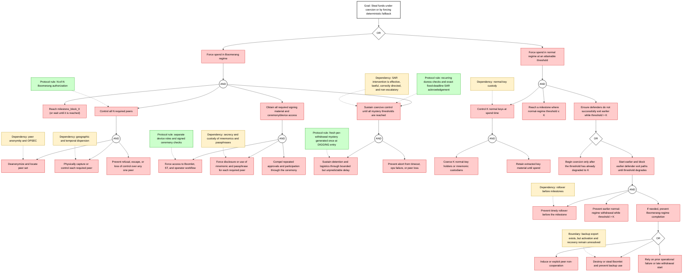
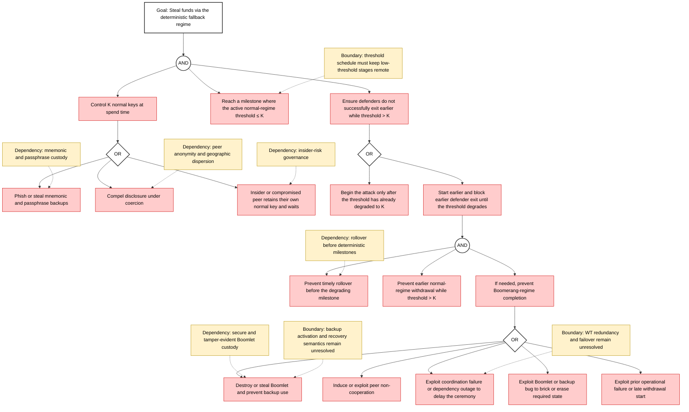
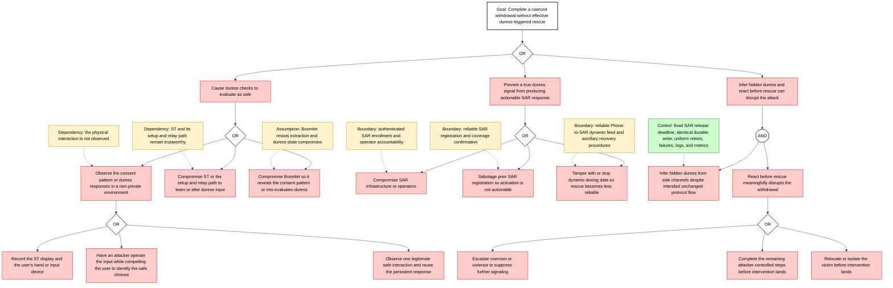
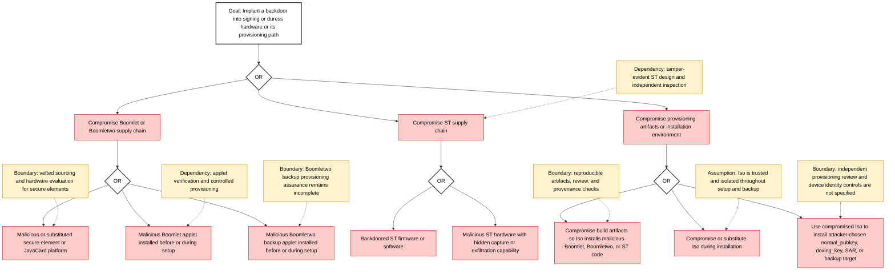
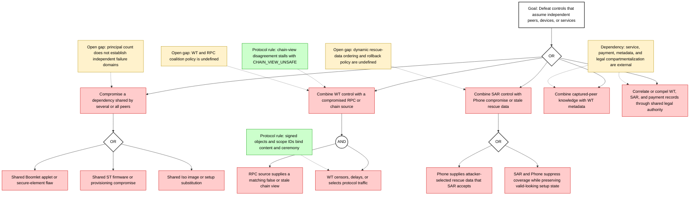

# Boomerang attack trees

> **Last change — 2026-07-13:** Added physical-observation and composite-attack paths and separated protocol rules from external dependencies.

### Tree 0: Primary attacker campaign: steal funds under coercion or force deterministic fallback

Green nodes are rules enforced by the protocol. Yellow nodes are assumptions,
external dependencies, or unresolved gaps.

### Tree 1: Steal funds by tampering PSBT or breaking intent continuity

```mermaid
flowchart TD
  A["Goal: Steal funds by tampering the transaction or breaking intent continuity"] --> OR0{OR}

  OR0 --> B["Get a malicious PSBT approved by all required peers"]
  OR0 --> C["Cause a different PSBT or transaction to be signed than the one approved"]
  OR0 --> D["Exploit signing, parser, or state-machine implementation bugs"]

  B --> AND1((AND))
  AND1 --> B1["Modify or substitute the PSBT before peer approval"]
  AND1 --> B2["Defeat or mislead operator verification at every required peer"]
  AND1 --> B3["Keep the malicious PSBT and tx_id presentation consistent across all approval synchronization steps"]

  B1 --> OR1{OR}
  OR1 --> B1a["Malware alters outputs, change, or fees before first verification"]
  OR1 --> B1b["Swap the PSBT or per-peer encrypted PSBT payload before recipient peer decrypts it"]

  B2 --> OR2{OR}
  OR2 --> B2a["Compromise initiator watch-only wallet or Niso view so the malicious PSBT appears intended"]
  OR2 --> B2b["Compromise non-initiator Niso verification views so the same malicious PSBT is accepted"]
  OR2 --> B2c["Exploit operator-review weakness so tx_id approval is given for a malicious but consistently presented PSBT"]

  C --> AND2((AND))
  AND2 --> C1["Defeat tx_id and continuity protections across the withdrawal state machine"]
  AND2 --> C2["Make the final signed PSBT or transaction differ from the operator-approved one"]

  C1 --> OR3{OR}
  OR3 --> C1a["Exploit inconsistent PSBT parsing, tx_id derivation, or serialization across components"]
  OR3 --> C1b["Exploit replay or state-confusion bug despite nonce, freshness, and sequence checks"]
  OR3 --> C1c["Exploit approval-to-commit, commit-to-ping, or reached-state binding flaw"]

  C2 --> OR4{OR}
  OR4 --> C2a["Exploit PSBT hydration mismatch at finalization"]
  OR4 --> C2b["Exploit message substitution between reached-state verification and Iso/Boomlet signing"]

  D --> OR5{OR}
  OR5 --> D1["PSBT parser or serializer bug causes signing of a different transaction"]
  OR5 --> D2["MuSig2 implementation bug: nonce, session, or transcript binding failure"]
  OR5 --> D3["State-machine bug skips or misapplies prerequisite approval or reached-state checks"]

  F1["Control: independent PSBT verification on operator tooling and ST tx_id approval at each peer"] -.-> B2
  F2["Control: tx_id-bound withdrawal_id, unanimous approved_withdrawal_id, and reached-state checks"] -.-> C1
  F3["Control: nonces, recency, and sequence-number checks to block replay and stale-state reuse"] -.-> C1b
  F4["Control: hydration allow-list, SIGHASH_DEFAULT, Boomlet revalidation, Iso signing-package checks, and final tx_id equality"] -.-> C2
  F5["Assumption: correct PSBT and MuSig2 implementation on isolated Iso"] -.-> D1
  F6["Control: BIP327 session binding and fresh MuSig2 nonces"] -.-> D2
  F7["Boundary: complete state-machine hardening and prerequisite enforcement"] -.-> D3

  classDef goal fill:#ffffff,stroke:#222,stroke-width:2px,color:#000;
  classDef attack fill:#ffcccc,stroke:#cc0000,color:#000;
  classDef control fill:#ccffcc,stroke:#009900,color:#000;
  classDef open fill:#fff2cc,stroke:#b38f00,color:#000;
  classDef gate fill:#ffffff,stroke:#333,stroke-width:2px,color:#000;

  class A goal;
  class B,C,D,B1,B2,B3,B1a,B1b,B2a,B2b,B2c,C1,C2,C1a,C1b,C1c,C2a,C2b,D1,D2,D3 attack;
  class F1,F2,F3,F4,F6 control;
  class F5,F7 open;
  class OR0,OR1,OR2,OR3,OR4,OR5,AND1,AND2 gate;

```

### Tree 2: Reach deterministic fallback and then steal with normal keys

### Tree 3: Complete a coerced withdrawal without effective duress-triggered rescue

### Tree 4: Deanonymize peers and target them with coercion

```mermaid
flowchart TD
  A["Goal: Identify at least one peer operator to target physically"] --> OR0{OR}

  OR0 --> B["Exploit network and communication metadata"]
  OR0 --> C["Exploit WT metadata or service-provider records"]
  OR0 --> D["Exploit SAR registration, payment, or account records"]
  OR0 --> E["Exploit out-of-band peer-data exchange or operator OPSEC failure"]
  OR0 --> F["Exploit insider leakage"]

  B --> OR1{OR}
  OR1 --> B1["Tor traffic or endpoint correlation against peer-to-peer or peer-to-WT communications"]
  OR1 --> B2["Compromise Niso, host, or local network environment to reveal peer communication metadata"]

  C --> OR2{OR}
  OR2 --> C1["WT logs or retained metadata leak, subpoena, or compromise"]
  OR2 --> C2["WT registration or coordination records reveal peer IDs, params, or communication relationships"]

  D --> OR3{OR}
  OR3 --> D1["SAR payment invoice, receipt, or customer records leak, subpoena, or compromise"]
  OR3 --> D2["SAR registration or account metadata leak, subpoena, or compromise"]
  OR3 --> D3["SAR learns identity on duress, then turns rogue or later leaks that knowledge"]

  E --> OR4{OR}
  OR4 --> E1["Intercept or compromise out-of-band sharing of peer IDs and signed Tor addresses"]
  OR4 --> E2["Operator reuses identifiable channels, accounts, or devices during peer coordination"]
  OR4 --> E3["Compromise a peer device that stores peer address collections or signed peer data"]

  F --> OR5{OR}
  OR5 --> F1["Malicious peer reveals peer contacts or identities"]
  OR5 --> F2["WT insider sells or discloses metadata"]
  OR5 --> F3["SAR insider sells or discloses registration or rescue data"]

  G1["Dependency: Tor hygiene, endpoint hardening, and communication-metadata minimization"] -.-> B
  G2["Boundary: WT log minimization, retention limits, and encryption"] -.-> C1
  G3["Boundary: minimize WT-visible metadata and compartmentalize identifiers"] -.-> C2
  G4["Boundary: privacy-preserving SAR payment and record minimization"] -.-> D1
  G5["Boundary: minimize SAR-held account metadata and compartmentalize identifiers"] -.-> D2
  G6["Dependency: secure out-of-band exchange discipline and operator OPSEC"] -.-> E
  G7["Dependency: compartmentalized peer knowledge and governance"] -.-> F1

  classDef goal fill:#ffffff,stroke:#222,stroke-width:2px,color:#000;
  classDef attack fill:#ffcccc,stroke:#cc0000,color:#000;
  classDef control fill:#ccffcc,stroke:#009900,color:#000;
  classDef open fill:#fff2cc,stroke:#b38f00,color:#000;
  classDef gate fill:#ffffff,stroke:#333,stroke-width:2px,color:#000;

  class A goal;
  class B,C,D,E,F,B1,B2,C1,C2,D1,D2,D3,E1,E2,E3,F1,F2,F3 attack;
  class G1,G2,G3,G4,G5,G6,G7 open;
  class OR0,OR1,OR2,OR3,OR4,OR5 gate;

```

### Tree 5: Supply-chain compromise of Boomlet and ST

### Tree 6: Defeat separation through a common cause or coalition

