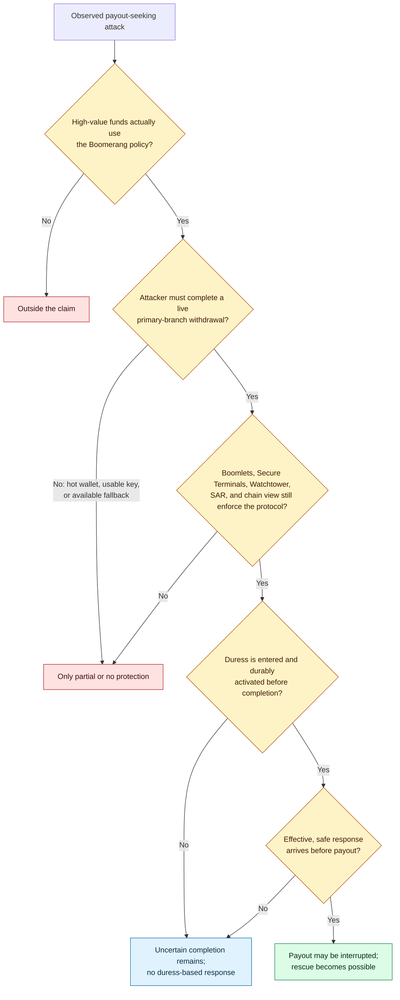
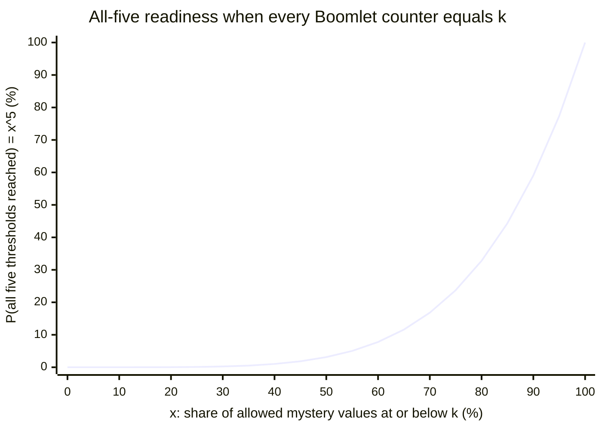
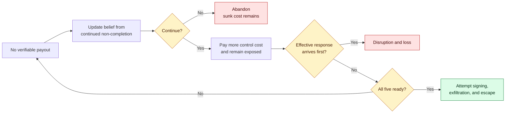

# Coercion economics

> **Design status:** Boomerang is not production-ready. This analysis separates
> observed attack evidence, probability derived from the specified mechanism,
> and deployment quantities that have not been measured.

## Contents

1. [Question and scope](#1-question-and-scope)
2. [Observed attack evidence](#2-observed-attack-evidence)
3. [Historical fit and counterfactual outcomes](#3-historical-fit-and-counterfactual-outcomes)
4. [Protocol-derived completion distribution](#4-protocol-derived-completion-distribution)
5. [From counter progress to intervention](#5-from-counter-progress-to-intervention)
6. [Game-theoretic attacker utility and continuation](#6-game-theoretic-attacker-utility-and-continuation)
7. [Calibration and evaluation requirements](#7-calibration-and-evaluation-requirements)
8. [Supported and unsupported conclusions](#8-supported-and-unsupported-conclusions)

## 1. Question and scope

The relevant question is not whether Boomerang makes coercion impossible. It
does not. The question is whether, for a payout-seeking and cost-sensitive
attacker, a live withdrawal through the five-of-five Boomerang branch can be
made less attractive to start and less attractive to continue, while giving a
prepared responder time to act before a verifiable payout. That branch is the
earliest Taproot script branch, gated by `milestone_block_0`; the Boomlet
devices separately enforce the off-chain progress rules before contributing
their signing shares.

The attacker must complete a sequence: identify the target, control every
required participant, compel each user to confirm the exact unsigned
transaction and cause each Boomlet to issue its pre-signing `TxApproval`, keep
the primary withdrawal ceremony progressing, obtain the later Bitcoin
transaction signatures, verify the transfer, exfiltrate the funds, and escape.
Boomerang changes only part of that sequence. Once each Boomlet has verified
the complete signed `TxCommit` collection and its own exact SAR acknowledgment
and has entered `DIGGING`, the participants cannot accelerate the five private
device thresholds. The same required progress carries initial and repeated
duress state to a setup-bound Search and Rescue service (`SAR`).

This evaluation concerns high-value, low-velocity bitcoin protected by the
five-of-five Boomerang branch and its device-enforced withdrawal protocol. It
does not model ordinary hot-wallet
robbery, a spend through an already available fallback branch, broken trusted
hardware, or an attacker whose main objective is harm rather than payout.

## 2. Observed attack evidence

The most useful peer-reviewed source is Ordekian, Atondo-Siu, Hutchings, and
Vasek's
[2024 AFT study](https://drops.dagstuhl.de/entities/document/10.4230/LIPIcs.AFT.2024.24).
The authors reviewed 146 news articles describing 147 incidents and retained
the 105 cases reported from 2014 through October 2023 that met their
wrench-attack definition. What the attackers demanded splits into the case
Boomerang addresses and the cases it only partly touches: sixty-six of the
105 reports involved a demanded cryptocurrency transfer — 26 specifically
demanding Bitcoin, the rest an unspecified cryptocurrency — thirty involved
means of access such as private keys or storage devices, and nine recorded no
demand. The distinction matters: a compelled live transfer is a closer match
for Boomerang than theft of an immediately spendable wallet or key.

The dominant acts were 38 burglaries, 24 kidnappings, 23 robberies, 7 forcible
confinements, 6 murders, 3 blackmail cases, 3 cases of cryptocurrency-facilitated
domestic economic abuse, and 1 fraud. Seventy attacks were reported successful,
29 failed, and 6 had no stated outcome. Among the 99 reports with a stated
outcome, `70 / 99 = 70.7%` were successful.

That 70.7% is a descriptive proportion within a selected media sample, not a
population probability. The study covers reports discovered by the authors,
less severe and failed attacks may be less newsworthy, only 2 of 11 incidents
described by interview participants had been reported to police, and the paper
expressly limits generalizability. The counts show a tangible problem and its
forms; they cannot estimate an individual's annual victimization risk or a
Boomerang deployment's success rate.

The paper contains one especially relevant observation. In two news cases,
attackers successfully coerced victims to initiate transfers but failed to
fully receive the funds. The transfers passed through exchanges whose 24-hour
delay and verification feature let the victims flag and stop them. This is
observed evidence that an interval before final payout can matter when an
effective response can use it. It is not a test of Boomerang, evidence of
traffic indistinguishability, or evidence that the victims were physically
rescued.

A
[2026 TRM Labs and Metropolitan Police response framework](https://www.trmlabs.com/reports-and-whitepapers/wrench-attacks-crypto-enabled-violent-targeting)
describes 17 reported London offences from March through December 2024: 59%
kidnap, 35% aggravated burglary, and 6% robbery, with an approximate mean
cryptoasset loss of £660,000 per offence. The reviewed cases are not official
statistics and are also subject to underreporting. This commercial and
operational source supports the material-stakes and response-coordination
context; it does not validate Boomerang.

No source above supplies a defensible universal daily cost of coercion, SAR
effectiveness rate, response-time distribution, or attacker penalty. Those
inputs must remain variables until a specific deployment can measure or
justify them.

## 3. Historical fit and counterfactual outcomes

The attack reports do not record enough custody detail to label a historical
case “prevented by Boomerang.” A defensible counterfactual must pass every gate
below:



The 38 burglaries, 24 kidnappings, and 7 confinements in the AFT media sample
are plausibly compatible with sustained physical control, but those 69 labels
do not prove that the attacker needed a live cold-storage withdrawal. Similarly,
the 66 demanded-transfer cases are potentially relevant, not 66 preventable
cases. Seventeen of the study's 23 robberies occurred during P2P transactions;
many such incidents concern mobile or immediately available funds and fall
outside the intended use.

There are three different counterfactual cases.

1. **Deterrence** occurs when prior knowledge of uncertain completion and
   response risk causes a cost-sensitive attacker not to start.
2. **Abandonment** occurs when an attacker stops after control begins because
   continued cost and exposure no longer justify an uncertain payout.
3. **External response before payout** becomes possible when durable duress
   activation leaves time to act before signing, exfiltration, or escape. An
   effective response may interrupt payout, permit a safe intervention for the
   victims, do both, or achieve neither.

Payout interruption within the third case has a close analogue in the two
exchange-delay cases, although their intervention mechanism was different. The
datasets provide no numerical Boomerang rate for deterrence, abandonment,
payout interruption, or safe intervention. These effects remain conditional
possibilities rather than historical results.

## 4. Protocol-derived completion distribution

The probability that can be calculated exactly is the device-threshold part of
the ceremony. Let each of the five Boomlets draw a mystery `M_i` uniformly from
the inclusive implementation-profile range `{m, ..., M}` when that withdrawal
enters `DIGGING` after the required `TxCommit` collection and SAR acknowledgment
verification. Let `n = M - m + 1`, and assume the five trusted random draws are
independent. In a simplified synchronized execution where all five counters
advance together, the common counter value at which every Boomlet can be ready
is:

```text
K = max(M_1, M_2, M_3, M_4, M_5)
```

For `m <= k <= M`, its exact discrete cumulative distribution and probability
mass are:

```text
P(K <= k) = ((k - m + 1) / n)^5

P(K = k) = ((k - m + 1)^5 - (k - m)^5) / n^5
```

The exact mean for selected profile constants can be evaluated without a
simulation:

```text
E[K] = sum from k=m to M of
       k * ((k - m + 1)^5 - (k - m)^5) / n^5
```

If device counters differ, define the single-device cumulative distribution:

```text
F(k) = 0                         for k < m
       (k - m + 1) / n           for m <= k <= M
       1                         for k > M

P(all five ready | k_1, ..., k_5) = product from i=1 to 5 of F(k_i)
```

The plotted `x^5` curve is therefore the synchronized slice
`k_1 = ... = k_5 = k`, not a claim that real device counters always match.

To compare profiles without inventing values for `m` and `M`, define
`x = F(k)`. This is the **share of one Boomlet's allowed mystery values that
are at or below its counter `k`**. It is zero when the counter is below `m`,
is one when the counter is at least `M`, and is neither elapsed time nor
“percent of the withdrawal.” One Boomlet is ready with probability `x`; all
five are ready with probability `x^5`.



| Share of allowed mystery values at or below `k` (`x`) | One Boomlet ready | All five ready (`x^5`) |
| ---: | ---: | ---: |
| 0% | 0% | 0% |
| 25% | 25% | 0.10% |
| 50% | 50% | 3.13% |
| 75% | 75% | 23.73% |
| 90% | 90% | 59.05% |
| 95% | 95% | 77.38% |
| 100% | 100% | 100% |

The chart's point is specific: requiring the maximum of five private draws
concentrates all-ready completion near the upper end of the possible threshold
values. When the counter has passed half of those values, each device is
individually as likely as not to be ready, yet there is only a 3.13% chance all
five are ready. In a continuous normalization, the maximum's mean position is
`5/6 = 83.3%`, its median is `0.5^(1/5) = 87.1%`, and its 90th percentile is
`0.9^(1/5) = 97.9%`.

After observing that completion has not occurred at counter value `s`, the
attacker can update the probability of completion by a later value `k > s`:

```text
P(K <= k | K > s)
    = (P(K <= k) - P(K <= s)) / (1 - P(K <= s))
```

This is a real conditional update, but it does not reveal any individual
mystery or let the coerced users accelerate the counters. The same `x^5`
curve is shown in the [root README](../README.md#attack-economics) as the
first-contact view, and
[DESIGN §12](../DESIGN.md#12-attack-economics-and-security-argument) keeps
the explanatory derivation.

## 5. From counter progress to intervention

`K` counts successful counter increments; it is not wall-clock duration. A
counter increments only after the Boomlet validates a pong (the bundled
progress-round reply from the Watchtower, `WT`), local chain progress, and
current signed pings from every other peer. Every included ping must carry a
freshly encrypted placeholder whose exact SAR acknowledgment was obtained
before pong construction. A valid no-advance round, chain-view stall, peer
outage, WT outage, SAR outage, or freshness failure can add elapsed time
without increasing the counter.

Let:

- `T` be the time at which the attacker obtains a verifiable payout and can
  exfiltrate it;
- `A` be the time SAR durably activates the relevant duress state;
- `R` be the time from activation to an effective external intervention; and
- `E` be the event that the intervention is correctly directed, lawful,
  operationally effective, and does not make the situation worse.

The narrow response event is:

```text
effective interruption = E and (A + R < T)
```

If duress is entered during the initial challenge, exact SAR acknowledgment
and durable activation precede entry to `DIGGING`, so the entire digging period
is potentially available to the responder. Repeated checks provide later
opportunities if the initial response was safe or a new duress condition
arises. Safe and duress handling must remain protocol-indistinguishable on the
specified observability surface.

Neither the protocol nor the attack datasets provide the distribution of `R`
or the probability of `E`. SAR acknowledgment proves exact delivery and durable
activation where applicable. It does not prove that intervention occurs before
`T`, reaches the right people, complies with law, succeeds, avoids retaliation,
or rescues anyone.

The normal-key fallback schedule is a competing clock. The primary Boomerang
branch begins at `milestone_block_0`; deterministic normal-key fallback begins
at `milestone_block_1`. If the attacker can wait for fallback, starts too late,
or forces a stall, the practical horizon becomes more predictable. Any elapsed-
time evaluation must model the actual milestone distance and rollover policy,
not just the mystery distribution.

## 6. Game-theoretic attacker utility and continuation

Let:

- `V` be the attacker's usable payout;
- `D` be the time of effective disruption, with `D = infinity` if none occurs;
- `C(t)` be cumulative operating cost through time `t`; and
- `L` be additional loss when disruption occurs before payout, such as arrest,
  asset seizure, or loss of the escape route.

A risk-neutral payout-seeking attacker's realized and expected utility can be
written as:

```text
U_A = V * 1[T < D]
      - C(min(T, D))
      - L * 1[D <= T]

E[U_A] = V * P(T < D)
         - E[C(min(T, D))]
         - L * P(D <= T)
```

The break-even payout is therefore:

```text
V* = (E[C(min(T, D))] + L * P(D <= T)) / P(T < D)
```

when `P(T < D) > 0`. This is a sensitivity equation, not an empirical dollar
estimate. The London review gives evidence that stakes can be material; it does
not calibrate the attacker's costs or disruption loss.

The attacker makes a new decision while the ceremony remains incomplete:



The qualitative sensitivities are direct:

| Change, all else equal | Effect on attack incentive |
| --- | --- |
| Larger usable payout `V` | Increases incentive to start or continue |
| Greater or faster-growing control cost `C(t)` | Decreases incentive |
| More probability that effective disruption precedes payout | Decreases expected payout and increases expected loss |
| Greater disruption loss `L` | Decreases incentive for a cost-sensitive attacker |
| Easier or nearer deterministic fallback | Increases incentive by making completion more schedulable |
| Service or peer failure that only prolongs captivity | May reduce attacker utility while increasing victim harm; it is not automatically protective |

## 7. Calibration and evaluation requirements

A deployment-specific quantitative claim requires measurements that do not yet
exist in this repository or the cited attack literature:

1. Select and publish the versioned profile constants `m` and `M`, then verify
   uniform, independent trusted-device sampling.
2. Measure the distribution of successful counter increments per unit of time,
   including block progress, no-advance rounds, peer availability, WT/SAR
   latency, retries, and outages.
3. Measure duress-entry usability under stress without exposing consent state,
   including missed signals and unsafe false activation.
4. Exercise each SAR response plan to estimate activation-to-action time,
   jurisdictional authority, routing accuracy, operational success, and human-
   safety failure modes.
5. Study attacker costs and choices by jurisdiction and attack form rather than
   importing an unsupported universal cost per day.
6. Record which real incidents involved a live cold-storage transfer, an
   immediately usable key or device, a service account, P2P funds, or another
   path. Existing aggregate categories are not enough.
7. Evaluate fallback distance and rollover performance so that the uncertain
   Boomlet-enforced withdrawal is not silently replaced by a predictable
   fallback waiting strategy.

Only after these inputs exist should an evaluator produce calendar-time curves,
response probabilities, expected-utility estimates, or a break-even balance for
a named deployment. Sensitivity ranges should remain visible rather than being
collapsed into one headline number.

## 8. Supported and unsupported conclusions

The evidence supports four bounded conclusions:

- violent coercion for cryptocurrency is a documented, materially costly
  problem, not a purely hypothetical threat;
- compelled transfers are common within the selected AFT media sample;
- two observed cases show that a usable pre-payout interval can stop a coerced
  transfer; and
- under the specified five independent uniform mysteries, five-of-five
  readiness is mathematically concentrated toward the upper end of the
  possible threshold values.

Together, those facts show how Boomerang could deter some compatible attacks,
cause abandonment, or provide time for an external response before payout. A
response may interrupt payout, permit a safe intervention, do both, or achieve
neither. The evidence does not establish an incident-prevention rate, an
intervention success rate, a universal attacker cost, a production mystery
range, or the conclusion that any named historical victim would have been
saved.

Longer coercion can increase injury, trauma, retaliation, and danger to victims,
families, and responders. Time is valuable only when a credible, prepared, and
safe response can use it.
